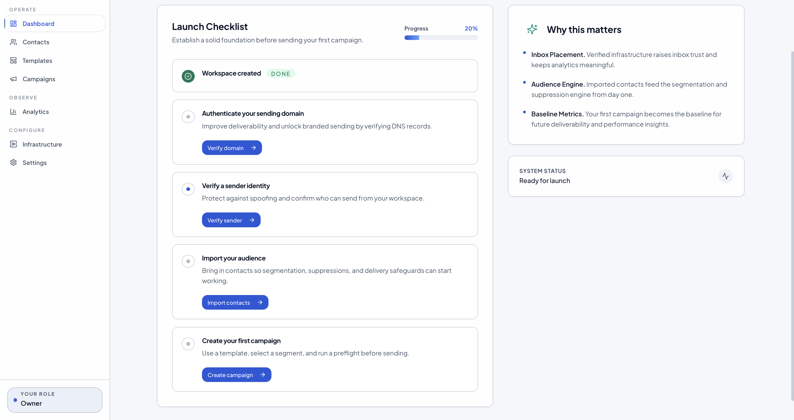
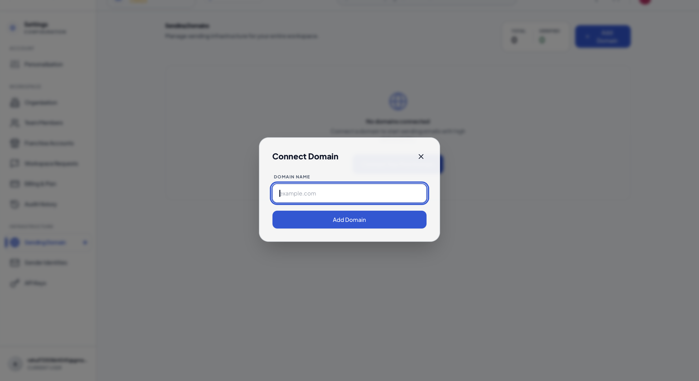
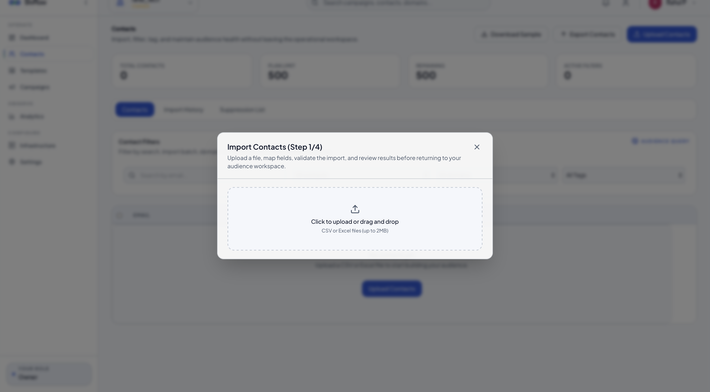

# Quick Start Guide

Welcome to **ShrFlow**! This guide walks you through setting up your workspace, verifying your sender reputation, importing your audience, and launching your first email campaign in **under 10 minutes**.

---

  
Estimated time

  <h3>10 Minutes</h3>
  
Goal: Set up sending infrastructure, import contacts, and dispatch your first email campaign.

## 1. Access Your Dashboard

First, log in to your workspace. The active dashboard features a startup checklist designed to guide you through the initial configuration steps.

* **What to do:** Log in using your registered credentials.
* **Expected Result:** You will see the main dashboard displaying your workspace launch checklist.
* **Pro-tip:** Follow the checklist items in order to ensure you don't miss any critical infrastructure steps.

---

## 2. Verify Your Domain & Sender Identity

To ensure your emails bypass spam filters and land reliably in your subscribers' inboxes, you must authorize your domain and create sender identities.

### Step A: Connect Domain
Go to **Settings > Domains** and click **Connect Domain**. Enter your website's domain to generate the required SPF, DKIM, and DMARC verification records.

### Step B: DNS Authentication
Add the generated CNAME/TXT records to your DNS provider (e.g., Cloudflare, Route 53, GoDaddy).

### Step C: Setup Sender Identities
Navigate to **Settings > Sender Identities** to configure the "From" email addresses (e.g., `newsletter@yourdomain.com`) that your campaigns will use.

  ⚠️
  
<strong>DNS Propagation:</strong> While verification is often instant, DNS updates can sometimes take up to 24 hours to propagate globally depending on your registrar.

---

## 3. Import Your Contacts

Load your existing subscriber list into ShrFlow using our high-throughput audience importer.

### Step A: Upload CSV
Navigate to **Audience > Import** and upload your CSV or spreadsheet file. 

### Step B: View Import History
Monitor the progress of your batch uploads and track metrics like successful records and syntax rejections.

* **Common Mistake:** Make sure your CSV contains an explicit column labeled **Email** or **email** so the field mapper matches it automatically.

---

## 4. Launch Your First Campaign

With your sending domain verified and audience loaded, you are ready to compose and dispatch your first campaign.

* **What to do:** Go to **Campaigns > New Campaign**, select your template or write your newsletter, choose your sender identity, target your imported list, and hit **Send**.
* **Expected Result:** The delivery engine queues the emails using RabbitMQ and starts transmitting them through your SMTP/SES sending pools immediately.

---

  🎉
  
<strong>Congratulations!</strong> You have successfully configured your workspace sending infrastructure and sent your first campaign. Next, track your delivery performance in real-time in the <strong>Analytics</strong> dashboard.

