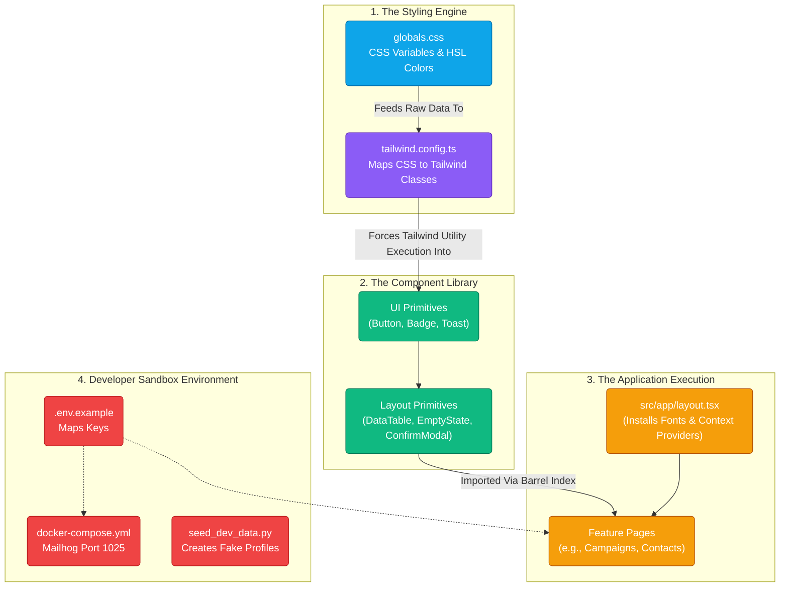

# Phase 0 - Developer Implementation Guide & Technical Audit

> **Scope:** This document is written for engineers. It acts as both an audit of what we have built, and a strict **Implementation Matrix** explaining *how* to build it. If you are a new developer joining the team, read this carefully to understand the exact file structures, Mermaid logical flows, and code mechanics required to construct Phase 0.

---

## 1. Phase 0 Architecture Map (Mermaid)

Before writing any code, you must understand how the files talk to each other. Here is the exact data flow for Phase 0:



---

## 2. Core Setup Initialization

### `shadcn/ui` installed and initialized
**What it is:** Instead of installing a black-box NPM package like Material-UI, `shadcn` pulls raw, editable React files into your local codebase.
**Implementation Guide (How YOU do this):** 
1. Initialize the CLI in the terminal: `npx shadcn-ui@latest init`
2. This drops a `components.json` configuration file in your root folder. This file instructs the CLI to install all future components into the path `src/components/ui`.
3. When you need a button, you run `npx shadcn-ui@latest add button`. The raw `.tsx` code physically appears in your folder for you to edit.

### `Inter` font installed in root layout
**What it is:** The mathematical optimization of font-loading in Next.js to prevent "Flash of Unstyled Text" (FOUT).
**Implementation Guide (How YOU do this):**
1. Open `platform/client/src/app/layout.tsx`.
2. Import the Next.js optimization package: `import { Inter } from 'next/font/google'`.
3. Instantiate it globally: `const inter = Inter({ subsets: ['latin'] })`.
4. Bind it to the absolute root element of the HTML document: `<body className={inter.className}>`. Next.js will now pre-load the font securely during the Node.js SSR build cycle.

---

## 3. Engineering the Token Layer

### Adding Dark-Mode CSS Tokens
**What it is:** Shifting from static hex colors to dynamic CSS-Level-4 variables that the browser calculates live.
**Implementation Guide (How YOU do this):**
1. Open `platform/client/src/app/globals.css`.
2. Target the Light Theme root pseudo-class using HSL (Hue, Saturation, Lightness):
   ```css
   :root {
     --background: 0 0% 100%; /* Pure White */
   }
   ```
3. Target the Dark Theme using the `.dark` selector:
   ```css
   .dark {
     --background: 224 71.4% 4.1%; /* Near Black */
   }
   ```
4. Never wrap these variables in `hsl()` here. PostCSS needs raw numbers to inject opacity modifiers later.

### Dark / Light Mode Toggle Execution
**What it is:** Giving the user an interactive switch to swap the theme safely without a page reload.
**Implementation Guide (How YOU do this):**
1. Install `next-themes`. Wrap your entire app layout inside the `<ThemeProvider>` context.
2. In your Toggle Button React component, import the runtime hook: `const { setTheme } = useTheme()`.
3. Bind the `onClick` event to `setTheme('dark')`. 
4. **How the code works:** `next-themes` immediately mutates the HTML DOM, physically injecting `<html class="dark">`. The browser's C++ paint engine sees this and instantly flips all the CSS variables.

---

## 4. The Compiler Bridge

### Mapping Tailwind securely to CSS
**What it is:** Tailwind expects static hex colors. We must "hijack" the Tailwind configuration compiler so that when a developer types `bg-background`, it mathematically points to our CSS file.
**Implementation Guide (How YOU do this):**
1. Open `platform/client/tailwind.config.ts`.
2. Locate the JavaScript object tree called `theme.extend.colors`.
3. Map the variable:
   ```javascript
   colors: {
     background: "hsl(var(--background))",
     destructive: { DEFAULT: "hsl(var(--destructive))" }
   }
   ```
4. Now, if a developer tries to use an invalid Tailwind string, the code simply won't compile, saving you from deploying broken UI.

---

## 5. UI Component Primitives 

### Variant-Driven Construction (`Button.tsx`)
**What it is:** Passing complex logic via simple React props (e.g., `<Button variant="destructive" size="lg">`).
**Implementation Guide (How YOU do this):**
1. Import `cva` (Class Variance Authority) inside `Button.tsx`.
2. Construct your dictionary tree:
   ```javascript
   const buttonVariants = cva("inline-flex items-center...", {
     variants: {
       variant: { default: "bg-primary text-white", destructive: "bg-destructive text-white" },
       size: { sm: "h-8 px-3", lg: "h-12 px-8" }
     }
   })
   ```
3. Pass the strings through `React.forwardRef` to ensure the DOM nodes stay stable across re-renders.

### The React Context Notification Engine (`Toast.tsx`)
**What it is:** A popup system that can be triggered from deeply nested files without "prop-drilling".
**Implementation Guide (How YOU do this):**
1. Create a `ToastContext.tsx`. Use standard `useState`: `const [toasts, setToasts] = useState<ToastObject[]>([])`.
2. Build a `useToast` hook that exposes `toast({ title: 'Success' })`. 
3. When `toast()` is invoked, logically append a new dictionary object to the state array: `setToasts(prev => [...prev, newToast])`.
4. Wrap your entire `layout.tsx` in `<ToastProvider>`. Use an internal `useEffect()` timeout to mathematically `pop()` the latest index off the array 3000ms later to orchestrate the disappearing animation.

### The Pagination Data Map (`DataTable.tsx`)
**What it is:** A highly complex component capable of taking massive arrays of data and splitting them neatly for human consumption.
**Implementation Guide (How YOU do this):**
1. Enforce strict typescript security: `interface DataTableProps<T> { data: T[] }`. The `<T>` ensures it works whether passing an array of "Users" or "Campaigns".
2. Store the mathematical boundary: `const [currentPage, setCurrentPage] = useState(1)`.
3. Slice the incoming data dynamically:
   ```javascript
   const startIndex = (currentPage - 1) * pageSize;
   const visibleData = data.slice(startIndex, startIndex + pageSize);
   ```
4. Render `visibleData.map()` inside the `<tbody>` tags instead of the raw data.

### Structural Z-Index Escape (`ConfirmModal.tsx`)
**What it is:** Modals inherently suffer from structural CSS bugs where they get stuck under sidebars due to complex `z-index` stacking orders.
**Implementation Guide (How YOU do this):**
1. You must use `ReactDOM.createPortal()` (built into Radix UI Dialog).
2. What the code actually does is physically rip the modal's `div` out of its parent component tree, traverse directly to `document.body`, and inject itself at the absolute bottom of the HTML page, guaranteeing it floats above everything else.

---

## 6. Accessiblity Execution (A11y)

### Re-establishing the Focus Engine
**What it is:** Allowing keyboard navigators to "see" what button they are on.
**Implementation Guide (How YOU do this):** Search all CSS files for `*:focus { outline: none }` and delete it entirely. Verify that the browser's default blue ring appears when hitting the `Tab` key.

### Screen-Reader Modal Trapping
**What it is:** Preventing a blind user from tabbing "out" of an open modal dialog accidentally.
**Implementation Guide (How YOU do this):**
1. Utilize the native `<Dialog>` primitives.
2. Ensure you have an `onOpenChange` React lifecycle listener.
3. The underlying DOM utilizes `<span tabindex="0">` invisible boundary nodes. When the keyboard focus hits the bottom of the modal, it programmatically sets `document.activeElement` back to the top-most input field.

### Geometric Touch Surfaces
**What it is:** Mathematical validation of mobile thumb hit-boxes.
**Implementation Guide (How YOU do this):** Measure padding logically. Instead of hardcoding `height: 44px`, use CSS `padding: 1rem 2rem` ensuring that the inner click-target pushes outward, creating a minimum boundary volume of 44 square pixels.

---

## 7. Developer Operations Sandboxes

### The Mailhog SMTP Docker Loop
**What it is:** An insulated fake-internet environment to prevent physical emails from transmitting during local debugging.
**Implementation Guide (How YOU do this):**
1. Open `docker-compose.yml`. Add the Golang binary: `image: mailhog/mailhog`.
2. Expose the specific ports: `- "1025:1025"` (The SMTP TCP Pipe) and `- "8025:8025"` (The HTTP Web Interface View).
3. Set your `.env` to `SMTP_HOST=localhost` and `SMTP_PORT=1025`.
4. Now, the Python API writes TCP bytes directly to the host port, and Docker swallows them, preventing transmission to external mail exchanges like Google or Yahoo.

### Database Structuring via Faker (`seed_dev_data.py`)
**What it is:** Instant, massive fake data insertion for pagination testing.
**Implementation Guide (How YOU do this):**
1. Open the python script. Initialize the Supabase Client.
2. Initialize `from faker import Faker`.
3. Build a generative loop: `for _ in range(1000): buffer.append(Faker().email())`.
4. Fire a bulk API insert: `db.client.table('contacts').insert(buffer).execute()`. This prevents UI engineers from wasting 4 hours clicking "Add Contact" manually.