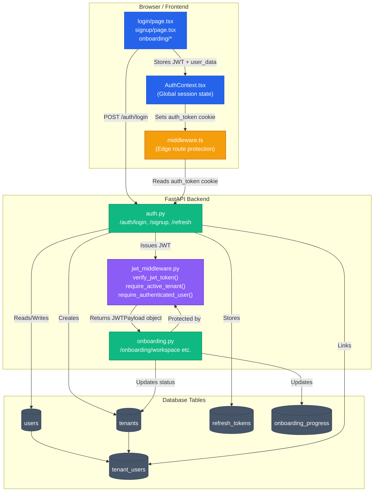

# Phase 1 — Developer Implementation Guide & Technical Audit

> **Who is this for?** Any developer — beginner or senior — who needs to understand exactly how Phase 1 is built, what every file does, how the data flows, and how to implement or extend any part of it from scratch.

---

## 1. Phase 1 Complete Architecture Map

Read this Mermaid diagram before looking at any code. It shows exactly how every file and layer connects.



---

## 2. Complete File Index — Phase 1

Every file relevant to Phase 1 and what it does:

| File | Layer | Role |
|---|---|---|
| `platform/api/routes/auth.py` | Backend | All auth endpoints: login, signup, refresh, logout, switch-workspace |
| `platform/api/routes/onboarding.py` | Backend | Onboarding wizard step endpoints |
| `platform/api/routes/password_reset.py` | Backend | Forgot password and reset password flows |
| `platform/api/utils/jwt_middleware.py` | Backend | JWT validation and dependency injection guards |
| `platform/api/utils/supabase_client.py` | Backend | Database connection singleton |
| `platform/api/utils/rate_limiter.py` | Backend | IP + email composite rate limit enforcement |
| `platform/api/utils/captcha.py` | Backend | Google reCAPTCHA verification |
| `platform/api/repositories/user_repository.py` | Backend | Abstracted DB queries for `users` table |
| `platform/api/repositories/auth_repository.py` | Backend | Abstracted DB queries for tenant membership |
| `platform/api/repositories/audit_repository.py` | Backend | Writes immutable audit log rows |
| `platform/client/src/context/AuthContext.tsx` | Frontend | Global React session state provider |
| `platform/client/src/middleware.ts` | Frontend Edge | Next.js middleware for server-side route protection |
| `platform/client/src/app/login/page.tsx` | Frontend | Login page UI |
| `platform/client/src/app/signup/page.tsx` | Frontend | Signup page UI |
| `platform/client/src/app/onboarding/*` | Frontend | 4-step onboarding wizard pages |
| `platform/client/src/app/dashboard/page.tsx` | Frontend | Dashboard with onboarding checklist |
| `migrations/002_progressive_onboarding.sql` | Database | Creates `users`, `tenants`, `tenant_users`, `onboarding_progress` |
| `migrations/021_onboarding_field_extensions.sql` | Database | Adds extra onboarding columns |
| `migrations/022_campaign_runtime_alignment.sql` | Database | Campaign runtime schema sync |
| `migrations/manual_apply_latest_runtime_sync.sql` | Database | Catch-up SQL for environments that missed migrations |

---

## 3. Database Schema — What We Built

### The Identity Model (3 Core Tables)

```sql
-- Table 1: Individual users
users (
  id UUID PRIMARY KEY,
  email TEXT UNIQUE NOT NULL,
  password_hash TEXT NOT NULL,  -- bcrypt hash, never raw password
  full_name TEXT,
  is_active BOOLEAN DEFAULT TRUE,
  email_verified BOOLEAN DEFAULT FALSE,
  token_version INTEGER DEFAULT 0  -- revocation counter
)

-- Table 2: Companies/Workspaces
tenants (
  id UUID PRIMARY KEY,
  company_name TEXT NOT NULL,
  status TEXT DEFAULT 'onboarding'  -- 'onboarding' | 'active' | 'suspended'
  -- status is THE authoritative gate. Active = unlocked. Anything else = blocked.
)

-- Table 3: Junction — links a user to a tenant with a role
tenant_users (
  user_id UUID REFERENCES users(id),
  tenant_id UUID REFERENCES tenants(id),
  role TEXT DEFAULT 'member',  -- 'owner' | 'admin' | 'member'
  joined_at TIMESTAMPTZ DEFAULT NOW()
)
```

**Why this 3-table design?**
- One user can belong to many companies (junction table)
- Each membership has its own role (a consultant can be "owner" of their agency but "member" of a client's workspace)
- `tenants.status` is the single gate that controls everything

### The Refresh Token Table
```sql
refresh_tokens (
  id UUID PRIMARY KEY,
  user_id UUID REFERENCES users(id),
  tenant_id UUID,
  token_hash TEXT UNIQUE,  -- SHA-256 hash, never raw token
  expires_at TIMESTAMPTZ,
  revoked BOOLEAN DEFAULT FALSE
)
```

---

## 4. Authentication Flow — Step-by-Step

### Signup Flow (How to implement it)

1. **Frontend** (`signup/page.tsx`) — User fills form and submits → sends `POST /auth/signup` with `{ email, password, full_name, tenant_name, captcha_token }`

2. **Backend** (`auth.py`) — On receiving the request:
   - Calls `verify_captcha(captcha_token)` to validate with Google
   - Hashes the password: `bcrypt.hashpw(password.encode(), bcrypt.gensalt())`
   - Creates a `users` row with the hash
   - Depending on the user's email domain, picks one of 3 tenant paths:
     - **Normal owner flow:** Creates a `tenants` row with `status='onboarding'`, links via `tenant_users` with `role='owner'`  
     - **Enterprise JIT flow:** Detects verified corporate domain, creates a `join_requests` row
     - **Invite flow:** Finds pending team invitation, sets status to `pending_join`
   - Signs a JWT: `jwt.encode({ user_id, tenant_id, email, role }, SECRET_KEY, algorithm="HS256")`
   - Creates a refresh token, stores its SHA-256 hash in `refresh_tokens` table, sets it as an `HttpOnly` cookie
   - Returns the JWT in the response body

3. **Frontend** — Stores JWT in `localStorage` and mirrors it into a readable cookie for middleware

### Login Flow (How to implement it)

1. **Frontend** sends `POST /auth/login` with `{ email, password }`
2. **Backend** (`auth.py`):
   - Looks up `users` by email
   - Checks `bcrypt.checkpw(submitted_password, stored_hash)`
   - Verifies `user.is_active == True`
   - Finds the primary tenant via `tenant_users` ordered by `joined_at`
   - Checks `tenants.status` to decide redirect destination
   - Issues fresh JWT + refresh token pair
3. **Frontend** (`AuthContext.tsx`) — Parses the JWT payload, sets React state, redirects based on `tenant_status`

### Silent Refresh Flow (The Invisible Session Extension)

This is triggered automatically when the JWT is about to expire (within 60 seconds of expiry):

1. `AuthContext.tsx` decodes the JWT payload: `JSON.parse(atob(token.split('.')[1]))`
2. Checks `payload.exp * 1000 < Date.now() + 60000`
3. If true, fires `POST /auth/refresh` — the `HttpOnly` cookie is automatically sent by the browser
4. **Backend** (`auth.py`): Reads the cookie, hashes it (`SHA-256`), looks up the `refresh_tokens` table, validates it is not expired or revoked
5. Deletes the old refresh token row (one-time use), issues a new refresh token + new JWT
6. Frontend stores the new JWT silently — the user never knows a refresh happened

---

## 5. JWT Middleware — How the Guard System Works

File: `platform/api/utils/jwt_middleware.py`

There are 4 guard functions. Every protected route must use one as a FastAPI `Depends()`:

### Guard 1: `verify_jwt_token` — Base verification
```python
# Extracts token from "Authorization: Bearer <token>" header
# Decodes the JWT using the shared SECRET_KEY
# Returns a JWTPayload object: { user_id, tenant_id, email, role, isolation_model }
# Raises HTTP 401 if token is missing, malformed, or expired
```
**Use on:** Any route that needs to know WHO is requesting.

### Guard 2: `require_authenticated_user` — Auth without status check
```python
# Wraps verify_jwt_token
# Returns the JWTPayload for any authenticated user regardless of tenant status
```
**Use on:** Onboarding routes (user is authenticated but company is still in `onboarding`)

### Guard 3: `require_active_tenant` — The main production gate
```python
# Runs verify_jwt_token first
# Additionally checks: db.table("tenants").select("status").eq("id", tenant_id)
# If status != "active" → HTTP 403 Forbidden
# Also validates X-Tenant-ID header matches JWT (anti-spoofing)
```
**Use on:** Every campaign, contact, analytics, and template route.

### Guard 4: `require_admin_or_owner` — Role authorization
```python
# Wraps verify_jwt_token
# Checks jwt_payload.role in ["admin", "owner"]
# Returns HTTP 403 if the user is just a "member"
```
**Use on:** Team management, domain settings, billing routes.

### How to wire a guard onto any route:
```python
@router.get("/campaigns")
async def list_campaigns(tenant_id: str = Depends(require_active_tenant)):
    # At this point, we know:
    # 1. The JWT is valid and not expired
    # 2. The tenant is in 'active' status
    # 3. The tenant_id variable is safe to use in DB queries
    contacts = db.table("campaigns").select("*").eq("tenant_id", tenant_id).execute()
```

---

## 6. Frontend Session State — How `AuthContext.tsx` Works

`AuthContext.tsx` is the **global brain** of the frontend session. It runs once at app startup.

### Startup Sequence (on every page load or refresh):
1. Reads `auth_token` from `localStorage`
2. Decodes the JWT payload: `JSON.parse(atob(token.split('.')[1]))`
3. Checks if `payload.exp * 1000 < Date.now() - 60000` (is it expired or about to expire?)
4. If expiring: calls `silentRefresh()` → `POST /auth/refresh` → stores new JWT
5. Sets React state: `setUser(parsedUser)` and `setIsAuthenticated(true)`
6. Calls `GET /auth/me` to sync the latest server-side profile (theme, role updates)

### Data stored in localStorage:
```javascript
localStorage.setItem('auth_token', jwtString);
localStorage.setItem('user_data', JSON.stringify({
  userId, email, fullName, tenantId, tenantStatus, role
}));
```

### Cookies set for Next.js middleware:
```javascript
document.cookie = `auth_token=${token}; path=/; max-age=${7 * 24 * 60 * 60}; SameSite=Lax`;
document.cookie = `tenant_status=${status}; path=/;`;
```
The cookie must use `SameSite=Lax` (not `Strict`) to allow OAuth redirect flows to work correctly.

---

## 7. Next.js Middleware Route Protection (`middleware.ts`)

This runs **before any page is rendered**, at the Edge Network level.

### How it works:
1. For every incoming request, Next.js middleware reads `request.cookies.get('auth_token')`
2. If cookie is absent and the route is protected → `redirect('/login')`
3. If cookie is present and the user is in `onboarding` status → `redirect('/onboarding/workspace')`
4. If cookie is present and user is `active` visiting `/login` → `redirect('/dashboard')`

### Protected prefixes checked by middleware:
`/dashboard`, `/contacts`, `/campaigns`, `/templates`, `/analytics`, `/settings`, `/team`

---

## 8. Onboarding State Machine

### The 5 Steps:

| Step | Frontend Route | Backend Endpoint | What it writes |
|---|---|---|---|
| 1 | `/onboarding/workspace` | `POST /onboarding/workspace` | `tenants.company_name` |
| 2 | `/onboarding/use-case` | `POST /onboarding/use-case` | `onboarding_progress.use_case` |
| 3 | `/onboarding/integrations` | `POST /onboarding/integrations` | `onboarding_progress.integrations` |
| 4 | `/onboarding/scale` | `POST /onboarding/scale` | `onboarding_progress.scale` |
| 5 | `/onboarding/complete` | `POST /onboarding/complete` | **`tenants.status = 'active'`** |

Step 5 is the state transition that unlocks the entire platform. `require_active_tenant` now passes. The user can use campaigns, contacts, everything.

---

## 9. Rate Limiting Implementation

File: `platform/api/utils/rate_limiter.py`

Uses a **composite key**: `f"{ip_address}:{email}"` — meaning both the IP AND the specific email being targeted must stay within limits. This prevents two attacks simultaneously:
- IP rate limiting → stops botnets from hammering from one IP
- Email rate limiting → stops distributed botnets from hammering one specific account across many IPs

### How to apply it to any route:
```python
@router.post("/login")
async def login(request: Request, body: LoginRequest):
    await enforce_auth_rate_limit(request, body.email)  # raises HTTP 429 if exceeded
    # ... rest of login logic
```

---

## 10. Known Architectural Notes

- **RLS is NOT the active enforcement layer.** Supabase is accessed via `SERVICE_ROLE_KEY`, which bypasses Row Level Security. Tenant isolation is enforced entirely in application code via JWT claims and `require_active_tenant`. RLS is planned for a future hardening phase.
- **The refresh cookie `secure` flag** must be `False` in local development (`http://localhost`) and `True` in production (`https://`). We use `os.getenv("ENVIRONMENT") == "production"` to toggle this dynamically. If `secure=True` is hardcoded, the browser silently drops the cookie on local HTTP, causing the "Silent refresh failed" session expiry error.
- **Legacy onboarding endpoints** (`/onboarding/status`, `/onboarding/intent`) still use `X-Tenant-ID` header resolution instead of JWT-derived tenant identity. These are kept for backwards compatibility but should not be used in new code.
- **The `token_version` revocation counter** in the `users` table is the escape hatch for emergency session termination. Incrementing it instantly invalidates all active JWTs for that user.
