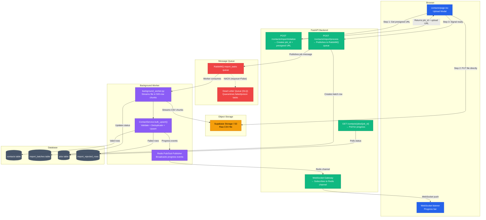

# Phase 2 — Developer Implementation Guide & Technical Audit
## Contacts Engine: How It's Built, How Every Piece Works, How to Extend It

> **Who is this for?** Any developer — beginner or senior — who needs to understand exactly how Phase 2 is built, what every file does, how data flows from a user's CSV file into a queryable database, and how to implement or extend any part of the contacts pipeline from scratch.

---

## 1. Phase 2 Complete Architecture Map

Read this diagram first. It shows the exact flow a CSV file takes from the user's browser to a stored database record.



---

## 2. Complete File Index — Phase 2

Every file relevant to Phase 2 and what it does:

| File | Layer | Role |
|---|---|---|
| `platform/api/routes/contacts.py` | Backend | All contact endpoints: CRUD, import, search, export, suppression |
| `platform/api/services/contact_service.py` | Backend | Core business logic: validation, deduplication, upsert, scoring |
| `platform/api/services/batch_service.py` | Backend | Import batch lifecycle: create, list, delete batches |
| `platform/api/utils/file_parser.py` | Backend | CSV/XLSX parsing: reads file bytes, normalizes headers, drops blank rows |
| `platform/api/utils/rabbitmq_client.py` | Backend | RabbitMQ connection + message publishing |
| `platform/worker/background_worker.py` | Worker | Async import processing: streams file, validates, upserts in 500-row chunks |
| `platform/client/src/app/contacts/page.tsx` | Frontend | Main contacts list page: table, search, import modal, history tab |
| `platform/client/src/app/contacts/[id]/page.tsx` | Frontend | Contact detail page: edit email, custom fields, tags |
| `platform/client/src/app/contacts/suppression/page.tsx` | Frontend | Suppression list: bounced, unsubscribed, complained contacts |
| `platform/client/src/app/contacts/batch/[batchId]/page.tsx` | Frontend | Batch detail: per-batch contacts, domain breakdown, error rows |
| `migrations/003_contacts_module_phase2.sql` | Database | Base contacts schema: tenant_id, email, status, custom_fields |
| `migrations/019_phase2_contacts_alignment.sql` | Database | Adds import_batches, contacts.import_batch_id |
| `migrations/020_contacts_email_domain.sql` | Database | Adds contacts.email_domain column |
| `migrations/manual_apply_latest_runtime_sync.sql` | Database | Catch-up SQL for environments missing recent migrations |

---

## 3. Database Schema — What We Built

```sql
-- Core contacts table
contacts (
  id UUID PRIMARY KEY DEFAULT gen_random_uuid(),
  tenant_id UUID NOT NULL REFERENCES tenants(id),
  email TEXT NOT NULL,
  first_name TEXT,
  last_name TEXT,
  status TEXT DEFAULT 'subscribed',  -- 'subscribed' | 'unsubscribed' | 'bounced' | 'complained'
  tags TEXT[] DEFAULT '{}',          -- Array of label strings
  custom_fields JSONB DEFAULT '{}',  -- All extra CSV columns stored here as key-value
  email_domain TEXT,                 -- Extracted: 'gmail.com', 'accenture.com'
  import_batch_id UUID REFERENCES import_batches(id),
  created_at TIMESTAMPTZ DEFAULT NOW(),
  UNIQUE(tenant_id, email)           -- Deduplication constraint
)

-- Import batch tracking
import_batches (
  id UUID PRIMARY KEY,
  tenant_id UUID REFERENCES tenants(id),
  file_name TEXT,
  total_rows INTEGER,
  imported_count INTEGER DEFAULT 0,
  failed_count INTEGER DEFAULT 0,
  skipped_blank INTEGER DEFAULT 0,
  errors JSONB DEFAULT '[]',         -- Array of {row, email, reason} objects
  status TEXT DEFAULT 'processing',  -- 'processing' | 'completed' | 'failed'
  created_at TIMESTAMPTZ DEFAULT NOW()
)

-- Async job tracking for polling
jobs (
  id UUID PRIMARY KEY,
  tenant_id UUID,
  type TEXT,                         -- 'csv_import'
  status TEXT DEFAULT 'pending',     -- 'pending' | 'processing' | 'completed' | 'failed'
  progress INTEGER DEFAULT 0,        -- Rows processed so far
  total INTEGER DEFAULT 0,           -- Total rows expected
  result JSONB,
  created_at TIMESTAMPTZ DEFAULT NOW(),
  updated_at TIMESTAMPTZ DEFAULT NOW()
)
```

**Important schema note:** An older migration (`003_contacts_module_phase2.sql`) creates a `contact_custom_fields` table. This table is **not used** by the running code. Custom fields are stored in `contacts.custom_fields` as a JSONB column. Do not implement against the `contact_custom_fields` table — it is a legacy artifact.

---

## 4. The 6-Step Import Pipeline — Step by Step

### Step 1: Initialize (`POST /contacts/import/initialize`)
```python
# What the backend does:
job = db.table("jobs").insert({"tenant_id": tenant_id, "type": "csv_import", "status": "pending"}).execute()
presigned_url = supabase.storage.from_("imports").create_signed_upload_url(f"{tenant_id}/{job_id}.csv")
return {"job_id": job_id, "upload_url": presigned_url["signedURL"]}
```
The frontend receives a signed URL valid for 10 minutes and a `job_id` to track the import.

### Step 2: Direct Upload (Browser → Object Storage)
```javascript
// Frontend uploads directly to Supabase Storage — API server RAM is never touched
await fetch(upload_url, {
  method: "PUT",
  body: csvFile,
  headers: { "Content-Type": "text/csv" }
});
```

### Step 3: Signal Process (`POST /contacts/import/process`)
```python
# Backend creates the batch record and queues the work
batch = db.table("import_batches").insert({
  "tenant_id": tenant_id, "job_id": job_id, "file_name": filename,
  "total_rows": row_count, "status": "processing"
}).execute()
rabbitmq.publish("import_tasks", {"job_id": job_id, "tenant_id": tenant_id, "batch_id": batch_id})
return {"job_id": job_id, "batch_id": batch_id}  # Returns immediately — no waiting
```

### Step 4: RabbitMQ Worker Picks Up the Job
```python
# background_worker.py
async def process_csv_import(message: dict):
    job_id, tenant_id, batch_id = message["job_id"], message["tenant_id"], message["batch_id"]
    
    # Download file from storage as a streaming reader — never loads full file into RAM
    stream = supabase.storage.from_("imports").download(f"{tenant_id}/{job_id}.csv")
    
    # Process in chunks of 500 rows
    for chunk in pd.read_csv(stream, chunksize=500):
        valid_rows, failed_rows = validate_chunk(chunk)
        await ContactService.bulk_upsert(valid_rows, tenant_id, batch_id)
        
        # Publish progress to Redis for WebSocket broadcast
        await redis.publish(f"import:{job_id}", json.dumps({
            "processed": processed_count, "total": total_rows, "failed": len(failed_rows)
        }))
        
        # Update the jobs table for HTTP polling fallback
        db.table("jobs").update({"progress": processed_count}).eq("id", job_id).execute()
```

### Step 5: Validation inside `ContactService.bulk_upsert()`
```python
def bulk_upsert(contacts: list, tenant_id: str, batch_id: str):
    valid_rows, errors = [], []
    seen_emails = set()  # In-memory deduplication within this chunk
    
    for row in contacts:
        email = row.get("email", "").lower().strip()
        
        # Layer 1: Syntax check
        if not validate_email(email): 
            errors.append({"email": email, "reason": "invalid_email_syntax"})
            continue
        
        # Layer 2: In-chunk deduplication
        if email in seen_emails:
            errors.append({"email": email, "reason": "duplicate_in_upload"})
            continue
        seen_emails.add(email)
        
        valid_rows.append({"tenant_id": tenant_id, "email": email, 
                           "first_name": row.get("first_name"), "email_domain": email.split("@")[1],
                           "custom_fields": row.get("custom_fields", {}), "import_batch_id": batch_id})
    
    # Layer 3: Database upsert — existing emails UPDATE, new emails INSERT
    db.table("contacts").upsert(valid_rows, on_conflict="tenant_id,email").execute()
    return valid_rows, errors
```

### Step 6: Frontend Polls + Receives WebSocket Updates
```javascript
// Dual tracking: WebSocket for live updates, HTTP polling as fallback
const ws = new WebSocket(`ws://api/ws/import/${job_id}`);
ws.onmessage = (event) => setProgress(JSON.parse(event.data));

// HTTP polling fallback every 3 seconds
const poll = setInterval(async () => {
  const res = await fetch(`/contacts/jobs/${job_id}`);
  const job = await res.json();
  if (job.status === "completed") { clearInterval(poll); showResults(job); }
}, 3000);
```

---

## 5. Plan Limit Logic — How Quota is Tracked Fairly

This is one of the most critical business logic pieces in Phase 2. The wrong implementation would either allow unlimited free contacts or charge users for re-importing existing contacts.

```python
def check_plan_limits(new_contacts: list, tenant_id: str):
    # Count how many contacts the tenant already has
    current_count = db.table("contacts").select("id", count="exact").eq("tenant_id", tenant_id).execute().count
    
    # Check the tenant's plan limit
    plan = db.table("tenants").select("plans(max_contacts)").eq("id", tenant_id).execute()
    max_contacts = plan.data[0]["plans"]["max_contacts"] if plan.data else 500  # Fallback to 500
    
    # Count how many uploaded emails ALREADY exist in the database
    # (checked in batches of 100 to avoid large SQL IN() clauses)
    emails = [c["email"] for c in new_contacts]
    existing_count = count_existing_emails_in_batches(emails, tenant_id, batch_size=100)
    
    # Only truly NEW contacts count against quota
    net_new = len(new_contacts) - existing_count
    
    if current_count + net_new > max_contacts:
        raise PlanLimitExceeded(f"Would exceed limit of {max_contacts}")
```

**Known operational behavior:** Because limit checks happen per chunk (not pre-flight on the entire file), a 200-contact import when the tenant only has room for 80 will partially succeed — the first chunk of 50 imports, the second chunk of 30 might import, and later chunks fail. This is "partial import" behavior, not atomic all-or-nothing.

---

## 6. Domain-Aware Filtering — How It Works

Every contact stores `email_domain` extracted during import:
```python
email_domain = email.split("@")[1].lower()  # "john@gmail.com" → "gmail.com"
```

The `/contacts/domains` endpoint aggregates these:
```python
# Returns: [{"domain": "gmail.com", "count": 5420}, {"domain": "accenture.com", "count": 312}]
db.table("contacts").select("email_domain").eq("tenant_id", tenant_id).execute()
```

Typo-domain detection uses `difflib.get_close_matches()`:
```python
import difflib
known_good = ["gmail.com", "outlook.com", "yahoo.com"]
close = difflib.get_close_matches("gmial.com", known_good, n=1, cutoff=0.8)
# → suggests "gmail.com", flags "gmial.com" as a likely typo
```

Campaign audience targets that can be passed:
```
all_contacts          → No filter, all subscribers
batch:{batch_id}      → All contacts from a specific import 
domain:{domain}       → All contacts with a specific email domain
batch_domain:{batch}:{domain}       → Domain-scoped to one batch
batch_domains:{batch}:{d1},{d2}     → Multiple domains within a batch
```

---

## 7. Contact Search & Suppression — What's Implemented

### Search (simple text search across 3 columns):
```python
# From ContactService.get_contacts()
query = db.table("contacts").select("*").eq("tenant_id", tenant_id)
if search_query:
    query = query.or_(f"email.ilike.%{search}%,first_name.ilike.%{search}%,last_name.ilike.%{search}%")
```
**What is NOT implemented:** tag search, field/operator/value segment composition, rules-based dynamic segments.

### Suppression list:
```python
# Only returns non-subscribed statuses
query = db.table("contacts").select("*").eq("tenant_id", tenant_id)
            .in_("status", ["bounced", "unsubscribed", "complained"])
```

### Subscribable contacts (for campaign sending):
```python
# Only subscribed contacts are eligible for campaign dispatch
query = db.table("contacts").select("*").eq("tenant_id", tenant_id).eq("status", "subscribed")
```

---

## 8. Export Implementation

The export endpoint dynamically discovers all custom field keys across the entire result set before building the CSV headers:

```python
def export_contacts(tenant_id: str):
    contacts = db.table("contacts").select("*").eq("tenant_id", tenant_id).execute().data
    
    # Discover all unique custom field keys across all contacts
    all_custom_keys = set()
    for c in contacts:
        all_custom_keys.update((c.get("custom_fields") or {}).keys())
    
    headers = ["email", "first_name", "last_name", "status", "tags"] + sorted(all_custom_keys)
    
    # Write CSV rows
    output = io.StringIO()
    writer = csv.DictWriter(output, fieldnames=headers)
    writer.writeheader()
    for c in contacts:
        row = {k: c.get(k, "") for k in ["email", "first_name", "last_name", "status"]}
        row["tags"] = ",".join(c.get("tags") or [])  # Tags serialized as comma-separated
        for key in all_custom_keys:
            row[key] = (c.get("custom_fields") or {}).get(key, "")
        writer.writerow(row)
    
    return StreamingResponse(iter([output.getvalue()]), media_type="text/csv")
```

---

## 9. Known Architectural Notes

- **`contact_custom_fields` table is a legacy artifact.** The current runtime stores all custom field data in `contacts.custom_fields` (JSONB). Do not implement new features against the separate `contact_custom_fields` table.
- **Partial imports are the current behavior.** The worker chunks imports and applies plan limits chunk-by-chunk, meaning a large over-limit import partially succeeds rather than being atomically rejected. This is a known technical gap, not a bug that was missed.
- **Hardcoded localhost URLs exist in the frontend.** `platform/client/src/app/contacts/batch/[batchId]/page.tsx` uses `http://127.0.0.1:8000` while `contacts/page.tsx` uses `http://localhost:8000`. These must be replaced with a shared `NEXT_PUBLIC_API_URL` environment variable before any staging or production deployment.
- **The suppression route ordering matters.** `GET /contacts/suppression` must be registered BEFORE `GET /contacts/{contact_id}` in `contacts.py`. FastAPI matches routes top-to-bottom, and registering the wildcard first would cause `suppression` to be treated as a contact ID string, breaking the endpoint.
- **`contact_activity_timeline` is not implemented.** The contact detail page shows static profile data, tags, and custom fields — but does not yet show a history of campaign sends, opens, or clicks to that contact. This requires the analytics/events infrastructure from a later phase.
- **Soft delete is not implemented.** The `deleted_at` column and restore window described in the Phase 2 checklist has not been built. All current deletes are hard deletes.
