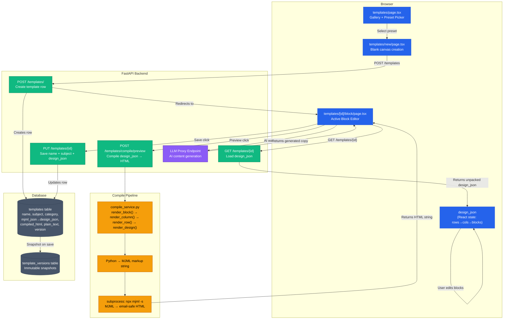

# Phase 3 — Developer Implementation Guide & Technical Audit
## Template Engine: How It's Built, How Every Piece Works, How to Extend It

> **Who is this for?** Any developer — beginner or senior — who needs to understand exactly how Phase 3 is built, what every file does, how a user's block editor actions become email-safe HTML, and how to implement or extend any part of the template pipeline from scratch.

---

## 1. Phase 3 Complete Architecture Map

Read this diagram first. It shows the exact path from the user editing a block in the browser to a stored, compiled email template.



---

## 2. Complete File Index — Phase 3

Every file relevant to Phase 3 and what it does:

| File | Layer | Role |
|---|---|---|
| `platform/api/routes/templates.py` | Backend | All template endpoints: CRUD + compile preview |
| `platform/api/services/template_service.py` | Backend | Template persistence: create, list, get, update, delete, design_json unpacking |
| `platform/api/services/compile_service.py` | Backend | Core rendering: design_json → MJML → HTML, preflight checks |
| `platform/api/models/template.py` | Backend | Pydantic schema validation for template payloads |
| `platform/client/src/app/templates/page.tsx` | Frontend | Templates list page with gallery and client-side search |
| `platform/client/src/app/templates/new/page.tsx` | Frontend | Blank canvas creation flow |
| `platform/client/src/app/templates/[id]/page.tsx` | Frontend | Redirect shim → `/templates/[id]/block` |
| `platform/client/src/app/templates/[id]/editor/page.tsx` | Frontend | Redirect shim → `/templates/[id]/block` |
| `platform/client/src/app/templates/[id]/block/page.tsx` | Frontend | **Active primary editor** — block editor UI |
| `platform/client/src/app/templates/[id]/builder/page.tsx` | Frontend | Legacy GrapesJS builder — NOT the active path |
| `platform/client/src/components/GrapesJSEditor.tsx` | Frontend | Stub — redirects users to block editor |
| `platform/client/src/data/templatePresets.ts` | Frontend | Static preset design_json definitions |
| `migrations/003_create_templates_table.sql` | Database | Base templates schema |
| `migrations/004_add_mjml_source.sql` | Database | Adds mjml_source column |

---

## 3. Database Schema — What We Built

```sql
-- Core templates table
templates (
  id UUID PRIMARY KEY DEFAULT gen_random_uuid(),
  tenant_id UUID NOT NULL REFERENCES tenants(id),
  name TEXT NOT NULL,
  subject TEXT DEFAULT '',
  category TEXT DEFAULT 'general',         -- 'newsletter' | 'promotional' | 'transactional' | 'event'
  mjml_json JSONB DEFAULT '{}',            -- ⚠️ design_json is stored NESTED inside here as mjml_json.design_json
  mjml_source TEXT DEFAULT '',             -- Legacy: raw MJML string (no longer written by active flow)
  compiled_html TEXT DEFAULT '<p>Loading…</p>',  -- Email-safe HTML output from MJML compiler
  plain_text TEXT DEFAULT '',              -- Plain-text version for spam filters
  template_type TEXT DEFAULT 'block',      -- 'block' | 'html' (block = structured editor)
  schema_version TEXT DEFAULT '1.0',
  version INTEGER DEFAULT 1,              -- Increments on every save (for versioning)
  created_at TIMESTAMPTZ DEFAULT NOW(),
  updated_at TIMESTAMPTZ DEFAULT NOW()
)
```

**Critical schema note:** `design_json` is NOT stored in a dedicated column. It is nested inside `mjml_json` as `mjml_json.design_json`. This is a compatibility shortcut that avoids a schema migration. The `TemplateService` unpacks it transparently on every fetch:
```python
# In template_service.py — always unpack on read
if template.get("mjml_json") and isinstance(template["mjml_json"], dict):
    template["design_json"] = template["mjml_json"].get("design_json", {})
```

---

## 4. The design_json Data Structure

`design_json` is the structured representation of the entire email template. It is a nested JSON object:

```json
{
  "rows": [
    {
      "id": "row-1",
      "columns": [
        {
          "id": "col-1",
          "width": 100,
          "blocks": [
            {
              "id": "block-1",
              "type": "text",
              "content": "<p>Hello <strong>{{first_name}}</strong>!</p>",
              "style": {
                "fontSize": "16px",
                "color": "#333333",
                "padding": "16px"
              }
            },
            {
              "id": "block-2",
              "type": "button",
              "label": "Click Here",
              "url": "https://example.com",
              "style": { "backgroundColor": "#4f46e5", "borderRadius": "6px" }
            }
          ]
        }
      ]
    }
  ],
  "globalStyle": {
    "backgroundColor": "#f5f5f5",
    "fontFamily": "Arial, sans-serif"
  }
}
```

Supported block types: `text`, `image`, `button`, `divider`, `spacer`, `social`, `hero`, `footer`

---

## 5. The Compile Pipeline — Step by Step

The compile pipeline lives in `platform/api/services/compile_service.py` and converts `design_json` → MJML → HTML.

### Step 1: `render_block(block)` — Converts one block to MJML

```python
def render_block(block: dict) -> str:
    btype = block.get("type")
    content = block.get("content", "")
    style = block.get("style", {})
    
    if btype == "text":
        return f'<mj-text font-size="{style.get("fontSize","14px")}" color="{style.get("color","#000")}">{content}</mj-text>'
    
    elif btype == "button":
        return f'<mj-button href="{block.get("url","#")}" background-color="{style.get("backgroundColor","#4f46e5")}">{block.get("label","Click")}</mj-button>'
    
    elif btype == "image":
        return f'<mj-image src="{block.get("src","")}" alt="{block.get("alt","")}" />'
    
    elif btype == "divider":
        return '<mj-divider border-color="#e0e0e0" />'
    
    # ... other block types
```

### Step 2: `render_column(column)` — Wraps blocks in an `<mj-column>`

```python
def render_column(column: dict) -> str:
    blocks_html = "".join(render_block(b) for b in column.get("blocks", []))
    width = column.get("width", 100)
    return f'<mj-column width="{width}%">{blocks_html}</mj-column>'
```

### Step 3: `render_row(row)` — Wraps columns in an `<mj-section>`

```python
def render_row(row: dict) -> str:
    columns_html = "".join(render_column(c) for c in row.get("columns", []))
    return f'<mj-section>{columns_html}</mj-section>'
```

### Step 4: `render_design(design_json)` — Assembles full MJML document

```python
def render_design(design_json: dict) -> str:
    rows_html = "".join(render_row(r) for r in design_json.get("rows", []))
    return f"""
    <mjml>
      <mj-body>
        {rows_html}
      </mj-body>
    </mjml>
    """
```

### Step 5: `compile_mjml_to_html(mjml_string)` — Invokes MJML CLI

```python
def compile_mjml_to_html(mjml_source: str) -> str:
    # Write MJML to a temp file, run the CLI, read back HTML
    result = subprocess.run(
        ["npx", "-y", "mjml", "--stdin"],
        input=mjml_source,
        capture_output=True, text=True, timeout=30
    )
    if result.returncode != 0:
        raise CompileError(result.stderr)
    return result.stdout  # Returns full email-safe HTML
```

**How to trigger it from the API:**
```python
# POST /templates/compile/preview
@router.post("/compile/preview")
async def compile_preview(body: CompileRequest, tenant_id = Depends(require_active_tenant)):
    mjml_string = render_design(body.design_json)
    html = compile_mjml_to_html(mjml_string)
    return {"html": html}
```

---

## 6. Preflight Checks — Built but Not Yet Wired

`compile_service.py` contains `run_preflight_checks(html)` with valuable logic that exists in code but is not yet exposed in the UI:

```python
def run_preflight_checks(html: str) -> list[dict]:
    warnings = []
    
    # Gmail clips emails over 102KB
    if len(html.encode("utf-8")) > 102_400:
        warnings.append({"level": "warning", "message": "Email exceeds 102KB — Gmail will clip it"})
    
    # Unsubscribe link is legally required (CAN-SPAM)
    if "unsubscribe" not in html.lower():
        warnings.append({"level": "error", "message": "No unsubscribe link found — required by CAN-SPAM"})
    
    # Spam trigger: excessive ALL CAPS
    caps_ratio = sum(1 for c in html if c.isupper()) / max(len(html), 1)
    if caps_ratio > 0.3:
        warnings.append({"level": "warning", "message": "High ratio of ALL CAPS text detected"})
    
    return warnings
```

**To wire this into the preview endpoint**, call `run_preflight_checks(html)` and include results in the API response:
```python
return {"html": html, "warnings": run_preflight_checks(html)}
```

---

## 7. Template Service — Key Implementation Details

### How `design_json` is saved (nested write):
```python
# In template_service.py — pack design_json into mjml_json before writing
def update_template(template_id, data, tenant_id):
    update_payload = {
        "name": data.get("name"),
        "subject": data.get("subject"),
        "mjml_json": {"design_json": data.get("design_json", {})},  # Nested!
        "version": current_version + 1,
        "updated_at": datetime.utcnow().isoformat()
    }
    db.table("templates").update(update_payload).eq("id", template_id).eq("tenant_id", tenant_id).execute()
```

### How `design_json` is read (unpack on fetch):
```python
def get_template(template_id, tenant_id):
    result = db.table("templates").select("*").eq("id", template_id).eq("tenant_id", tenant_id).execute()
    template = result.data[0]
    # Unpack compatibility layer
    if isinstance(template.get("mjml_json"), dict):
        template["design_json"] = template["mjml_json"].get("design_json", {})
    return template
```

---

## 8. Frontend Block Editor — Key Mechanics

The editor at `templates/[id]/block/page.tsx` holds the entire `design_json` in React state and updates it immutably on every user action:

```javascript
// Add a block to a column
const addBlock = (rowId, colId, blockType) => {
  setDesign(prev => ({
    ...prev,
    rows: prev.rows.map(row =>
      row.id === rowId ? {
        ...row,
        columns: row.columns.map(col =>
          col.id === colId ? {
            ...col,
            blocks: [...col.blocks, createNewBlock(blockType)]  // Immutable push
          } : col
        )
      } : row
    )
  }));
};

// Preview — send current design_json to backend, receive HTML
const handlePreview = async () => {
  const res = await fetch(`${API_URL}/templates/compile/preview`, {
    method: "POST",
    body: JSON.stringify({ design_json: design })
  });
  const { html } = await res.json();
  setPreviewHtml(html);  // Renders in an <iframe> sandbox
};

// Save — persist name, subject, current design_json
const handleSave = async () => {
  await fetch(`${API_URL}/templates/${templateId}`, {
    method: "PUT",
    body: JSON.stringify({ name, subject, design_json: design })
  });
};
```

---

## 9. Known Architectural Notes

- **`compiled_html` is NOT kept in sync on save.** The block editor save path sends `name`, `subject`, and `design_json` but does NOT include `compiled_html`. This means the stored HTML may not reflect the current design state. The fix is to compile inside the save handler before calling `PUT /templates/{id}`.
- **Duplicate template endpoint is missing.** The templates list page calls `POST /templates/{id}/duplicate` but this backend route does not exist. The frontend button will always throw a 404. Either implement the endpoint or remove the button.
- **GrapesJS is legacy, not active.** `templates/[id]/builder/page.tsx` still exists with a full GrapesJS implementation. It is NOT the primary editor. `templates/[id]/block/page.tsx` is the active path. The routing shims at `[id]/page.tsx` and `[id]/editor/page.tsx` both redirect to `/block`.
- **Hardcoded API URLs.** Different template pages mix `http://127.0.0.1:8000`, `http://localhost:8000`, and `NEXT_PUBLIC_API_URL`. Standardize all pages to use `process.env.NEXT_PUBLIC_API_URL`.
- **Version history shape exists but snapshots don't.** The `version` integer increments on every save, but there is no `template_versions` table or snapshot write. Restoring a previous version is not possible until snapshot writes are implemented.
- **Plain text has no editor tab.** The `plain_text` column exists in the schema and `TemplateService` supports it, but there is no UI tab in the block editor to view or edit the plain-text version. Auto-generation from compiled HTML is also not wired.
