# Email Engine — Complete Phase Plan

> This document is the **strategic planning guide** for the Email Engine platform.
> It describes what each phase is, why it exists, what it covers, and the technical architecture behind it.
> Progress tracking (what is done vs. pending) lives in the **interactive HTML tracker** (`docs/progress.html`).
> Live URL: https://rahul-pamula.github.io/ShrFlow/progress.html (redirect available at https://rahulpamula.me/ShrFlow/)

Each phase is divided into TWO parts:
  [BACKEND] — API, database, worker logic
  [FRONTEND] — Pages, components, UX flows

---

## 🏗 CRITICAL ARCHITECTURE: DUAL EMAIL ENGINE

Before phases — explain this first:

Our system sends two completely different types of emails:

1. **System Emails** — OTPs, welcome emails, team invites, password reset → sent via `shrmail.app@gmail.com` (Gmail SMTP) — almost always lands in the inbox because Gmail has a trusted reputation.
2. **Campaign Emails** — Bulk newsletters to thousands of subscribers → sent via the tenant's own verified domain (e.g. `sales@theircompany.com`) via **AWS SES** — isolates sender reputation per tenant.

> **Why this matters:** This design means even if one tenant's campaign has deliverability issues or spam complaints, it never affects our platform's ability to deliver critical OTPs and system alerts to another user.

### Architecture Flow

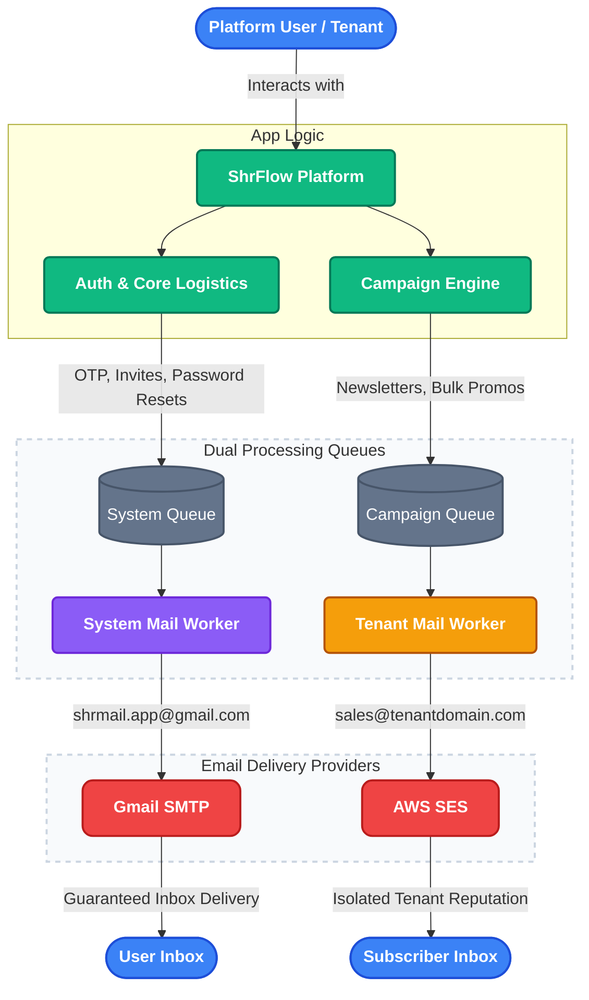
```mermaid
graph TD
    classDef userNode fill:#3b82f6,stroke:#1d4ed8,stroke-width:2px,color:#fff,font-weight:bold,rx:10px,ry:10px;
    classDef coreApp fill:#10b981,stroke:#047857,stroke-width:2px,color:#fff,font-weight:bold,rx:5px,ry:5px;
    classDef sysWorker fill:#8b5cf6,stroke:#6d28d9,stroke-width:2px,color:#fff,font-weight:bold,rx:5px,ry:5px;
    classDef tenWorker fill:#f59e0b,stroke:#b45309,stroke-width:2px,color:#fff,font-weight:bold,rx:5px,ry:5px;
    classDef provider fill:#ef4444,stroke:#b91c1c,stroke-width:2px,color:#fff,font-weight:bold,rx:10px,ry:10px;
    classDef db fill:#64748b,stroke:#475569,stroke-width:2px,color:#fff,rx:5px,ry:5px;
    
    User([Platform User / Tenant]) --> |Interacts with| App[ShrFlow Platform]
    class User userNode;
    class App coreApp;
    
    subgraph AppLogic [App Logic]
        Auth[Auth & Core Logistics]
        Campaigns[Campaign Engine]
        App --> Auth
        App --> Campaigns
        class Auth coreApp;
        class Campaigns coreApp;
    end

    subgraph DualProcessingQueues [Dual Processing Queues]
        SysQueue[(System Queue)]
        TenantQueue[(Campaign Queue)]
        Auth --> |"OTP, Invites, Password Resets"| SysQueue
        Campaigns --> |"Newsletters, Bulk Promos"| TenantQueue
        class SysQueue db;
        class TenantQueue db;

        SysWorker[System Mail Worker]
        TenantWorker[Tenant Mail Worker]
        SysQueue --> SysWorker
        TenantQueue --> TenantWorker
        class SysWorker sysWorker;
        class TenantWorker tenWorker;
    end

    subgraph EmailDeliveryProviders [Email Delivery Providers]
        Gmail[Gmail SMTP]
        SES[AWS SES]
        SysWorker --> |"shrmail.app@gmail.com"| Gmail
        TenantWorker --> |"sales@tenantdomain.com"| SES
        class Gmail provider;
        class SES provider;
    end

    Inbox1([User Inbox])
    Inbox2([Subscriber Inbox])
    Gmail --> |"Guaranteed Inbox Delivery"| Inbox1
    SES --> |"Isolated Tenant Reputation"| Inbox2
    class Inbox1 userNode;
    class Inbox2 userNode;

    classDef dualBox fill:#f8fafc,stroke:#cbd5e1,stroke-width:2px,stroke-dasharray: 5 5;
    class DualProcessingQueues dualBox;
    class EmailDeliveryProviders dualBox;
```

---

## Phase 0 — UI/UX Foundation & Design System
**WHY:** Establishes the visual language, reusable UI primitives, interaction rules, and accessibility baseline before feature work scales.

### Phase 0 Implementation Snapshot

The core frontend foundation has now been substantially implemented in the product shell and primary work surfaces.

Implemented foundation work includes:
- Hybrid app shell with persistent sidebar plus global header.
- Product IA aligned to Dashboard, Contacts, Templates, Campaigns, Analytics, Infrastructure, and Settings.
- Shared design primitives expanded beyond the original base set:
  `SectionCard`, `InlineAlert`, `FilterBar`, `KeyValueList`, `TableToolbar`, `InspectorPanel`, `ModalShell`.
- Core operational pages standardized onto the shared system:
  Dashboard, Contacts, Campaigns, Templates, Analytics, Infrastructure, and major Settings areas.
- Core workflow modernization completed for the campaign wizard shell and primary steps.
- Native destructive dialogs replaced across major flows with shared confirm patterns.
- Theme infrastructure active through `next-themes`, currently following the operating system theme via CSS variable tokens.

Remaining Phase 0 cleanup is mostly edge-polish and legacy-page normalization rather than missing foundation architecture.

### Phase 0 Architecture Flow

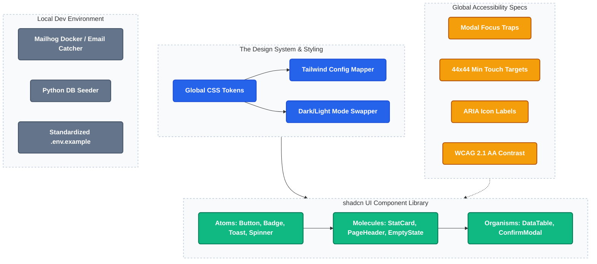
```mermaid
graph TD
    classDef foundation fill:#2563eb,stroke:#1d4ed8,stroke-width:2px,color:#fff,font-weight:bold,rx:5px,ry:5px;
    classDef component fill:#10b981,stroke:#047857,stroke-width:2px,color:#fff,font-weight:bold,rx:5px,ry:5px;
    classDef a11y fill:#f59e0b,stroke:#b45309,stroke-width:2px,color:#fff,font-weight:bold,rx:5px,ry:5px;
    classDef devtool fill:#64748b,stroke:#475569,stroke-width:2px,color:#fff,font-weight:bold,rx:5px,ry:5px;

    subgraph TheDesignSystem [The Design System & Styling]
        Tokens[Global CSS Tokens]
        Tailwind[Tailwind Config Mapper]
        Theme[Dark/Light Mode Swapper]
        Tokens --> Tailwind
        Tokens --> Theme
        class Tokens foundation;
        class Tailwind foundation;
        class Theme foundation;
    end

    subgraph ComponentLibrary [shadcn UI Component Library]
        Atoms[Atoms: Button, Badge, Toast, Spinner]
        Molecules[Molecules: StatCard, PageHeader, EmptyState]
        Organisms[Organisms: DataTable, ConfirmModal]
        Atoms --> Molecules
        Molecules --> Organisms
        class Atoms component;
        class Molecules component;
        class Organisms component;
    end

    subgraph AccessibilityLayer [Global Accessibility Specs]
        Focus[Modal Focus Traps]
        Touch[44x44 Min Touch Targets]
        Aria[ARIA Icon Labels]
        Contrast[WCAG 2.1 AA Contrast]
        class Focus a11y;
        class Touch a11y;
        class Aria a11y;
        class Contrast a11y;
    end

    subgraph LocalDeveloperTools [Local Dev Environment]
        Mailhog[Mailhog Docker / Email Catcher]
        Seeder[Python DB Seeder]
        Env[Standardized .env.example]
        class Mailhog devtool;
        class Seeder devtool;
        class Env devtool;
    end

    TheDesignSystem --> ComponentLibrary
    AccessibilityLayer -.-> ComponentLibrary

    classDef dualBox fill:#f8fafc,stroke:#cbd5e1,stroke-width:2px,stroke-dasharray: 4 4;
    class TheDesignSystem dualBox;
    class ComponentLibrary dualBox;
    class AccessibilityLayer dualBox;
    class LocalDeveloperTools dualBox;
```

**[BACKEND]**
- Mailhog added to docker-compose for local email testing and debugging.
- Database seed script (`seed_dev_data.py`) for reproducible development states.
- Standardized environment variables fully documented in `.env.example`.

**[FRONTEND]**
- Dark-mode first design tokens in `globals.css` bridged via `tailwind.config.ts`.
- Typography scale and semantic color set defined.
- Reusable UI component library (`Button`, `Badge`, `StatCard`, `DataTable`, `Toast`, `ConfirmModal`, `EmptyState`, etc.).
- Standard page layout pattern: Breadcrumb -> PageHeader -> Stat row -> DataTable -> EmptyState.
- Accessible modal implementations with focus traps, escape-to-close, and visible outlines.
- WCAG 2.1 AA color contrast validation and minimum 44x44px touch-target guidance enforced.

**📋 Planned Tasks — Phase 0**
- shadcn/ui installed and initialized
- Inter font installed in root layout
- Core dark-mode tokens exist in globals.css
- Typography scale is fully defined
- Semantic token set is complete
- App no longer uses hardcoded colors or inline style-heavy UI
- Design Tokens Documentation Page (internal token reference)
- Loading skeletons on all list pages (contacts, campaigns, templates)
- Dark / Light mode toggle (CSS variable swap)
- Button.tsx
- Badge.tsx
- HealthDot.tsx
- LoadingSpinner.tsx
- StatCard.tsx
- StatusBadge.tsx
- ConfirmModal.tsx
- Toast.tsx
- PageHeader.tsx
- DataTable.tsx
- EmptyState.tsx
- Breadcrumb.tsx
- src/components/ui/index.ts
- Tailwind config maps tokens to utility names
- All mapped Tailwind token names resolve to actual CSS variables
- Every destructive action uses ConfirmModal
- Every async form submit uses loading state consistently
- Every API success path uses toast feedback consistently
- Every API error path uses toast feedback consistently
- Every empty list uses EmptyState
- Every list page has consistent search and filter behavior
- Mobile navigation is complete end-to-end
- Remove global *:focus { outline: none }
- Modal accessibility is complete (focus trap + restore)
- Icon-only buttons are fully labeled app-wide
- 44x44 touch-target guidance is satisfied app-wide
- Mailhog added to docker-compose.yml
- scripts/seed_dev_data.py added
- .env.example fully documents all required variables

---

---

---

### 🚀 Newly Discovered (From Codebase)
- `AuthContext.tsx` handles complex global state and route guards.
- Extensive use of Lucide React icons.

---

### 🧱 Architecture
- Planned: Basic UI components.
- Actual: Fully integrated hybrid app shell with persistent sidebar and complex layout wrappers.
- Impact: Highly robust frontend foundation.

---

### 🎨 UI / UX
- Pages/components implemented: Dashboard, Contacts, Settings, Campaigns, Templates.
- Missing flows: None in base UI.
- Inconsistent patterns: Some older forms might not use the latest `Input` or `SectionCard` wrapper, but mostly uniform.
- RBAC visibility issues in UI: `can()` utility actively used to hide elements.

## Phase 1 — Foundation, Auth, Tenant Identity & Onboarding
**WHY:** Before any email can be sent, we need a secure multi-tenant foundation. Every query, row, and action must be strictly isolated by `tenant_id`.

### Phase 1 Architecture Flow

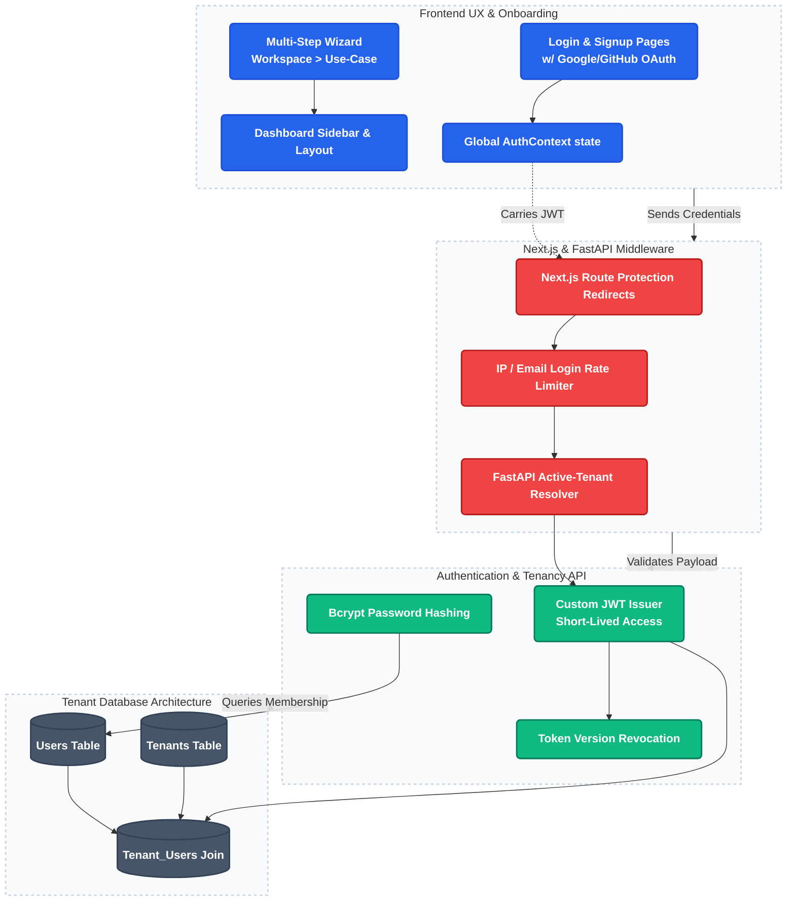
```mermaid
graph TD
    classDef frontend fill:#2563eb,stroke:#1d4ed8,stroke-width:2px,color:#fff,font-weight:bold,rx:5px,ry:5px;
    classDef auth fill:#10b981,stroke:#047857,stroke-width:2px,color:#fff,font-weight:bold,rx:5px,ry:5px;
    classDef security fill:#ef4444,stroke:#b91c1c,stroke-width:2px,color:#fff,font-weight:bold,rx:5px,ry:5px;
    classDef database fill:#475569,stroke:#334155,stroke-width:2px,color:#fff,font-weight:bold,rx:5px,ry:5px;

    subgraph UserInterface [Frontend UX & Onboarding]
        Login[Login & Signup Pages <br> w/ Google/GitHub OAuth]
        Wizard[Multi-Step Wizard <br> Workspace > Use-Case]
        DashboardShell[Dashboard Sidebar & Layout]
        Context[Global AuthContext state]
        
        Login --> Context
        Wizard --> DashboardShell
        class Login frontend;
        class Wizard frontend;
        class DashboardShell frontend;
        class Context frontend;
    end

    subgraph SecurityMiddleware [Next.js & FastAPI Middleware]
        RouteGuard[Next.js Route Protection Redirects]
        FastAPIGuard[FastAPI Active-Tenant Resolver]
        RateLimit[IP / Email Login Rate Limiter]
        
        Context -.-> |"Carries JWT"| RouteGuard
        RouteGuard --> RateLimit
        RateLimit --> FastAPIGuard
        class RouteGuard security;
        class FastAPIGuard security;
        class RateLimit security;
    end

    subgraph AuthEngine [Authentication & Tenancy API]
        JWT[Custom JWT Issuer <br> Short-Lived Access]
        Revocation[Token Version Revocation]
        Bcrypt[Bcrypt Password Hashing]
        
        FastAPIGuard --> JWT
        JWT --> Revocation
        class JWT auth;
        class Revocation auth;
        class Bcrypt auth;
    end

    subgraph TenantModel [Tenant Database Architecture]
        Users[(Users Table)]
        Tenants[(Tenants Table)]
        TenantUsers[(Tenant_Users Join)]
        
        Users --> TenantUsers
        Tenants --> TenantUsers
        Bcrypt --> Users
        JWT --> TenantUsers
        class Users database;
        class Tenants database;
        class TenantUsers database;
    end

    UserInterface --> |"Sends Credentials"| SecurityMiddleware
    SecurityMiddleware --> |"Validates Payload"| AuthEngine
    AuthEngine --> |"Queries Membership"| TenantModel

    classDef dualBox fill:#f8fafc,stroke:#cbd5e1,stroke-width:2px,stroke-dasharray: 4 4;
    class UserInterface dualBox;
    class SecurityMiddleware dualBox;
    class AuthEngine dualBox;
    class TenantModel dualBox;
```

**[BACKEND]**
- Custom email/password auth using bcrypt and JWT validation.
- JWT payloads carry `tenant_id`, `user_id`, `role`, and `email` for rapid authorization.
- Tenant membership model linking `users`, `tenants`, via a `tenant_users` join table.
- Onboarding APIs providing step-by-step wizard endpoints (workspace creation, use-case selection).
- Active-tenant request-time guards verifying valid workspace context.

**[FRONTEND]**
- Modern Login and Signup pages supporting Social Auth (Google/GitHub context).
- Multi-step interactive onboarding wizard (`workspace` -> `use-case` -> `integrations` -> `scale` -> `complete`).
- Sidebar navigation layout governing the dashboard shell.
- Global `AuthContext` distributing verified session state across components.
- Middleware executing route protection and redirecting unauthenticated traffic safely.

**📋 Planned Tasks — Phase 1**
- Custom email/password auth (bcrypt + custom JWT)
- Tenant membership model (users, tenants, tenant_users)
- Onboarding flow (4-step wizard + progressive endpoints)
- JWT middleware (tenant_id, role, email, user_id verification)
- Active-tenant guard exists
- Workspace switching exists
- /auth/me fully implemented
- All onboarding endpoints use JWT-only tenant resolution consistently
- Login page
- Signup page
- reCAPTCHA on Signup form
- Onboarding wizard (workspace > use-case > integrations > scale > complete)
- Interactive onboarding checklist on dashboard
- Sidebar navigation layout
- Auth context exists
- Middleware redirects exist
- Route protection is fully centralized and consistent
- JWT carries tenant identity
- X-Tenant-ID is validated against JWT when used
- Onboarding tenants are blocked from active-tenant routes
- Social Auth (Google, GitHub) via OAuth 2.0
- Rate limiting on login + registration endpoints (per IP, per email)
- Email verification required before onboarding completes
- Short-lived access tokens (15-30 min) + silent refresh tokens
- Token revocation via token_version counter

---

---

---

### 🚀 Newly Discovered (From Codebase)
- "Onboarding Escape" mechanism in `AuthContext` to rescue users trapped in ghost workspaces.

---

### 🔐 RBAC System
- Roles involved: Owner, Admin, Member, Viewer.
- What is enforced in backend: `require_authenticated_user` checks valid JWT. Role enforcement exists in other modules via `require_permission`.
- What is enforced in frontend: `AuthContext` guards prevent unauthenticated access and route users through onboarding.
- Missing enforcement: None at auth level.

---

### 🧱 Architecture
- Planned: Standard JWT.
- Actual: Custom JWT with `tenant_id`, `role`, and `user_id` injected for stateless authorization.

---

### 🎨 UI / UX
- Pages implemented: Login, Signup, Onboarding Workspace/Use Case flows.
- Missing flows: None.

---

### 🚀 Features (From Real System)
- **Onboarding Escape Guard**
  - **What it does:** Automatically rescues users trapped in an uncompleted "ghost" workspace by redirecting them to their active workspace.
  - **Where it exists:** `platform/client/src/context/AuthContext.tsx`
  - **Why it belongs here:** Auth and Tenant Routing foundation.
  - **Classification:** Core Feature

### 🎨 UI / UX
- **What UI exists:** Complete onboarding wizard and login flows.
- **RBAC visibility mismatches:** None detected.

- **Plan vs actual mismatch:** The original plan did not account for edge cases where a user could have multiple workspaces in differing states of completion, requiring the newly added Escape Guard.

## Phase 1.5 — Auth Hardening & Audit Logging
**WHY:** Secures the core authentication layer and introduces deep observability for crucial tenant actions.

**[BACKEND]**
- Immutable audit log table recording metadata securely (`user_id`, `tenant_id`, `action`, `resource_type`, timestamp). Never logs sensitive email contents or PII lists.
- Log severity levels distinguishing INFO, WARNING, and CRITICAL actions.
- Automated system alerts via Centralized System Emailer triggering when CRITICAL events occur (e.g., massive contact deletion).
- Two-factor auth (TOTP) generation capability for workspace administrators.

**[FRONTEND]**
- Audit log viewer UI component allowing workspace owners to filter team actions chronologically.
- 2FA setup screen rendering secure QR codes and validating TOTP generation.

**📋 Planned Tasks — Phase 1.5**
- Remove custom /auth/forgot-password endpoint
- Remove custom /auth/reset-password endpoint
- reCAPTCHA token verification endpoint/middleware
- Audit logs table (who did what, when, on which record — metadata only)
- Audit log table is write-only / immutable (no UPDATE or DELETE allowed)
- Log severity levels: INFO / WARNING / CRITICAL on every log row
- Auto-alert on CRITICAL log events (bulk delete >1000, suspicious login)
- Configure Supabase Auth SMTP to use shrmail.app@gmail.com
- Fix forgot-password page — Supabase Auth built-in reset email flow
- Fix reset-password page — Supabase Auth password update
- Test: sign up > verify email > login > forgot password > reset
- Audit log viewer with severity filter (INFO / WARNING / CRITICAL)
- MFA via TOTP for workspace admins
- [AUDIT FIX 1] Cross-tenant webhook suppression — add tenant_id filter to _suppress_contact()
- [AUDIT FIX 2] JWT refresh token model — 30-min access token + HttpOnly refresh cookie + token_version revocation
- [SECURITY UPGRADE] **PostgreSQL Row Level Security (RLS)** — Move multi-tenancy logic to the database level for bulletproof isolation.
- [AUDIT FIX 3] Lock CORS to FRONTEND_URL env var — no wildcard in production
- [AUDIT FIX 4] Enable SSL cert verification in worker — remove ssl.CERT_NONE
- [AUDIT FIX 5] Delete /contacts/upload + /test-send from main.py; remove dev scripts from repo root
- [AUDIT FIX 6] Remove duplicate events router registration in main.py
- [FRIEND AUDIT FIX 17] OAuth State Parameter — validate random state string in Google/GitHub OAuth flow
- [GAP 1 — System Email Provider Risk] Track daily system email count in Redis key `system:emails:sent:{date}`
- [GAP 1] Auto-trigger CRITICAL audit log when system email count exceeds 1,600/day (80% of Workspace limit)
- [GAP 1] Add `SYSTEM_MAILER=gmail|ses` env flag — abstraction layer for future migration

> ⚠️ **Gmail Risk Note:** `shrmail.app@gmail.com` is capped at ~2,000 emails/day on Workspace. At moderate signup volume (200 users/day triggering welcome + verification = 400 emails/day), this limit will be hit within months. **Migration target: Phase 9 — `mail.shrflow.app` via AWS SES.** See Phase 9 for full plan.

---

---

---

### 🔐 RBAC System
- Roles involved: System.
- What is enforced in backend: Audit logs are append-only.
- What is enforced in frontend: Audit viewer UI available in settings.

## Phase 1.6 — GDPR & Legal Compliance
**WHY:** Ensures the system complies with EU data regulations securely before enterprise deployment.

**[BACKEND]**
- Async data export API generating ZIP files of all tenant contact data using a job queuing system avoiding HTTP timeouts.
- "Right to be Forgotten" endpoint triggering PII anonymization (`deleted@gdpr.invalid`) instead of hard deletion to perfectly preserve aggregate analytics history.
- Soft-delete architectural pattern utilizing `deleted_at` timestamps establishing a 30-day "recycle bin" restoration window.
- Consent tracking capturing import source, exact timestamp, and originating IP upon list ingestion.

**[FRONTEND]**
- Quick data export request functionality in Settings routing download instructions to email.
- Restoration action flows permitting users to undelete soft-deleted items.
- Specific consent and source columns visibly rendered in the contacts data table.

**📋 Planned Tasks — Phase 1.6**
- Data export API (async job — POST > job_id > poll > download ZIP)
- Right to be forgotten: DELETE /contacts/{id}/anonymize (anonymize PII, keep row)
- Soft delete pattern: deleted_at on contacts, campaigns, templates (30-day restore)
- Consent tracking: consent_source, consent_date, consent_ip on contacts
- Data retention policy: auto-flag contacts inactive >24 months for purge
- Consent re-validation: exclude contacts with consent >24 months old
- Do Not Contact (DNC) global suppression list (platform-level, blocks all emails)
- Restore modal for soft-deleted items
- Data export button in Settings
- Consent column visible in contacts table
- Privacy policy / Terms page linked from footer

---

---

### 🚀 Features (From Real System)
- **GDPR Erasure Endpoint**
  - **What it does:** Anonymizes user PII to comply with GDPR Right to be Forgotten without destroying aggregate analytics.
  - **Where it exists:** `platform/api/routes/settings.py` (`gdpr_erase_contact`)
  - **Why it belongs here:** GDPR Compliance block.
  - **Classification:** Partial Feature (Backend only, UI missing)

### 🎨 UI / UX
- **Missing flows:** The Data Export and GDPR Erasure triggers are not fully wired into the user-facing Settings UI. Restore modal for soft-deleted contacts is incomplete.

## Phase 1.7 — Enterprise Workspace Lifecycle & Data Isolation
**WHY:** Ensures data stays with the company, not the individual, and provides a professional invite-only onboarding for team members. Also locks the data isolation layer at the database level so no application bug can ever leak cross-tenant data.

**[BACKEND]**
- **Invitation System Architecture**:
    - `invitations` table: `email`, `tenant_id`, `role`, `token`, `expires_at`, `invited_by`.
    - Secure Token Generation (SHA-256) with 7-day expiry.
    - `POST /invitations`: Validates that the email isn't already a member.
- **Data Sovereignty Design**:
    - All business objects (`contacts`, `templates`, `campaigns`) are linked to `tenant_id`, NOT the individual `user_id`.
    - Cascading rules: Deleting a user ONLY removes their access (deleting from `tenant_users`); it does NOT delete their created content.
    - `created_by_user_id` is retained for history, even if the user is removed.
- **PostgreSQL Row Level Security (RLS)**:
    - Implementation of `ALTER TABLE ENABLE ROW LEVEL SECURITY`.
    - Session variable `app.current_tenant_id` set via `SET LOCAL` in the database service.
    - asyncpg connection pool replaces Supabase PostgREST for all write paths (PostgREST cannot set session variables).
- **Security Hardening (Critical)**:
    - SNS webhook signature verification on all SES event endpoints — validates `x-amz-sns-message-signature` before processing any bounce/complaint.
    - CORS locked to `FRONTEND_URL` env var (remove wildcard `*` from production).
    - Redis key namespace standardized to `tenant:{tenant_id}:*` across all workers and API routes to prevent cross-tenant key collisions.

**[FRONTEND]**
- **Invite Modal**: Admin UI to enter email and select a Role (Owner, Admin, Member, Viewer).
- **Public Invitation Landing Page**: Handles token validation and forces signup/login before joining the workspace.
- **Workspace Switcher Header**: A global dropdown allowing users to move between multiple tenant contexts seamlessly.

**📋 Planned Tasks — Phase 1.7**
- [SECURITY — CRITICAL] SNS webhook signature verification (validate `x-amz-sns-message-signature` before any bounce/complaint processing)
- [SECURITY — CRITICAL] CORS lock to `FRONTEND_URL` env var (remove wildcard `*` in production)
- [STABILITY — CRITICAL] asyncpg connection pool setup (`platform/api/utils/db_engine.py`) — replaces Supabase PostgREST for all core queries
- [STABILITY — CRITICAL] PostgreSQL RLS: `ALTER TABLE ... ENABLE ROW LEVEL SECURITY` + `SET LOCAL app.current_tenant_id` on every asyncpg transaction
- [STABILITY] Redis key namespace standardized to `tenant:{tenant_id}:*` across all workers and API routes
- [WORKSPACE] Invitations table schema + migration
- [WORKSPACE] POST /invitations — token generation, email send, duplicate check
- [WORKSPACE] GET /invitations/accept?token=... — validate + join workspace
- [WORKSPACE] DELETE /invitations/{id} — cancel pending invite
- [WORKSPACE] Member removal endpoint (delete from tenant_users, invalidate session)
- [WORKSPACE] Data sovereignty: cascade delete from tenant_users only, never from content tables
- [WORKSPACE FRONTEND] Invite modal (email + role selector)
- [WORKSPACE FRONTEND] Public invite landing page (token → signup/login → join)
- [WORKSPACE FRONTEND] Workspace Switcher dropdown in global header

---

---

---

### 🔐 RBAC System
- Roles involved: Owner, Admin, Creator, Viewer.
- What is enforced in backend: Endpoint `DELETE /settings/workspace/{tenant_id}` explicitly checks `tenant_users.role`. Only Owners can delete (if solo), others only leave.
- What is enforced in frontend: Organization Settings UI conditionally renders "Delete Workspace" vs "Leave Workspace" based on role.
- Risk: None, strict enforcement at DB and API layer.

---

### 🧱 Architecture
- Planned: RLS.
- Actual: RLS heavily enforced. Migration from Supabase PostgREST to `asyncpg` connection pool to allow `SET LOCAL app.current_tenant_id` for true transaction-level data isolation.

## Phase 1.8 — Account Layer & Workspace Navigation

### WHY
- Multi-workspace UX problem
- Need for centralized navigation
- Prevent onboarding inconsistencies
- Enable scalable SaaS structure

### ARCHITECTURE PRINCIPLE
Account = identity + navigation
Workspace = business logic

🚫 No business logic in account layer

### ONBOARDING ALIGNMENT
- onboarding is workspace-scoped
- tied to tenant_id
- runs per workspace
- not global per user

### FLOW DEFINITIONS
- New user → create workspace → onboarding → enter
- 1 workspace → direct entry
- multiple → account dashboard
- new workspace → onboarding again

**[BACKEND]**
- Add `GET /account/workspaces`
- Add `GET /account/invitations`
- Add `POST /account/switch`
- Add `user_preferences` table:
  - `user_id`
  - `last_active_tenant_id`
- Add `workspace_creation_logs` table:
  - `user_id`
  - `created_at`
  - `ip_address`
- Add workspace limit per user
- Add creation rate limiting

**[FRONTEND]**
- `/account` dashboard
- workspace list UI
- invitations section
- create workspace button
- workspace switcher (global header)
- smart login routing:
  - `1 workspace` → direct
  - `multiple` → `/account`

### INTEGRATION
- uses Phase 1 auth system
- integrates Phase 1.7 invitations
- does NOT affect Phase 2+

### ROLLOUT PLAN
- A → backend
- B → switcher
- C → dashboard
- D → routing

### CRITICAL RULES
- no business logic in account layer
- tenant isolation must remain
- all APIs validate `tenant_users`
- no regression allowed

---

## Phase 1.9 — MCP Framework & Developer Intelligence
**WHY:** Establish a standardized "AI-to-Code" bridge (Model Context Protocol) to allow AI agents to assist in system monitoring, debugging, and automated testing during the build process.

### Phase 1.9 Architecture Flow

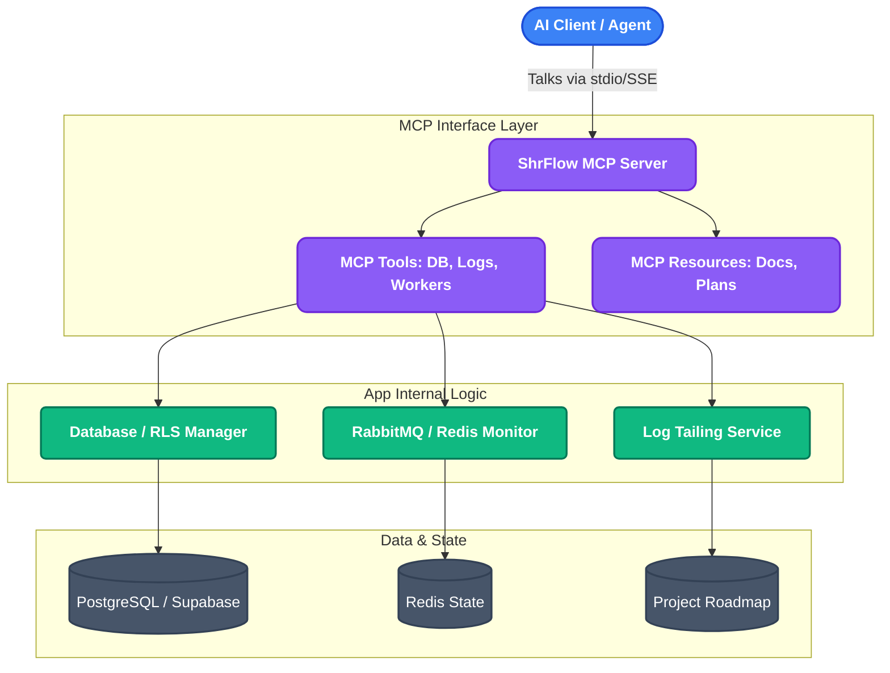
```mermaid
graph TD
    classDef mcp fill:#8b5cf6,stroke:#6d28d9,stroke-width:2px,color:#fff,font-weight:bold,rx:10px,ry:10px;
    classDef logic fill:#10b981,stroke:#047857,stroke-width:2px,color:#fff,font-weight:bold,rx:5px,ry:5px;
    classDef client fill:#3b82f6,stroke:#1d4ed8,stroke-width:2px,color:#fff,font-weight:bold,rx:10px,ry:10px;
    classDef storage fill:#475569,stroke:#334155,stroke-width:2px,color:#fff,rx:5px,ry:5px;

    AIClient([AI Client / Agent]) --> |"Talks via stdio/SSE"| MCPServer[ShrFlow MCP Server]
    class AIClient client;
    class MCPServer mcp;

    subgraph MCPLayer [MCP Interface Layer]
        Tools[MCP Tools: DB, Logs, Workers]
        Resources[MCP Resources: Docs, Plans]
        MCPServer --> Tools
        MCPServer --> Resources
        class Tools mcp;
        class Resources mcp;
    end

    subgraph AppInternal [App Internal Logic]
        DBLogic[Database / RLS Manager]
        LogLogic[Log Tailing Service]
        QueueLogic[RabbitMQ / Redis Monitor]
        
        Tools --> DBLogic
        Tools --> LogLogic
        Tools --> QueueLogic
        class DBLogic logic;
        class LogLogic logic;
        class QueueLogic logic;
    end

    subgraph Persistence [Data & State]
        PG[(PostgreSQL / Supabase)]
        Redis[(Redis State)]
        Docs[(Project Roadmap)]
        
        DBLogic --> PG
        LogLogic --> Docs
        QueueLogic --> Redis
        class PG storage;
        class Redis storage;
        class Docs storage;
    end
```

**[BACKEND]**
- Initialize `scripts/mcp/` directory with `mcp_server.py` foundation using the Python MCP SDK.
- Implement a shared database connection manager for MCP that respects existing Supabase credentials.
- Define `db_inspector` tool to safely read database schema, column types, and RLS policy metadata.
- Define `audit_viewer` tool to query immutable audit records chronologically for debugging.
- Define `worker_monitor` tool to check RabbitMQ queue depths and active Redis distributed locks.
- Implement resource providers for live-tailing application logs and project documentation.

**[FRONTEND / DEV]**
- Generate `mcp_config.json` template for AI Client (e.g., Claude Desktop) integration.
- Expose `phase_wise_plan.md` as an MCP Resource to provide the AI with live project context.
- Document local developer setup for connecting external AI models to the ShrFlow MCP server.

**📋 Planned Tasks — Phase 1.9**
- Initialize `scripts/mcp/` directory
- Create `mcp_server.py` with FastMCP foundation
- Implement shared DB connection utility for MCP
- Add `db_inspector` tool (read schema/RLS)
- Add `audit_viewer` tool (query audit_logs)
- Add `worker_monitor` tool (query RabbitMQ/Redis)
- Create `mcp_config.json` for AI client linking
- Expose `phase_wise_plan.md` as an MCP Resource
- Expose `/logs` as a tailing MCP Resource
- Manual verification: Connect Claude Desktop to ShrFlow MCP and query DB schema

---

## Phase 2 — Contacts Engine

**WHY:** Contacts are the core dataset. This phase creates a stable, scalable lifecycle for importing, managing, suppressing, and tagging audiences.

### Phase 2 Architecture Flow

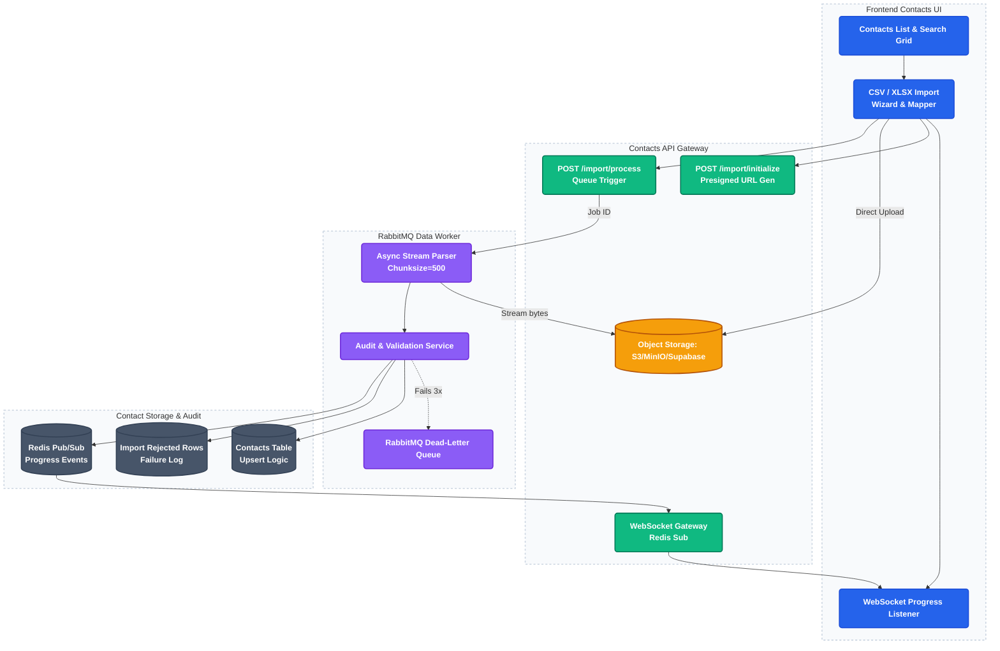
```mermaid
graph TD
    classDef frontend fill:#2563eb,stroke:#1d4ed8,stroke-width:2px,color:#fff,font-weight:bold,rx:5px,ry:5px;
    classDef api fill:#10b981,stroke:#047857,stroke-width:2px,color:#fff,font-weight:bold,rx:5px,ry:5px;
    classDef worker fill:#8b5cf6,stroke:#6d28d9,stroke-width:2px,color:#fff,font-weight:bold,rx:5px,ry:5px;
    classDef database fill:#475569,stroke:#334155,stroke-width:2px,color:#fff,font-weight:bold,rx:5px,ry:5px;
    classDef storage fill:#f59e0b,stroke:#b45309,stroke-width:2px,color:#fff,font-weight:bold,rx:5px,ry:5px;

    subgraph ContactsInterface [Frontend Contacts UI]
        List[Contacts List & Search Grid]
        ImportModal[CSV / XLSX Import <br> Wizard & Mapper]
        WS[WebSocket Progress Listener]
        
        List --> ImportModal
        ImportModal --> WS
        class List frontend;
        class ImportModal frontend;
        class WS frontend;
    end

    subgraph ContactsAPI [Contacts API Gateway]
        InitAPI[POST /import/initialize <br> Presigned URL Gen]
        ProcessAPI[POST /import/process <br> Queue Trigger]
        WSGW[WebSocket Gateway <br> Redis Sub]
        
        ImportModal --> InitAPI
        ImportModal --> |"Direct Upload"| S3[(Object Storage: S3/MinIO/Supabase)]
        ImportModal --> ProcessAPI
        WSGW --> WS
        class InitAPI api;
        class ProcessAPI api;
        class WSGW api;
        class S3 storage;
    end

    subgraph ImportWorker [RabbitMQ Data Worker]
        Chunker[Async Stream Parser <br> Chunksize=500]
        Validator[Audit & Validation Service]
        DLQ[RabbitMQ Dead-Letter Queue]
        
        ProcessAPI --> |"Job ID"| Chunker
        Chunker --> |"Stream bytes"| S3
        Chunker --> Validator
        Validator -.-> |"Fails 3x"| DLQ
        class Chunker worker;
        class Validator worker;
        class DLQ worker;
    end

    subgraph DataLayer [Contact Storage & Audit]
        Contacts[(Contacts Table <br> Upsert Logic)]
        Rejections[(Import Rejected Rows <br> Failure Log)]
        Redis[(Redis Pub/Sub <br> Progress Events)]
        
        Validator --> Contacts
        Validator --> Rejections
        Validator --> Redis
        Redis --> WSGW
        class Contacts database;
        class Rejections database;
        class Redis database;
    end

    classDef dualBox fill:#f8fafc,stroke:#cbd5e1,stroke-width:2px,stroke-dasharray: 4 4;
    class ContactsInterface dualBox;
    class ContactsAPI dualBox;
    class ImportWorker dualBox;
    class DataLayer dualBox;
```

### 🔄 Contacts Import: Deep-Dive Execution Flow

To support gigabyte-scale datasets without memory exhaustion, the import process follows a **Storage-First** and **Queue-Second** distributed pipeline:

1.  **Step 1: Initialization (`POST /import/initialize`)**: The UI requests a Job ID and a **S3/MinIO Presigned URL**. No file data is sent to the API.
2.  **Step 2: Direct-to-Storage Upload**: The Frontend uploads the raw CSV/XLSX directly to the object store. This bypasses API memory entirely.
3.  **Step 3: Signal Process (`POST /import/process`)**: Once the upload is verified, the UI signals the API to enqueue the work.
4.  **Step 4: RabbitMQ Tasking**: The API pushes a metadata message to the `import_tasks` queue.
5.  **Step 5: Distributed Streaming Worker**: 
    - A dedicated worker opens a stream from the object store.
    - It reads content in **chunks of 500 rows** (OOM prevention).
    - It validates each row (Syntax, MX Check, Disposable detection).
    - **Upsert Layer**: Valid contacts are inserted into Postgres; collisions are merged based on tenant_id + email.
    - **Audit Layer**: Failed rows are pushed to `import_rejected_rows` with specific error reasons.
6.  **Step 6: Real-time Progress (WebSockets)**: The worker publishes progress updates to **Redis Pub/Sub**, which are broadcast to the user via the WebSocket Gateway.

### 🚀 Why This Is Better (Old vs New)

| Feature | Old Architecture | NEW Enterprise Architecture |
| :--- | :--- | :--- |
| **Upload Reliability** | API times out on large files | Direct-to-Storage (Impossible to timeout) |
| **Memory Strategy** | Reads entire CSV into RAM (Crashes) | Streams in 500-row chunks (OOM safe) |
| **User Feedback** | "Please wait..." (Static spinner) | Live progress bar with real-time failure stats |
| **Fault Tolerance** | If API restarts, upload is lost | RabbitMQ ensures worker finishes tasks |
| **Data Integrity** | Silently skips errors | Precision Audit Logs for every rejected row |

**[BACKEND]**
- High-performance, streaming CSV/XLSX ingestion running asynchronously via RabbitMQ to support gigabyte-scale datasets.
- Real-time single contact insertion REST API designed for external CRM or web-form integrations.
- Tiered validation sequence rejecting malformed domains and detecting Disposable Email Providers instantly.
- Complex deduplication and append behavior preventing collisions.
- Contact scoring system assigning Engagement Scores (e.g., "Inactive", "Highly Engaged").
- **Smart Data Mapping & Splitting**: Enforce strict JSON key normalization during CSV imports (e.g., mapping "Full Name" to `first_name` and `last_name` via automatic string splitting) to guarantee Merge Tags resolve correctly.

**[FRONTEND]**
- robust Contacts grid implementing native search, sorting, and pagination logic.
- Import modal UI presenting column mapping and visualizing background polling progress.
- Specific status badges illustrating Subscribed, Bounced, or Unsubscribed states.
- Dedicated Suppression List view exposing spam complaints and hard bounces.
- Dynamic segment builder targeting specific field permutations.

**📋 Planned Tasks — Phase 2**
- CSV/XLSX ingestion (Phase 2 Master Refactor)
- POST /contacts/import/initialize (Presigned URL generator)
- POST /contacts/import/process (Signal upload completion)
- Import rejected rows table and audit service (Partial Success logic)
- [x] RabbitMQ Dead-Letter Queue (DLQ) for failed chunks
- WebSocket progress updates via Redis Pub/Sub
- Real-time contact ingestion API (POST /v1/contacts for forms/CRM webhooks)
- Email validation: syntax check + MX record check + disposable email detection
- Contact scoring system (engaged / at-risk / inactive / risky)
- Upload preview endpoint
- Async import job creation
- Dedicated RabbitMQ Import Worker
- Import batch history
- Deduplication (in-memory + Supabase upsert on tenant_id, email)
- Contact status (subscribed, unsubscribed, bounced, complained)
- Domain summary endpoint and email_domain storage
- Batch-scoped domain filtering
- Segmentation filters (filter by field/operator/value)
- Bulk delete
- Contact search endpoint (email, name, tag)
- Contact update endpoint (email + custom fields)
- Tags CRUD API (add/remove/list tags per contact)
- Soft delete: deleted_at column on contacts (restore within 30 days)
- Suppression list API (GET /contacts/suppression)
- Export contacts API
- FIX: GET /suppression route collision with /{contact_id} resolved
- FIX: Suppression list jwt_payload arg bug fixed (was returning 0 results)
- Contacts list page (table with search and pagination)
- Import contacts modal with preview and mapping
- Async import progress polling
- Import history tab
- Batch detail page
- Batch detail domain filtering
- Contact status badges (subscribed / unsubscribed / bounced)
- Segment builder UI (filter by field, value)
- Bulk action buttons (delete selected)
- Contact detail editing (email + custom fields)
- Contact detail page (individual contact activity)
- Export contacts to CSV button
- Tags UI (add/remove tags on contacts)
- Suppression list page (view bounced/spam/unsubscribed contacts)
- Campaign audience selection supports batch-domain targeting
- Campaign audience selection supports multi-domain selection inside a batch
- Duplicate resolution UI (show conflict, let tenant choose which values to keep)
- Contact scoring badge visible in contacts list
- [FRIEND AUDIT FIX 18] Streaming CSV Uploads — Replace pandas in-memory parser with async chunked byte stream parsing

---

---

---

### 🔐 RBAC System
- Roles involved: Admin, Creator.
- What is enforced in backend: `require_permission("contacts:import")` and `require_permission("contacts:view")` used across all endpoints.
- What is enforced in frontend: Hidden buttons for viewers.

---

### 🧱 Architecture
- Planned: Async CSV import.
- Actual: Highly robust S3-first upload -> RabbitMQ task -> Streaming chunked worker architecture. Eliminates API memory exhaustion.

## Phase 3 — Template Engine (REWRITTEN)
**WHY:** Email content must be responsive, dynamic, and perfectly rendered across extreme client environments (Outlook, Gmail, Apple). To achieve this, the engine must transition from a "Visual Shell" to a "State-Driven Architectural Core."

### Phase 3 Architecture Flow

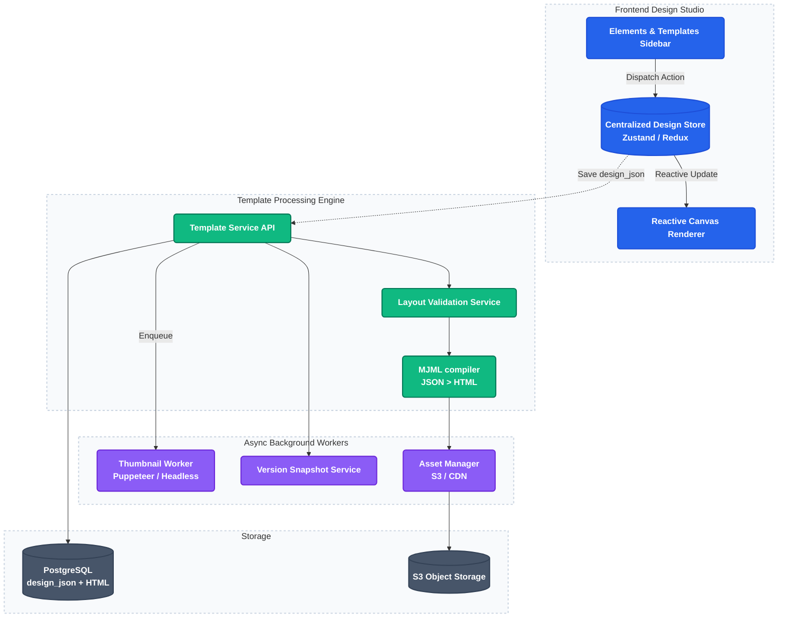
```mermaid
graph TD
    classDef frontend fill:#2563eb,stroke:#1d4ed8,stroke-width:2px,color:#fff,font-weight:bold,rx:5px,ry:5px;
    classDef engine fill:#10b981,stroke:#047857,stroke-width:2px,color:#fff,font-weight:bold,rx:5px,ry:5px;
    classDef worker fill:#8b5cf6,stroke:#6d28d9,stroke-width:2px,color:#fff,font-weight:bold,rx:5px,ry:5px;
    classDef database fill:#475569,stroke:#334155,stroke-width:2px,color:#fff,font-weight:bold,rx:5px,ry:5px;

    subgraph DesignStudio [Frontend Design Studio]
        Sidebar[Elements & Templates Sidebar]
        Store[(Centralized Design Store <br> Zustand / Redux)]
        Canvas[Reactive Canvas Renderer]
        
        Sidebar --> |"Dispatch Action"| Store
        Store --> |"Reactive Update"| Canvas
        class Sidebar frontend;
        class Store frontend;
        class Canvas frontend;
    end

    subgraph ProcessingLayer [Template Processing Engine]
        API[Template Service API]
        Compiler[MJML compiler <br> JSON > HTML]
        Validator[Layout Validation Service]
        
        Store -.-> |"Save design_json"| API
        API --> Validator
        Validator --> Compiler
        class API engine;
        class Compiler engine;
        class Validator engine;
    end

    subgraph AsyncOperations [Async Background Workers]
        Thumbnail[Thumbnail Worker <br> Puppeteer / Headless]
        Versioning[Version Snapshot Service]
        Assets[Asset Manager <br> S3 / CDN]
        
        API --> |"Enqueue"| Thumbnail
        API --> Versioning
        Compiler --> Assets
        class Thumbnail worker;
        class Versioning worker;
        class Assets worker;
    end

    subgraph PersistenceLayer [Storage]
        DB[(PostgreSQL <br> design_json + HTML)]
        S3Storage[(S3 Object Storage)]
        
        API --> DB
        Assets --> S3Storage
        class DB database;
        class S3Storage database;
    end

    classDef dualBox fill:#f8fafc,stroke:#cbd5e1,stroke-width:2px,stroke-dasharray: 4 4;
    class DesignStudio dualBox;
    class ProcessingLayer dualBox;
    class AsyncOperations dualBox;
    class PersistenceLayer dualBox;
```

### 🧱 CORE ARCHITECTURE
*   **DesignJSON as Single Source of Truth:** The system operates exclusively on a `DesignJSON` state. All visual edits are mutations of this JSON. The MJML and HTML outputs are transient, derived artifacts.
*   **Strict Structural Schema:** Enforces a hierarchical scaffolding of **Rows → Columns → Blocks**. 
    *   **Rows:** Control vertical stacking and background isolation.
    *   **Columns:** Manage horizontal grid distribution (1-4 cols) with strict width calculations.
    *   **Blocks:** Atomic units (Text, Image, Button) with type-specific validation schemas.
*   **NO Free Positioning:** To guarantee 100% rendering stability across Outlook and Gmail, the editor enforces a "Flow Layout" only. Absolute "Canva-style" positioning is strictly prohibited.

### ⚙️ SERVICES
*   **Template Service:** Manages multi-tenant CRUD and RLS-enforced access to design states.
*   **MJML Rendering Service:** A stateless microservice that transforms `DesignJSON` into compliant, table-based HTML with automatic CSS inlining.
*   **Asset Manager Service:** Implements CDN-backed storage with **Dependency Tracking** (prevents deletion of images referenced in active templates).
*   **Template Versioning Service:** Provides immutable snapshotting and **JSON-Patch diffing** for high-fidelity "Undo/Redo" and version restoration.
*   **Thumbnail Generation Worker:** A BullMQ-backed headless browser (Puppeteer) service that auto-snapshots templates on every commit for the Library UI.
*   **Layout Validation Service:** Performs server-side structural integrity checks before saving, ensuring no malformed JSON enters the persistence layer.

### 🧩 EDITOR SYSTEM
*   **Centralized State (Zustand/Redux):** The editor is driven by a global store, not local component state. This eliminates "stale state" bugs.
*   **Unidirectional Flow:** **Sidebar/Elements → Store Actions → Canvas Re-render**.
*   **Data-Driven Interaction:** Drag-and-drop actions are **JSON Mutations**, not DOM manipulations. Dropping a block updates the JSON array; the Canvas reactively renders the new data.
*   **Block Registry:** A modular manifest defining properties, default values, and MJML mapping for every supported element.

### 🎯 OUTPUTS
*   **design_json:** Source state for the editor.
*   **compiled_html:** Minified, inlined, and production-ready email payload.
*   **plain_text:** Auto-generated text version derived from the JSON hierarchy for high deliverability.

---

## Phase 3.5 — Pre-Send Validation Gateway (REWRITTEN)
**WHY:** This is the **"Mandatory Security Layer"** that prevents campaign failure by blocking any email that doesn't meet strict rendering and data integrity standards.

### Phase 3.5 Architecture Flow

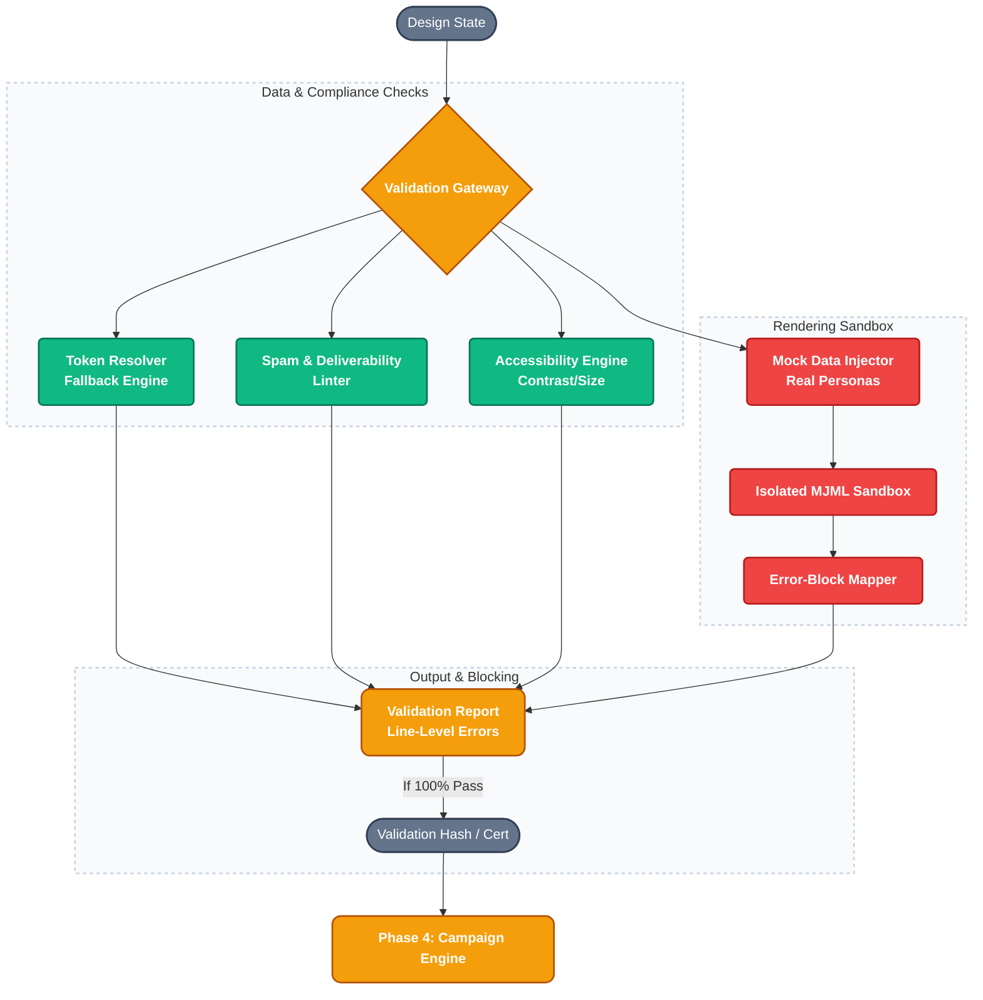
```mermaid
graph TD
    classDef gateway fill:#f59e0b,stroke:#b45309,stroke-width:2px,color:#fff,font-weight:bold,rx:10px,ry:10px;
    classDef engine fill:#10b981,stroke:#047857,stroke-width:2px,color:#fff,font-weight:bold,rx:5px,ry:5px;
    classDef sandbox fill:#ef4444,stroke:#b91c1c,stroke-width:2px,color:#fff,font-weight:bold,rx:5px,ry:5px;
    classDef output fill:#64748b,stroke:#334155,stroke-width:2px,color:#fff,rx:5px,ry:5px;

    Design([Design State]) --> Gateway{Validation Gateway}
    class Design output;
    class Gateway gateway;

    subgraph IntegrityChecks [Data & Compliance Checks]
        Token[Token Resolver <br> Fallback Engine]
        Spam[Spam & Deliverability <br> Linter]
        A11y[Accessibility Engine <br> Contrast/Size]
        
        Gateway --> Token
        Gateway --> Spam
        Gateway --> A11y
        class Token engine;
        class Spam engine;
        class A11y engine;
    end

    subgraph SimulationLayer [Rendering Sandbox]
        Mock[Mock Data Injector <br> Real Personas]
        Sandbox[Isolated MJML Sandbox]
        Mapper[Error-Block Mapper]
        
        Gateway --> Mock
        Mock --> Sandbox
        Sandbox --> Mapper
        class Mock sandbox;
        class Sandbox sandbox;
        class Mapper sandbox;
    end

    subgraph Certification [Output & Blocking]
        Report[Validation Report <br> Line-Level Errors]
        Hash([Validation Hash / Cert])
        
        Token & Spam & A11y & Mapper --> Report
        Report --> |"If 100% Pass"| Hash
        class Report gateway;
        class Hash output;
    end

    Hash --> Campaign[Phase 4: Campaign Engine]
    class Campaign gateway;

    classDef dualBox fill:#f8fafc,stroke:#cbd5e1,stroke-width:2px,stroke-dasharray: 4 4;
    class IntegrityChecks dualBox;
    class SimulationLayer dualBox;
    class Certification dualBox;
```

### 🚨 THE BLOCKING GATEWAY LAYER
No campaign can move to the "Sending" state without a **Pass Certificate** from this gateway.

#### 1. Token Engine
*   **Strict Parsing:** Scans designs for `{{merge_tags}}` and validates them against the tenant's actual data schema.
*   **Fallback Enforcement:** Blocks sending if any tag lacks a mandatory fallback (e.g., `{{first_name | default("Subscriber")}}`).

#### 2. Mock Data Injection Layer
*   **Persona Preview:** Instead of static fake data, it pulls real samples from the Phase 2 Contacts Engine.
*   **Multi-Persona Simulation:** Allows users to toggle through different "Live Personas" to see how the design adapts to varying data lengths and attributes.

#### 3. Rendering Sandbox
*   **Isolated Execution:** A stateless service that performs a "test-build" of the email.
*   **Metadata Generation:** Returns the HTML, file size audit (to prevent Gmail clipping), and a **Source Map** for errors.

#### 4. Error Mapping Engine
*   **Block-Level Reporting:** Translates low-level MJML syntax errors into UI-specific alerts. Errors are mapped to **Block IDs**, not line numbers, highlighting exactly which component in the builder needs fixing.

#### 5. Spam & Deliverability Analyzer
*   **Content Linter:** Scans for "Spam Trigger" words and high image-to-text ratios.
*   **Compliance Check:** Validates the presence of required physical addresses and unsubscribe links.

#### 6. Accessibility Engine
*   **Contrast Audit:** Checks text/background contrast ratios against WCAG 2.1 AA.
*   **Readability Check:** Flags small font sizes or insufficient line height that break mobile readability.

---

### 🔄 CONNECTED SYSTEM FLOW
**Editor → Validation → Preview → Campaign Send**

1.  **Change:** User modifies a block in the Builder.
2.  **Validate:** The **Validation Gateway** runs a background scan of the state.
3.  **Certify:** The gateway issues a `ValidationHash` only if all blocking checks (Tokens, Spam, Rendering) pass.
4.  **Lock:** The Phase 4 Campaign Engine **REJECTS** any dispatch attempt that does not include a valid, current `ValidationHash`.

---

### 🧩 TASK BREAKDOWN

#### BACKEND
*   **Services:** `TemplateOrchestrator`, `TokenResolver`, `ValidationGateway`, `MjmlSandbox`.
*   **APIs:** `POST /templates/validate`, `GET /templates/preview/:personaId`.
*   **Queues:** `thumbnail-gen`, `spam-scan`.

#### FRONTEND
*   **Panels:** `ValidationChecklist`, `PersonaSwitcher`, `ErrorMapOverlay`.
*   **Store:** `useValidationStore` tracking real-time design health.
*   **Isolation Fix:** `EditorCanvas` root enforces a **CSS Variable Reset** to isolate the white document theme from the platform's dark mode.

#### SYSTEM
*   **Data Models:** `TemplateVersion` (immutable), `ValidationAudit` (blocking results).
*   **Event Flow:** `onSave -> runValidation -> issueCertificate -> enableSend`.
*   **Caching:** Redis-backed caching for rendered HTML fragments and persona previews.

---

### ⚠️ ARCHITECTURAL FIXES (REAL-WORLD STABILITY)
*   **Fix: Buttons not working:** Transitioned to **Store-First Dispatch.** UI buttons no longer manage logic; they emit events to the global store, ensuring state consistency.
*   **Fix: Sidebar addition:** Implemented **Schema Injection.** Dragging an element now injects a validated JSON fragment into the store's array, triggering an automatic Canvas re-render.
*   **Fix: Theme Isolation:** Encapsulated the Editor Canvas in a **Shadow-Style Reset.** By shadowing CSS variables (`--bg: #fff`), the email document remains white even when the user selects a Dark platform theme.

---

## Phase 4 — Campaign Orchestration
**WHY:** Orchestrates the core action of filtering audiences, attaching content, validating legality, and queuing dispatches.

### Phase 4 Architecture Flow

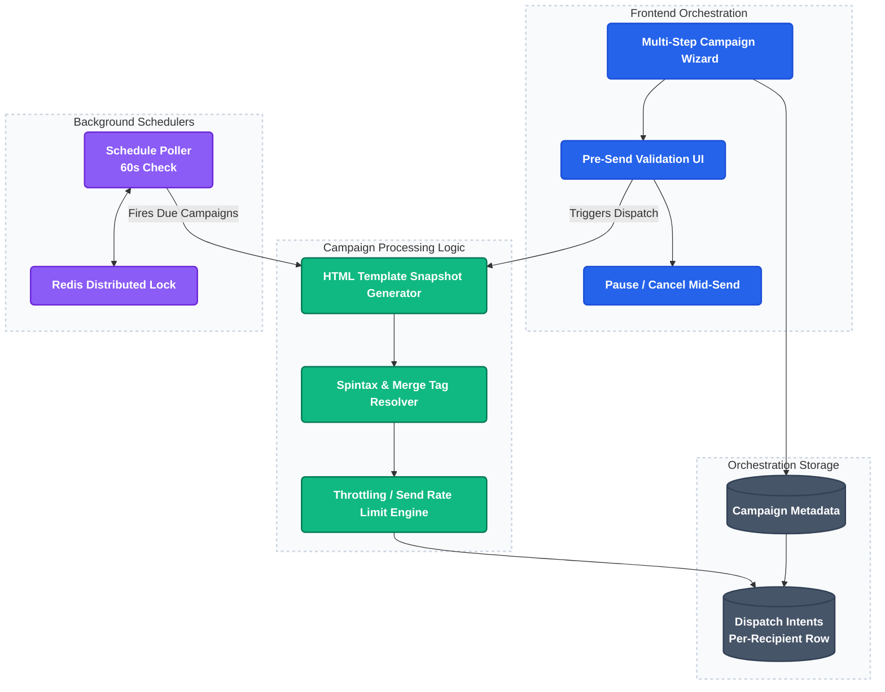
```mermaid
graph TD
    classDef frontend fill:#2563eb,stroke:#1d4ed8,stroke-width:2px,color:#fff,font-weight:bold,rx:5px,ry:5px;
    classDef logic fill:#10b981,stroke:#047857,stroke-width:2px,color:#fff,font-weight:bold,rx:5px,ry:5px;
    classDef background fill:#8b5cf6,stroke:#6d28d9,stroke-width:2px,color:#fff,font-weight:bold,rx:5px,ry:5px;
    classDef database fill:#475569,stroke:#334155,stroke-width:2px,color:#fff,font-weight:bold,rx:5px,ry:5px;

    subgraph CampaignUI [Frontend Orchestration]
        Wizard[Multi-Step Campaign Wizard]
        Checklist[Pre-Send Validation UI]
        Controls[Pause / Cancel Mid-Send]
        
        Wizard --> Checklist
        Checklist --> Controls
        class Wizard frontend;
        class Checklist frontend;
        class Controls frontend;
    end

    subgraph CampaignAPI [Campaign Processing Logic]
        Snapshot[HTML Template Snapshot Generator]
        Spintax[Spintax & Merge Tag Resolver]
        Rate[Throttling / Send Rate Limit Engine]
        
        Checklist --> |"Triggers Dispatch"| Snapshot
        Snapshot --> Spintax
        Spintax --> Rate
        class Snapshot logic;
        class Spintax logic;
        class Rate logic;
    end

    subgraph ScheduledWorker [Background Schedulers]
        Cron[Schedule Poller <br> 60s Check]
        DistLock[Redis Distributed Lock]
        
        Cron <--> DistLock
        Cron --> |"Fires Due Campaigns"| Snapshot
        class Cron background;
        class DistLock background;
    end

    subgraph CampaignData [Orchestration Storage]
        Campaigns[(Campaign Metadata)]
        Intents[(Dispatch Intents <br> Per-Recipient Row)]
        
        Wizard --> Campaigns
        Rate --> Intents
        Campaigns --> Intents
        class Campaigns database;
        class Intents database;
    end

    classDef dualBox fill:#f8fafc,stroke:#cbd5e1,stroke-width:2px,stroke-dasharray: 4 4;
    class CampaignUI dualBox;
    class CampaignAPI dualBox;
    class ScheduledWorker dualBox;
    class CampaignData dualBox;
```

**[BACKEND]**
- Snapshotting logic immutably locking campaign HTML and metadata exactly at send time.
- Spintax capability injecting alternating subject variations and localized merge-tag parsing.
- **Merge Tag Fallback Engine**: Systematically injects default fallback strings (e.g., "Customer") when a personalization token like `{{first_name}}` attempts to map to an empty database field, preventing broken or awkward emails.
- Scheduling engine committing tasks to execution timestamps.
- Dispatch throttling gate controlling total per-minute injection rates preventing SMTP connection flooding.

**[FRONTEND]**
- Multi-step Campaign Creation Wizard sequentially ordering details, audience targeting, content review, and summary checks.
- Pre-send checklist enforcing presence of Unsubscribe links, physical addresses, and blank subjects before enabling the Send action.
- Schedule picker allowing exact timezone-aware delivery planning.
- "Send to 5% sample" interactive switch for risk-free trial runs.
- Instant Pause and Cancel actions surfaced on active dashboard panels.

**📋 Planned Tasks — Phase 4**
- Campaign CRUD (Implemented)
- Campaign wizard (details > audience > content > review) (Implemented)
- [GATEWAY] **Pre-Send Integrity Guard** — Hard stop that runs the TokenService against the target audience before allowing a send.
- Snapshot campaign content + dispatch intents at send time (Implemented)
- Spintax + merge tags (Implemented)
- Scheduled sending (Implemented; dual scheduler consolidation pending)
- Pause/resume/cancel lifecycle (Implemented)
- Resend to unopened contacts (Not implemented; depends on Phase 6 metrics)
- FIX: exclude_suppressed=True enforced in scheduler.py, main.py, campaigns.py (Verified)
- Campaigns list page (status badges, stats) (Implemented)
- Campaign detail page (Implemented)
- Pre-send checklist UI (Implemented)
- Schedule picker (date/time input for scheduled send) (Implemented)
- Pause button / Cancel button on in-progress campaign (Implemented)
- Send test email modal (Implemented; contract fix required)
- Automated pre-send validation (Implemented)
- Send throttling control (Implemented)
- Send to 5% sample first mode (Implemented)
- Fix Step 3 template picker payload mismatch
- Fix duplicate flow required fields
- Normalize frontend API base URLs

---

---

---

### 🚀 Newly Discovered (From Codebase)
- Versioning (Optimistic Locking) added to Campaigns to prevent Approval Race Conditions.

---

### 🔐 RBAC System
- Roles involved: Owner, Admin (approvers), Creator (requesters).
- What is enforced in backend: `require_permission("campaign:manage")`, `"campaign:send"`, `"campaign:create"`.
- What is enforced in frontend: Approval flow UI enforces role separation.
- Security risks: None, version matching prevents outdated approvals.

---

### 🧱 Architecture
- Planned: Sync dispatch.
- Actual: `aio-pika` RabbitMQ publisher in API, asynchronous consumer in worker pulling contacts directly via `asyncpg` and pushing to email delivery providers. Redis used for distributed locks to prevent double-sends.

---

### 🚀 Features (From Real System)
- **Campaign Versioning (Optimistic Locking)**
  - **What it does:** Uses an integer increment on the campaign record to prevent race conditions where an Admin approves an outdated draft modified by a Creator.
  - **Where it exists:** `platform/api/routes/campaigns.py`
  - **Why it belongs here:** Campaign Orchestration & State Machine integrity.
  - **Classification:** Core Feature

- **Plan vs actual mismatch:** The plan lacked concurrency control specifications. Optimistic locking was retrofitted to secure the approval workflow.

## Phase 5 — Delivery Engine
**WHY:** Connects the system to the internet via SMTP, automatically responding to bounces, spam complaints, and user unsubscriptions securely.

### Phase 5 Architecture Flow

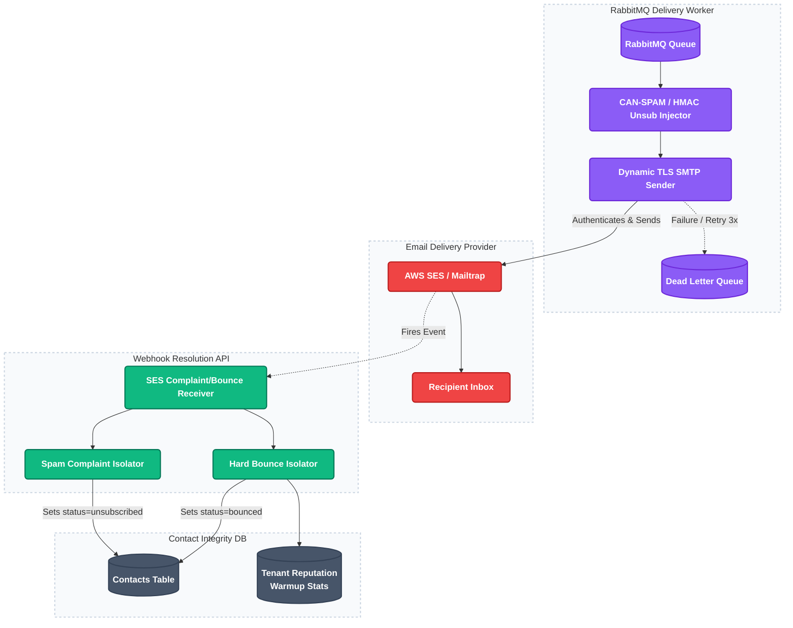
```mermaid
graph TD
    classDef worker fill:#8b5cf6,stroke:#6d28d9,stroke-width:2px,color:#fff,font-weight:bold,rx:5px,ry:5px;
    classDef external fill:#ef4444,stroke:#b91c1c,stroke-width:2px,color:#fff,font-weight:bold,rx:5px,ry:5px;
    classDef api fill:#10b981,stroke:#047857,stroke-width:2px,color:#fff,font-weight:bold,rx:5px,ry:5px;
    classDef database fill:#475569,stroke:#334155,stroke-width:2px,color:#fff,font-weight:bold,rx:5px,ry:5px;

    subgraph DispatchWorker [RabbitMQ Delivery Worker]
        RMQ[(RabbitMQ Queue)]
        Injector[CAN-SPAM / HMAC Unsub Injector]
        SMTP[Dynamic TLS SMTP Sender]
        DLQ[(Dead Letter Queue)]
        
        RMQ --> Injector
        Injector --> SMTP
        SMTP -.-> |"Failure / Retry 3x"| DLQ
        class RMQ worker;
        class Injector worker;
        class SMTP worker;
        class DLQ worker;
    end

    subgraph ExternalProvider [Email Delivery Provider]
        SES[AWS SES / Mailtrap]
        Inbox[Recipient Inbox]
        
        SMTP --> |"Authenticates & Sends"| SES
        SES --> Inbox
        class SES external;
        class Inbox external;
    end

    subgraph FeedbackLoop [Webhook Resolution API]
        Webhook[SES Complaint/Bounce Receiver]
        HardBounce[Hard Bounce Isolator]
        Spam[Spam Complaint Isolator]
        
        SES -.-> |"Fires Event"| Webhook
        Webhook --> HardBounce
        Webhook --> Spam
        class Webhook api;
        class HardBounce api;
        class Spam api;
    end

    subgraph ContactState [Contact Integrity DB]
        Contacts[(Contacts Table)]
        Reputation[(Tenant Reputation <br> Warmup Stats)]
        
        HardBounce --> |"Sets status=bounced"| Contacts
        Spam --> |"Sets status=unsubscribed"| Contacts
        HardBounce --> Reputation
        class Contacts database;
        class Reputation database;
    end

    classDef dualBox fill:#f8fafc,stroke:#cbd5e1,stroke-width:2px,stroke-dasharray: 4 4;
    class DispatchWorker dualBox;
    class ExternalProvider dualBox;
    class FeedbackLoop dualBox;
    class ContactState dualBox;
```

**[BACKEND]**
- RabbitMQ consumer loop maintaining persistent connections, dynamically executing TLS handshakes, and nacking failures into Dead Letter Queues gracefully.
- Legal footer injection statically appending CAN-SPAM compliant company addresses and HMAC-secure unsubscribe tokens.
- Immediate bounce classification logic segregating Soft Bounces (retried exponentially) from Hard Bounces (instantly placed on permanent suppression list).
- Spam complaint webhook ingestion directly suppressing contacts from further dispatches preventing reputation destruction.
- Domain warmup throttler incrementally raising outbound execution limits across 30 days.
- Tenant reputation tracking evaluating 30-day rolling bounce/spam statistics against critical suspension thresholds.

**[FRONTEND]**
- Clean Unsubscribe landing page capturing voluntary removal events effortlessly.
- Re-subscribe form confirming reversal of accidental unsubscribes.

**📋 Planned Tasks — Phase 5**
- Worker loop (RabbitMQ consumer)
- SMTP send via Mailtrap/SES
- Dynamic SMTP TLS Handshake based on active Port (587 support)
- Retry + dead-letter queue (nack on failure)
- Unsubscribe link injected into every email (HMAC-signed token)
- Physical business address in email footer (CAN-SPAM compliant)
- Hard bounce > auto-mark contact as bounced (SES webhook)
- Spam complaint > auto-mark contact as unsubscribed (SES webhook)
- Daily send limit enforcement (per-tenant, resets at midnight, 429 on breach)
- All dispatch paths enforce exclude_suppressed=True
- Bounce classification: hard bounce suppresses, soft bounce retries 3x
- Domain warmup automation (graduated daily limit increase over 30 days)
- Send reputation scoring per tenant (auto-throttle on >2% bounce/>0.1% complaint)
- FIX: Unsubscribe event logged to email_events with correct tenant_id
- FIX: Re-subscribe sets status to 'subscribed' (was 'active')
- FIX: Re-subscribe API uses NEXT_PUBLIC_API_URL (CORS resolved)
- /unsubscribe as a public route (no sidebar/header)
- Unsubscribe page: auto-close tab after 3 seconds + Close Window button
- Re-subscribe option on unsubscribe page
- Re-subscribe page: auto-close tab after 3 seconds + Close Window button
- [AUDIT FIX 7] Soft vs hard bounce classification — parse SES bounceType
- [AUDIT FIX 8] Real rolling bounce rate writer — write tenant:{id}:bounces:rolling to Redis
- [AUDIT FIX 9] Move scheduler to standalone worker/scheduler.py — Redis SET NX EX 90 distributed lock
- [FRIEND AUDIT FIX 19] Batch DB Updates in Worker — Refactor email_sender.py to batch dispatch row updates
- [FRIEND AUDIT FIX 20] Native DB Connection — Switch worker from Supabase PostgREST HTTP client to asyncpg TCP connection pool
- [GAP 3 — Token Bucket Rate Limiter] Redis `tenant:{id}:send_tokens` hash — refill rate per plan (Free: 60/min, Starter: 600/min, Pro: 3,000/min, Enterprise: 18,000/min)
- [GAP 3] Worker checks token bucket BEFORE each send; sleeps 0.5s if empty (never drops message)
- [GAP 3] SES `ThrottlingException` handler with exponential backoff (1s → 2s → 4s → 8s)
- [GAP 3] `emails_per_minute` configurable per tenant via plan defaults (stored in `plans` table)
- [GAP 3] Campaign ETA calculator: `(remaining_dispatch_count / rate_limit_per_min)` exposed in campaign detail UI
- [GAP 5 — Worker Decomposition Phase 1] Split `email_sender.py` (SMTP consumer) from `webhook_handler.py` (SES SNS bounce/complaint processor) — two separate processes
- [GAP 7 — Bounce Classification Matrix] Parse `bounceType` + `bounceSubType` from SES SNS notification payload
- [GAP 7] Permanent / NoEmail / MailboxDoesNotExist → IMMEDIATE suppress (no retry)
- [GAP 7] Transient / MailboxFull → retry 3× over 24h with 8h intervals
- [GAP 7] Transient / MessageTooLarge → mark event, skip (unsendable regardless of retries)
- [GAP 7] Transient / ContentRejected or AttachmentRejected → mark event, send CRITICAL audit alert to tenant
- [GAP 7] Transient / General → retry 3× over 72h
- [GAP 7] Undetermined / General → retry 2×, then escalate to CRITICAL audit log
- [GAP 7] Complaint (any subtype) → immediate unsubscribe (`status = 'unsubscribed'`)
- [NEW] Recipient Preference Center (Granular topic-based opt-outs instead of global unsubscribe)
- [ARCH REVIEW — CRITICAL] Contact audience streaming — cursor-based pagination `LIMIT 500 OFFSET n` fed to RabbitMQ (prevents OOM on 1M-row audience loads)
- [ARCH REVIEW — CRITICAL] Cross-tenant suppression guard in `_suppress_contact()` — always filter by `tenant_id` before suppressing, even on webhook path
- [ARCH REVIEW] Merge tag fallback engine — inject default value (e.g. "Customer") when `{{first_name}}` resolves to empty string, never send broken personalization

> 💡 **Worker Architecture Note (Gap 5):** This phase creates the initial worker. Full microservice decomposition into 5 focused workers (sender, webhook-handler, reputation-worker, warmup-scheduler, dispatch-logger) happens in **Phase 13**.

---

## Phase 5.7 — Backpressure & Queue Protection
**WHY:** Without prefetch limits and a kill-switch, a slow worker or a bad campaign can bring down the entire RabbitMQ broker. These are 2-hour fixes that prevent hours of downtime.

**[BACKEND]**
- **RabbitMQ Consumer Prefetch Limit**: `basic_qos(prefetch_count=10)` on all consumers. Without this, a single worker buffers thousands of messages locally and starves other workers.
- **Redis Campaign Kill-Switch**: Workers check `tenant:{id}:campaign:{cid}:stop` in Redis before every batch. Set this key to halt a campaign across all workers in milliseconds.
- **Worker Heartbeat**: Every worker writes `SET worker:{worker_id}:heartbeat {timestamp} EX 30` to Redis. Dead workers are detectable without external process monitoring.
- **DLQ Monitoring**: Dead-letter queue depth tracked and surfaced in admin health dashboard.

**📋 Planned Tasks — Phase 5.7**
- [BACKPRESSURE — CRITICAL] RabbitMQ `basic_qos(prefetch_count=10)` on all consumers
- [KILL-SWITCH — CRITICAL] Redis campaign kill-switch: check `tenant:{id}:campaign:{cid}:stop` before every batch in email_sender.py
- [RELIABILITY] Worker heartbeat: `SET worker:{id}:heartbeat {ts} EX 30` on every loop iteration
- [MONITORING] DLQ (Dead-Letter Queue) depth metric exposed to admin health endpoint
- [RELIABILITY] Standalone `scheduler.py` process with Redis `SET NX EX 90` distributed lock (moved from Phase 5 Audit Fix 9 — THIS IS THE CRITICAL ONE: run 2 API replicas without this and every scheduled campaign fires twice)

---

## Phase 5.6 — Advanced Feedback & Surveys
**WHY:** Closes the loop between the sender and the recipient, allowing for quality reviews and direct subscriber feedback.

**[BACKEND]**
- **Feedback & Surveys API**: Support for inbuilt and custom questions stored in JSONB.
- **Automatic Footer Injection**: MJML logic to inject "How was this email?" links into all outgoing campaigns.
- **Sentiment Analytics Service**: Aggregates feedback into "Health Scores" per campaign/template.

**[FRONTEND]**
- **Public Feedback Page**: A lightweight, mobile-optimized page for subscribers to rate and review emails.
- **Survey Builder (Campaign Wizard)**: UI for tenants to select which inbuilt questions to ask and add their own custom questions.
- **Feedback Inbox**: A central dashboard for tenants to view and respond to subscriber reports.

**📋 Planned Tasks — Phase 5.6**
- Feedback/Survey database models (JSONB responses)
- Automatic MJML Footer Injection (Good/Bad/Other)
- Public Feedback Landing Page (No-Auth)
- Sentiment Analytics Engine (Health scores)
- Survey Builder UI (Campaign Wizard integration)
- Feedback Inbox UI (Tenant dashboard)
- "Layout Broken" Critical Alerts (Notify tenant of rendering issues)

---

## Phase 5.7 — Support & Escalation Workflow
**WHY:** Bridges the gap between the Tenant and the platform Developers/Managing Team.

**[BACKEND]**
- **Escalation API**: Endpoint for tenants to "Push to Support" a specific feedback item or rendering issue.
- **Tripartite Rendering Snapshots**: When an issue is reported, the system captures:
    1. **Raw MJML AST**: The source code.
    2. **Masked JSON Context**: The dynamic data used for merge tags.
    3. **Compiled HTML**: The final failed output.
- **Support Ticket Model**: Internal tracking of escalated issues from tenants to the platform team.

**[FRONTEND]**
- **Escalate Button**: UI in the Feedback Inbox to notify the platform owners.
- **Status Tracker**: Tenant view of "Support Pending/Resolved" for escalated items.

## Phase 5.8 — Event Data Archival Strategy (Gap 4)
**WHY:** A 100k-recipient campaign instantly creates 100k+ rows. Over 1 year, the `email_events` table will grow to 100M+ rows, catastrophically degrading query performance. We must construct a tiered database isolation model immediately after launch.

**[BACKEND]**
- **Table Partitioning:** Refactor the primary `email_events` table using PostgreSQL `PARTITION BY RANGE (occurred_at)`.
- **Auto-Partitioning CRON:** Automated job executing monthly to dynamically generate the next chronological partition table (e.g., `email_events_2025_03`).
- **Data Pruning Preparation:** Establish the foundational schema required for Phase 13's ClickHouse rollout (90-day PostgreSQL retention window).

**📋 Planned Tasks — Phase 5.5 (Event Archival)**
- [GAP 4 — Event Archival Strategy] Refactor `email_events` schema to use `PARTITION BY RANGE (occurred_at)`
- [GAP 4] Write PL/pgSQL function to auto-generate monthly partition tables
- [GAP 4] Set up pg_cron (or worker CRON) to execute partition generation on the 25th of every month
- [GAP 4] Scope all campaign analytic queries to explicitly utilize `occurred_at` indexes for partition pruning
- [NEW] Campaign Health Early Warning System (Auto-pause RabbitMQ dispatch queue if hard bounce rate spikes early)

---

## Phase 6 — Observability & Analytics (Heatmaps & Time Tracking)
**WHY:** Displays critical performance markers allowing users to judge campaign effectiveness accurately.

### Phase 6 Architecture Flow

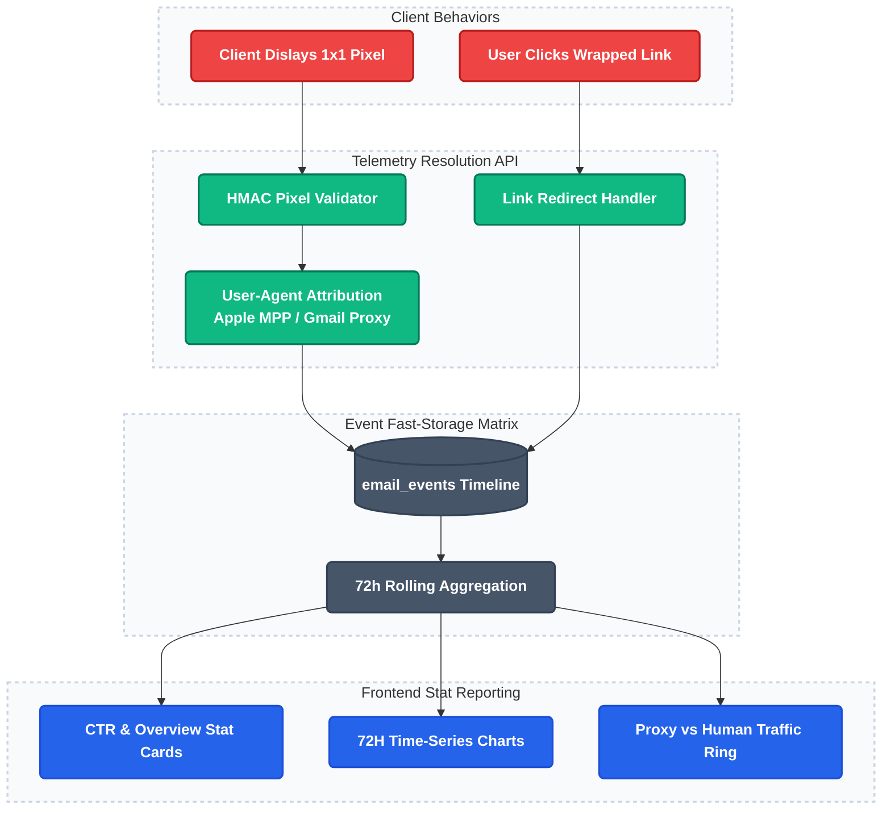
```mermaid
graph TD
    classDef external fill:#ef4444,stroke:#b91c1c,stroke-width:2px,color:#fff,font-weight:bold,rx:5px,ry:5px;
    classDef api fill:#10b981,stroke:#047857,stroke-width:2px,color:#fff,font-weight:bold,rx:5px,ry:5px;
    classDef frontend fill:#2563eb,stroke:#1d4ed8,stroke-width:2px,color:#fff,font-weight:bold,rx:5px,ry:5px;
    classDef database fill:#475569,stroke:#334155,stroke-width:2px,color:#fff,font-weight:bold,rx:5px,ry:5px;

    subgraph RecipientAction [Client Behaviors]
        EmailOpen[Client Dislays 1x1 Pixel]
        EmailClick[User Clicks Wrapped Link]
        class EmailOpen external;
        class EmailClick external;
    end

    subgraph TrackingEngine [Telemetry Resolution API]
        Pixel[HMAC Pixel Validator]
        LinkWrapper[Link Redirect Handler]
        Attribution[User-Agent Attribution <br> Apple MPP / Gmail Proxy]
        
        EmailOpen --> Pixel
        EmailClick --> LinkWrapper
        Pixel --> Attribution
        class Pixel api;
        class LinkWrapper api;
        class Attribution api;
    end

    subgraph AnalyticsData [Event Fast-Storage Matrix]
        Events[(email_events Timeline)]
        TimeSeries[72h Rolling Aggregation]
        
        Attribution --> Events
        LinkWrapper --> Events
        Events --> TimeSeries
        class Events database;
        class TimeSeries database;
    end

    subgraph AnalyticsUI [Frontend Stat Reporting]
        StatCards[CTR & Overview Stat Cards]
        Graphs[72H Time-Series Charts]
        Proxy[Proxy vs Human Traffic Ring]
        
        TimeSeries --> StatCards
        TimeSeries --> Graphs
        TimeSeries --> Proxy
        class StatCards frontend;
        class Graphs frontend;
        class Proxy frontend;
    end

    classDef dualBox fill:#f8fafc,stroke:#cbd5e1,stroke-width:2px,stroke-dasharray: 4 4;
    class RecipientAction dualBox;
    class TrackingEngine dualBox;
    class AnalyticsData dualBox;
    class AnalyticsUI dualBox;
```

**[BACKEND]**
- 1x1 image pixel endpoint logging secure opens, guarded by heuristic Bot Detection rules distinguishing Google/Apple privacy proxies from malicious scanners or true humans.
- Click tracking honeypots dropping bots mimicking link engagement.
- Stats aggregation routines executing asynchronously to compile real-time summaries.
- **Time Spent Tracking Calculation**: Multi-ping pixel tracking logic classifying the duration a recipient hovered over the message.
- **Click Heatmap Calculation Job**: Aggregation engine correlating click event URLs directly back to their DOM position in the exact sent template.

**[FRONTEND]**
- Detailed Campaign Analytics Dashboard exhibiting exact unique open, click, and bounce matrices.
- Recipient timeline exposing chronological interactions per individual contact.
- Time Series graph plotting engagement velocity across the immediate 72 hours post-send.
- **Click Heatmap Overlay Presentation**: Visually injecting heat maps directly onto the template preview canvas illustrating intense link engagement locations.
- **Engagement Duration Card**: UI stat displaying average read times effectively.

**📋 Planned Tasks — Phase 6**
- Open tracking pixel endpoint (HMAC-signed) via Supabase Edge Function
- Click tracking intentionally disabled (cost optimization)
- SES bounce/complaint webhooks captured natively (bypass Edge Functions)
- Stats aggregation (sent, opens, bounces, unsubscribes per campaign)
- Source attribution (gmail_proxy, apple_mpp, outlook, yahoo, scanner, human)
- FIX: Unsubscribes count cross-checks live contact status (re-subscriptions drop count)
- Contact activity log (recipient timeline in analytics API)
- Optional per-campaign click tracking (opt-in, stored in email_events)
- CTR stat card when click tracking enabled (unique clicks / unique opens)
- Engagement over time graph (opens/bounces/unsubs by hour, first 72h)
- Campaign analytics page (Sent, Opens Unique, Opens Total, Bounces, Unsubscribes)
- FIX: Recipient Activity 'Unsubscribed' column reflects live contact status
- Proxy/Scanner breakdown panel (Gmail, Apple MPP, Outlook, Yahoo, Human)
- FIX: Human-filtered toggle removed — all signals shown natively
- Dashboard homepage sender health widget
- Export analytics as CSV / PDF summary
- [NEW] Direct Feedback Widgets (Interactive 1-5 Star/Yes-No embedded tracking parameters in footers)
- [GAP 2 — Click Tracking Architecture Fix] `campaigns.click_tracking_enabled` BOOLEAN column (default: `False`)
- [GAP 2] Plan gate: only `plan IN ('pro', 'enterprise')` may enable click tracking on a campaign
- [GAP 2] Worker: conditionally wraps links via `https://trk.shrflow.app/c/{hmac_signed_token}` in MJML compile step when `click_tracking_enabled=True`
- [GAP 2] CTR stat card (`unique_clicks / unique_opens`) rendered ONLY when `click_tracking_enabled=True`
- [GAP 2] Click Heatmap Overlay (Phase 10) depends on `click_tracking_enabled=True` data being present
- [GAP 2] Free/Starter plans see an upgrade prompt when hovering the disabled click tracking toggle

> 📌 **Click Tracking Design Decision:** Click tracking is intentionally OFF by default for cost and simplicity (Free/Starter). It is a **Pro/Enterprise feature**. This resolves the contradiction between "disabled for cost" and "CTR/heatmaps available" — both can be true when gated by plan.

---

## Phase 7 — Plan Enforcement & Billing
**WHY:** Regulates computational exhaustion, prevents abuse, and ties usage directly to recurring revenue tiers.

### Phase 7 Architecture Flow

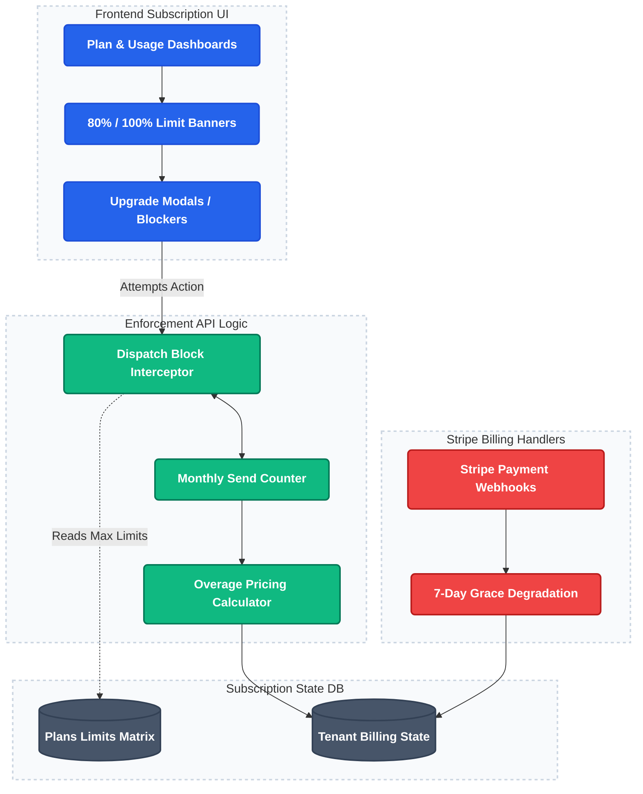
```mermaid
graph TD
    classDef frontend fill:#2563eb,stroke:#1d4ed8,stroke-width:2px,color:#fff,font-weight:bold,rx:5px,ry:5px;
    classDef logic fill:#10b981,stroke:#047857,stroke-width:2px,color:#fff,font-weight:bold,rx:5px,ry:5px;
    classDef external fill:#ef4444,stroke:#b91c1c,stroke-width:2px,color:#fff,font-weight:bold,rx:5px,ry:5px;
    classDef database fill:#475569,stroke:#334155,stroke-width:2px,color:#fff,font-weight:bold,rx:5px,ry:5px;

    subgraph BillingUI [Frontend Subscription UI]
        PlanPage[Plan & Usage Dashboards]
        Banner[80% / 100% Limit Banners]
        Upgrade[Upgrade Modals / Blockers]
        
        PlanPage --> Banner
        Banner --> Upgrade
        class PlanPage frontend;
        class Banner frontend;
        class Upgrade frontend;
    end

    subgraph QuotaEngine [Enforcement API Logic]
        MonthCounter[Monthly Send Counter]
        Gate[Dispatch Block Interceptor]
        Overage[Overage Pricing Calculator]
        
        Upgrade --> |"Attempts Action"| Gate
        Gate <--> MonthCounter
        MonthCounter --> Overage
        class MonthCounter logic;
        class Gate logic;
        class Overage logic;
    end

    subgraph StripeIntegration [Stripe Billing Handlers]
        Webhook[Stripe Payment Webhooks]
        GracePeriod[7-Day Grace Degradation]
        
        Webhook --> GracePeriod
        class Webhook external;
        class GracePeriod external;
    end

    subgraph BillingData [Subscription State DB]
        Plans[(Plans Limits Matrix)]
        Tenants[(Tenant Billing State)]
        
        Overage --> Tenants
        GracePeriod --> Tenants
        Gate -.-> |"Reads Max Limits"| Plans
        class Plans database;
        class Tenants database;
    end

    classDef dualBox fill:#f8fafc,stroke:#cbd5e1,stroke-width:2px,stroke-dasharray: 4 4;
    class BillingUI dualBox;
    class QuotaEngine dualBox;
    class StripeIntegration dualBox;
    class BillingData dualBox;
```

**[BACKEND]**
- Quota limiting services tracking precise daily and monthly volumetric outputs per tenant against defined tier maximums.
- Overage pricing intercept logic preventing hard-blocks while securely calculating micro-payments for excess bursts.
- Billing state watcher gracefully degrading system access rather than violently deleting instances upon payment failure.
- Auto-pause directives halting massive campaigns if quotas breach mid-flight.

**[FRONTEND]**
- Beautiful Plan & Usage page projecting consumption visuals natively via animated progress bars.
- Strategic warning banners displaying precisely at 80% usage and 100% capacity triggers.
- Blocking overlays actively freezing specific forms when quotas permanently prevent initiation.

**📋 Planned Tasks — Phase 7**
- Plans table (free/starter/pro/enterprise with limits)
- Monthly email sent counter per tenant
- Block sends when quota exceeded
- Contact count limit enforcement
- 80% quota trigger (notification)
- Worker-triggered email notifications via Centralized System Emailer
- Plan & Usage page (progress bars for emails + contacts vs limit)
- Upgrade plan modal (plan comparison table)
- In-app banner when 80% quota reached
- Blocked send page when quota maxed
- 14-day free trial with Pro limits (no credit card required)
- Overage pricing instead of hard blocking (per-email rate above quota)
- Auto-downgrade to Free tier on subscription lapse (pause, not delete campaigns)
- Grace period on failed payment (7 days, escalating reminder emails)
- [AUDIT FIX 10] Wire quota gate to queue_campaign_dispatch()

---

## Phase 7.1 — Global Billing & Payment Gateway
**WHY:** Bridges the gap between plan enforcement and revenue collection. Ensures the platform can scale internationally while remaining compliant with localized financial regulations (like RBI in India).

### Phase 7.1 Architecture Flow

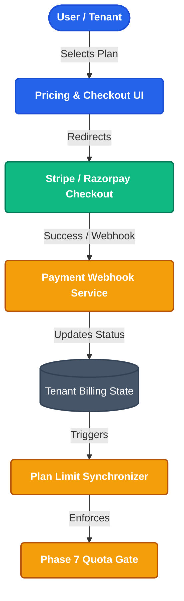
```mermaid
graph TD
    classDef frontend fill:#2563eb,stroke:#1d4ed8,stroke-width:2px,color:#fff,font-weight:bold,rx:5px,ry:5px;
    classDef gateway fill:#10b981,stroke:#047857,stroke-width:2px,color:#fff,font-weight:bold,rx:5px,ry:5px;
    classDef logic fill:#f59e0b,stroke:#b45309,stroke-width:2px,color:#fff,font-weight:bold,rx:5px,ry:5px;
    classDef database fill:#475569,stroke:#334155,stroke-width:2px,color:#fff,rx:5px,ry:5px;

    User([User / Tenant]) --> |"Selects Plan"| PricingUI[Pricing & Checkout UI]
    class User frontend;
    class PricingUI frontend;

    PricingUI --> |"Redirects"| StripeCheckout[Stripe / Razorpay Checkout]
    class StripeCheckout gateway;

    StripeCheckout --> |"Success / Webhook"| WebhookHandler[Payment Webhook Service]
    class WebhookHandler logic;

    WebhookHandler --> |"Updates Status"| BillingDB[(Tenant Billing State)]
    class BillingDB database;

    BillingDB --> |"Triggers"| LimitSync[Plan Limit Synchronizer]
    class LimitSync logic;

    LimitSync --> |"Enforces"| Phase7[Phase 7 Quota Gate]
    class Phase7 logic;
```

**[BACKEND]**
- **Webhook Orchestrator**: Dedicated handlers for Stripe and Razorpay events (subscription.created, invoice.paid, subscription.deleted).
- **Idempotency Layer**: Ensures a single webhook event never triggers multiple plan updates.
- **Subscription State Machine**: Manages transitions between `Trial` -> `Active` -> `Past Due` -> `Canceled`.
- **SaaS Pricing Localization**: Multi-currency support (INR/USD) with automatic tax calculation based on tenant geography.

**[FRONTEND]**
- **Tiered Pricing Matrix**: Comparative table showing Free, Starter, Pro, and Enterprise features.
- **Billing Portal**: Self-service area for tenants to download invoices, update cards, or cancel subscriptions.
- **Checkout Bridge**: Seamless transition from platform to secure payment gateway and back.

**📋 Planned Tasks — Phase 7.1**
- Stripe integration (Checkout Sessions + Webhooks)
- Razorpay integration (INR/RBI compliance)
- SaaS Pricing Localization (Currency & Tax logic)
- Subscription state machine (Active / Past Due / Canceled)
- Automated Invoice generation & email delivery
- Billing Dashboard (Usage vs. Plan history)
- Support for Overage micro-billing calculation
- [SECURITY] HMAC verification for all payment webhooks

---

---

## Phase 7.5 — Infrastructure & DevOps
**WHY:** Solidifies architectural foundations ensuring deployment stability, fault tolerance, and developer sanity.

### Phase 7.5 Architecture Flow

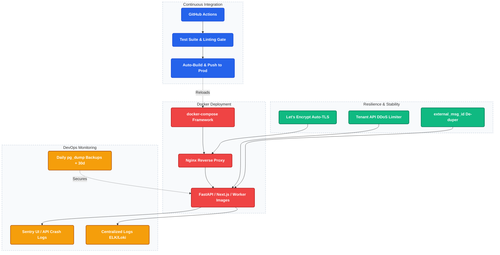
```mermaid
graph TD
    classDef infra fill:#ef4444,stroke:#b91c1c,stroke-width:2px,color:#fff,font-weight:bold,rx:5px,ry:5px;
    classDef security fill:#10b981,stroke:#047857,stroke-width:2px,color:#fff,font-weight:bold,rx:5px,ry:5px;
    classDef monitor fill:#f59e0b,stroke:#b45309,stroke-width:2px,color:#fff,font-weight:bold,rx:5px,ry:5px;
    classDef pipeline fill:#2563eb,stroke:#1d4ed8,stroke-width:2px,color:#fff,font-weight:bold,rx:5px,ry:5px;

    subgraph ContainerOrchestration [Docker Deployment]
        Compose[docker-compose Framework]
        Nginx[Nginx Reverse Proxy]
        Services[FastAPI / Next.js / Worker Images]
        
        Compose --> Nginx
        Nginx --> Services
        class Compose infra;
        class Nginx infra;
        class Services infra;
    end

    subgraph CICDPipeline [Continuous Integration]
        GitHub[GitHub Actions]
        Tests[Test Suite & Linting Gate]
        Deploy[Auto-Build & Push to Prod]
        
        GitHub --> Tests
        Tests --> Deploy
        Deploy -.-> |"Reloads"| Compose
        class GitHub pipeline;
        class Tests pipeline;
        class Deploy pipeline;
    end

    subgraph SecurityDefense [Resilience & Stability]
        SSL[Let's Encrypt Auto-TLS]
        Idempotent[external_msg_id De-duper]
        RateLimit[Tenant API DDoS Limiter]
        
        SSL --> Nginx
        RateLimit --> Services
        Idempotent --> Services
        class SSL security;
        class Idempotent security;
        class RateLimit security;
    end

    subgraph ObservabilityLayer [DevOps Monitoring]
        Sentry[Sentry UI / API Crash Logs]
        ELK[Centralized Logs ELK/Loki]
        Backup[Daily pg_dump Backups + 30d]
        
        Services --> Sentry
        Services --> ELK
        Backup -.-> |"Secures"| Services
        class Sentry monitor;
        class ELK monitor;
        class Backup monitor;
    end

    classDef dualBox fill:#f8fafc,stroke:#cbd5e1,stroke-width:2px,stroke-dasharray: 4 4;
    class ContainerOrchestration dualBox;
    class CICDPipeline dualBox;
    class SecurityDefense dualBox;
    class ObservabilityLayer dualBox;
```

**[BACKEND]**
- Docker orchestration wrapping APIs, Frontend frameworks, Queues, and Caches synchronously.
- Nginx configuration restricting ports and terminating SSL properly.
- Strict API Rate limiter specifically keying on `tenant_id` to prevent single-tenant database DOS attacks.
- Background Job Status synchronization allowing decoupled UI systems to query asynchronous progression globally.
- Error interception hooks funneling unhandled exceptions directly into centralized monitoring stations (Sentry).

**[FRONTEND]**
- Stringent Content-Security-Policy responses blocking inline execution preventing cross-site scripting natively.
- UI Toasts dynamically connected to generic job endpoints simulating real-time progress for heavy tasks.

**📋 Planned Tasks — Phase 7.5**
- Docker (Dockerfiles for API, worker, client)
- Docker Overhaul (Split workers, Standalone client, Env Alignment)
- docker-compose.yml
- Nginx config
- SSL/HTTPS (Let's Encrypt guide in docs)
- CI/CD pipeline (GitHub Actions)
- Load & Spam Testing Setup (k6 + Mail-Tester integration)
- Security Headers & Content Security Policy for all pages
- API Rate Limiting (per-tenant, per-endpoint, burst protection)
- Background Job Status Table (CSV import, GDPR export, campaign send)
- Worker concurrency safety (locked_by column to prevent zombie tasks)
- Idempotency guard (external_msg_id to prevent double-sends on retry)
- GET /health on FastAPI (db + worker status)
- GET /health on Worker (queue depth, last processed)
- Centralized structured logging (ELK stack or Grafana Loki)
- Sentry error tracking on FastAPI + Next.js frontend
- Database backup strategy (daily, 30-day retention, monthly restore drill)
- [AUDIT FIX 11] Uncomment Nginx block in docker-compose.yml; close ports 8000 and 3000 from public network
- [AUDIT FIX 12] GitHub Actions CI/CD pipeline — lint + test + Docker build + deploy on merge to main
- [AUDIT FIX 13] git rm frnds_contacts.csv, testmail_contacts.csv, platform/api/app.db; add *.csv and *.db to .gitignore
- [FRIEND AUDIT FIX 21] Dynamic Config Loading — Replace Path(__file__) .env loading with robust config.py / pydantic-settings
- [ARCH REVIEW — CRITICAL] Idempotency guard on HTTP dispatch endpoint itself — `Idempotency-Key` header check before accepting campaign send request
- [ARCH REVIEW] `external_msg_id` UUID uniqueness enforced at DB level (UNIQUE constraint) AND checked in worker before dispatching each message
- [ARCH REVIEW] Structured JSON logging with `requestId` + `tenantId` on every log line (FastAPI middleware injects these)

---

## Phase 8 — Workspace Administration, Team Management & Franchise Governance
**WHY:** This is the operating model for how a tenant workspace is actually run after onboarding. It brings workspace settings, member administration, franchise creation, export controls, and governance into one parent phase because all five depend on the same tenant boundary, role model, invitation flow, and audit layer.

### Phase 8 Parent Architecture Flow
MIND MAP
https://notebooklm.google.com/notebook/92453ebd-4bc6-4655-b7b5-40283155cfbe?authuser=5

```mermaid
graph TD
    classDef owner fill:#f59e0b,stroke:#d97706,stroke-width:2px,color:#fff,font-weight:bold,rx:5px,ry:5px;
    classDef admin fill:#2563eb,stroke:#1d4ed8,stroke-width:2px,color:#fff,font-weight:bold,rx:5px,ry:5px;
    classDef creator fill:#10b981,stroke:#047857,stroke-width:2px,color:#fff,font-weight:bold,rx:5px,ry:5px;
    classDef viewer fill:#64748b,stroke:#475569,stroke-width:2px,color:#fff,font-weight:bold,rx:5px,ry:5px;
    classDef system fill:#94a3b8,stroke:#64748b,stroke-width:1px,color:#fff,rx:5px,ry:5px;
    classDef workspace fill:#f8fafc,stroke:#cbd5e1,stroke-width:2px,stroke-dasharray: 5 5;

    %% ROOT
A[ShrFlow Platform]

%% WORKSPACE
A --> B[Workspace / Tenant]

%% USER MANAGEMENT
B --> C[User Management]

C --> C1[Owner 👑]
C --> C2[Admin 🧑💼]
C --> C3[Creator 🎨]
C --> C4[Viewer 👁️]

%% OWNER POWERS
C1 --> O1[Invite Users]
C1 --> O2[Manage Roles & Transfer]
C1 --> O3[Billing Control]
C1 --> O4[Approve Workspace Requests]

%% ADMIN POWERS
C2 --> M1[Invite Users]
C2 --> M2[Approve & Send Campaigns]
C2 --> M3[Manage Contacts/Templates]
C2 --> M4[Submit Workspace Requests]

%% CREATOR POWERS
C3 --> CM1[Create & Edit Campaigns]
C3 --> CM2[Import Contacts]
C3 --> CM3[Manage Templates]

%% CAMPAIGN WORKFLOW (STRICT RBAC)
CM1 -.->|Awaiting Review| M2
M2 -.->|Approved| Send[Execute Campaign Send]
O4 -.->|Approves| M4

%% VIEWER POWERS
C4 --> V1[View Analytics & Content]

%% CORE SYSTEMS
B --> D[Core Systems]

D --> D1[Campaigns]
D --> D2[Contacts]
D --> D3[Analytics]
D --> D4[Billing & Usage]
D --> D5[Senders]
D --> D6[Permissions]
D --> D7[Requests]
D --> D8[Notifications]
D --> D9[Activity Logs]

%% BILLING RULES
D4 --> BR1[Only Owner can Change Plan]
D4 --> BR2[Usage Shared Across Workspace]

%% REQUEST FLOW
D7 --> R1[Admin Creates Request]
R1 --> R2[Owner Reviews]
R2 --> R3[Approve or Reject]

%% SENDER RULES
D5 --> S1[Owner/Admin Verifies Sender]
S1 --> S2[Whole Workspace Uses Sender]

%% FRANCHISE SYSTEM
B --> E[Franchise System]

E --> E1[Admin/Owner Requests Franchise]
E1 --> E2[Owner Approval Required]
E2 --> E3[Create New Workspace]

%% FRANCHISE WORKSPACE
E3 --> F[Franchise Workspace]

F --> F1[Franchise Owner]
F --> F2[Franchise Admins]
F --> F3[Franchise Creators]

F --> F4[Own Campaigns]
F --> F5[Own Contacts]
F --> F6[Own Billing]
F --> F7[Own Senders]

%% RELATIONSHIP
B --> REL1[Parent Workspace]
REL1 --> REL2[Linked to Franchise Workspace]

%% RULES
B --> G[Global Rules]

G --> G1[Tenant = Container]
G --> G2[Owner = Highest Authority]
G --> G3[Admin Cannot Change Billing]
G --> G4[Admin Cannot Create Franchise Directly]
G --> G5[Creators Have Limited Access]
G --> G6[Franchise is Separate Workspace]

    class C1,F1 owner;
    class C2,F2 admin;
    class C3,F3 creator;
    class C4 viewer;
    class D1,D2,D3,D4,D5,D6,D7,D8,D9,R1,R2,R3,S1,S2 system;
    class B,F workspace;
```

### Phase 8 Scope Summary
- `Phase 8.1` establishes the workspace admin foundation, roles, settings baseline, and shared data model.
- `Phase 8.2` implements team management across the full role hierarchy (Owners, Admins, Creators, Viewers).
- `Phase 8.3` extends that model into franchise workspaces with parent-child governance.
- `Phase 8.4` delivers member export and reporting controls on top of the team model.
- `Phase 8.5` hardens the whole phase with audit, lifecycle rules, deletion policy, compliance, and operational safeguards.

### Phase 8.1 — Workspace Admin Foundation, Roles & Settings Core
**WHY:** All later team and franchise behavior depends on a single source of truth for workspace identity, role enforcement, settings ownership, and admin-safe navigation.

**[BACKEND]**
- Finalize the core workspace administration schema:
  `workspaces`, `workspace_members`, `invitations`, `audit_logs`, `exports_log`, and the parent-child `parent_workspace_id` relationship for franchise support.
- Normalize role definitions at the workspace level:
  `OWNER`, `ADMIN`, `CREATOR`, `VIEWER`, with optional `FRANCHISE_OWNER` represented as `OWNER` of a child workspace rather than a special role inside the parent workspace.
- Ensure all administrative writes are tenant-scoped and role-checked before execution.
- Keep data sovereignty explicit:
  content belongs to the workspace, not the individual user; removing a user must never silently delete workspace campaigns, contacts, templates, or analytics history.
- Prepare shared services used by every subphase:
  invitation token generation, role evaluation, membership lookup, session invalidation, and audit event capture.
- Align settings objects with admin workflows:
  workspace branding, CAN-SPAM address, domain verification state, verified senders, and API keys all live behind the same permission model.

**[FRONTEND]**
- Create a single workspace administration shell under settings for:
  Profile, Organization, Team Members, Franchise Accounts, Domains, Senders, API Keys, Compliance, and Exports.
- Add a clear role-aware navigation model so Owners see full administration controls, Admins see operational controls, and Creators/Viewers see limited self-service only.
- Make the Team Members and Franchise Accounts sections first-class admin pages, not secondary modals hidden inside generic settings.
- Standardize empty states, confirmation dialogs, success toasts, destructive warnings, and audit-friendly labels across the whole admin area.

**Core Data Relationships**

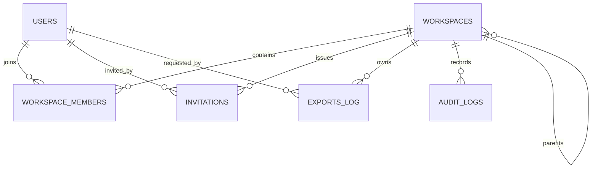
```mermaid
erDiagram
    WORKSPACES ||--o{ WORKSPACE_MEMBERS : contains
    USERS ||--o{ WORKSPACE_MEMBERS : joins
    WORKSPACES ||--o{ INVITATIONS : issues
    USERS ||--o{ INVITATIONS : invited_by
    WORKSPACES ||--o{ EXPORTS_LOG : owns
    USERS ||--o{ EXPORTS_LOG : requested_by
    WORKSPACES ||--o{ AUDIT_LOGS : records
    WORKSPACES ||--o{ WORKSPACES : parents
```

**📋 Planned Tasks — Phase 8.1**
- Workspace administration IA finalized in documentation and navigation.
- Role matrix defined for Owner, Admin, Creator, and Viewer actions.
- `workspaces` model updated for parent-child franchise support.
- `workspace_members` model includes `role`, `joined_at`, `invited_by`, `removed_at`, `removed_by`.
- `invitations` model includes token, expiry, role, status, invited_by, accepted_at.
- Shared permission guard documented for all admin APIs.
- Workspace branding section defined:
  logo, brand colors, sender display defaults, workspace identity metadata.
- Organization settings section defined:
  legal business name, CAN-SPAM address, timezone, business metadata.
- Domain and sender configuration grouped under the same admin phase for operational clarity.
- Admin shell states documented for desktop and mobile.
- Self-service and privileged actions separated clearly in UI copy and information architecture.

### Phase 8.2 — Team Management, Invites, Roles & Ownership
**WHY:** This subphase covers daily people operations inside one workspace: inviting users, assigning roles, removing access, allowing voluntary exit, and transferring ownership safely.

**[BACKEND]**
- Implement invitation lifecycle for workspace members:
  send invite, validate token, accept invite, resend invite, cancel invite, expire invite automatically.
- Enforce role-based behavior:
  Owners can invite Admins, Creators and Viewers, remove members, and transfer ownership;
  Admins can invite other users, but cannot manage roles or transfer ownership;
  Creators and Viewers cannot invite or remove others.
- Support removal flows with history preserved:
  removing a member revokes workspace access but keeps authored records tied to the workspace.
- Implement voluntary leave flow:
  a non-owner user can leave a workspace; the last remaining Owner cannot leave without ownership transfer.
- Implement ownership transfer:
  select an existing member or invite a new user, require confirmation, preserve an immutable audit trail, and prevent ownerless workspaces.
- Invalidate workspace sessions after role downgrade, removal, or ownership transfer where required.

**[FRONTEND]**
- Build a dedicated Team Members dashboard with:
  segmented lists or filtered table views for Owners, Admins, Creators, Viewers, pending invites, and recently removed users.
- Add invite dialogs for:
  Add Admin, Add Creator, Resend Invite, Cancel Invite.
- Provide clear row actions:
  change role, remove access, resend invite, view joined date, view inviter, and export list.
- Show policy-aware UI:
  hide restricted actions, explain disabled actions, and always warn on ownership or destructive changes.
- Add a self-service "Leave Workspace" flow in the user account area.

**Team Management Flow**

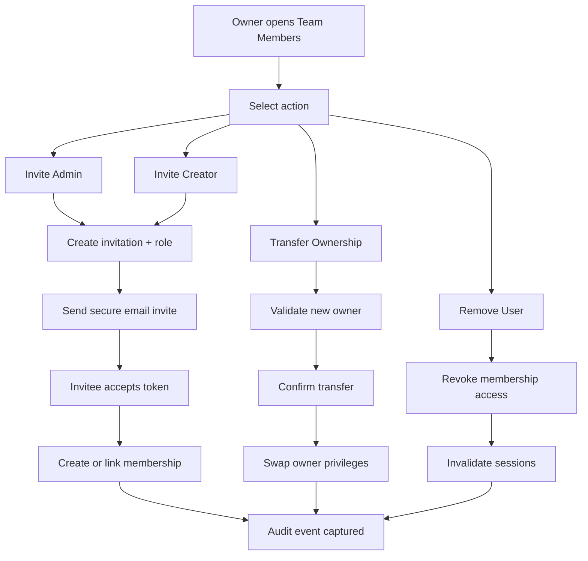
```mermaid
flowchart TD
    A[Owner opens Team Members] --> B[Select action]
    B --> C[Invite Admin]
    B --> D[Invite Creator]
    B --> E[Transfer Ownership]
    B --> F[Remove User]
    C --> G[Create invitation + role]
    D --> G
    G --> H[Send secure email invite]
    H --> I[Invitee accepts token]
    I --> J[Create or link membership]
    J --> K[Audit event captured]
    E --> L[Validate new owner]
    L --> M[Confirm transfer]
    M --> N[Swap owner privileges]
    N --> K
    F --> O[Revoke membership access]
    O --> P[Invalidate sessions]
    P --> K
    class A,B,C,D,E,F owner;
    class G,H,I,J,K,L,M,N,O,P system;
```

**📋 Planned Tasks — Phase 8.2**
- Team Members page with table UI and role filters.
- Owner, Admin, Creator, and Viewer lists, Pending Invites view.
- Invite Admin flow.
- Invite Creator flow.
- Invite cancellation flow.
- Invite resend flow.
- Invitation acceptance landing page.
- Role assignment and role update logic.
- Revoke Access flow with confirm dialog.
- Session invalidation after removal or privileged role downgrade.
- Voluntary Leave flow for non-owner users.
- Ownership Transfer flow with strong warnings and audit event.
- Prevent last-owner exit or deletion.
- Show inviter, join date, status, and role in the member table.
- Document exact behavior for Admin-managed team members.
- Define export button entry point on the Team Members page for the next subphase.

### Phase 8.3 — Franchise Workspace Management
**WHY:** ShrFlow needs a clean way for one master workspace Owner to create and govern child franchise workspaces without breaking isolation. A franchise is not just another user role; it is a separate workspace with its own owner, members, campaigns, settings, and data.

**[BACKEND]**
- Model each franchise as a child workspace using `parent_workspace_id`.
- Implement franchise invitation lifecycle:
  parent Owner invites a franchise owner, child workspace is provisioned in pending state, approval or activation rules are applied, and the franchise owner becomes Owner of the child workspace after acceptance.
- Keep parent and child data strictly segregated:
  contacts, campaigns, domains, analytics, billing context, and team membership remain workspace-bound.
- Define deletion rules for franchises:
  deleting a franchise archives or deletes the child workspace and all of its internal data according to product policy, while leaving the parent workspace intact.
- Support franchise status states:
  `pending_invite`, `pending_approval`, `active`, `suspended`, `deleted`.
- Audit every franchise action:
  invite, accept, approve, suspend, reactivate, delete.

**[FRONTEND]**
- Add a Franchise Accounts page for parent Owners showing:
  pending invites, active franchises, franchise owner, status, creation date, and action menu.
- Provide an "Add Franchise Owner" workflow that clearly explains a new workspace will be created.
- Make child workspace boundaries obvious in the UI so users never confuse parent team members with franchise team members.
- Show destructive warnings for franchise deletion:
  all users, campaigns, contacts, templates, and operational data inside that franchise will be removed or archived based on retention policy.

**Franchise Provisioning Flow**

```mermaid
flowchart LR
    classDef owner fill:#f59e0b,stroke:#d97706,stroke-width:2px,color:#fff,font-weight:bold,rx:5px,ry:5px;
    classDef system fill:#94a3b8,stroke:#64748b,stroke-width:1px,color:#fff,rx:5px,ry:5px;

    A[Parent Owner starts Add Franchise Owner] --> B[Enter franchise owner email]
    B --> C[Create pending child workspace]
    C --> D[Send franchise invitation email]
    D --> E[Invitee accepts]
    E --> F[Provision child owner membership]
    F --> G[Activate franchise workspace]
    G --> H[Franchise owner logs into isolated workspace]
    H --> I[Franchise owner manages own team, campaigns, and settings]

    class A,B,E,H,I owner;
    class C,D,F,G system;
```

**📋 Planned Tasks — Phase 8.3**
- Child workspace data model documented in the roadmap.
- Franchise Accounts admin page.
- Add Franchise Owner invitation flow.
- Pending franchise approval or activation rules documented.
- Franchise status lifecycle documented.
- Parent-child workspace visibility rules documented.
- Franchise owner onboarding flow documented.
- Franchise deletion flow with irreversible warning.
- Franchise suspension/reactivation rules documented.
- Audit coverage for franchise create, approve, suspend, delete.
- Clarify whether billing is inherited, delegated, or tracked separately.
- Clarify whether domains and sender identities are shared or isolated.

### Phase 8.4 — Team Directory Export, Reporting & Download Workflows
**WHY:** Once team membership is modeled correctly, admins need a safe way to export it. Export is not a standalone feature; it sits on top of the team model, permission layer, audit logs, and async job system.

**[BACKEND]**
- Support filtered user exports for Owners and eligible Admins.
- Allow export filters such as:
  role, invited_by, status, workspace, franchise, joined date range, and output format.
- Implement dual-mode export behavior:
  small exports stream directly, large exports run asynchronously.
- Write export jobs to `exports_log` with status, requester, filters, file format, progress, and storage metadata.
- Generate signed download URLs for completed files and expire them automatically.
- Rate-limit export creation and prevent duplicate concurrent export storms for the same workspace when needed.

**[FRONTEND]**
- Add export controls directly to the Team Members page and, if needed, an Export History subpage in settings.
- Show filter controls before export so users understand what dataset they are downloading.
- Distinguish immediate download from queued export clearly in the UI.
- Surface status:
  queued, processing, completed, failed, expired.
- Provide clear help text:
  "Large exports are emailed to you when ready."

**Export Flow**

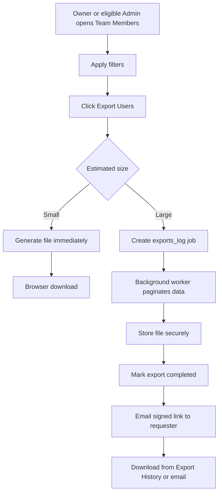
```mermaid
flowchart TD
    A[Owner or eligible Admin opens Team Members] --> B[Apply filters]
    B --> C[Click Export Users]
    C --> D{Estimated size}
    D -->|Small| E[Generate file immediately]
    D -->|Large| F[Create exports_log job]
    E --> G[Browser download]
    F --> H[Background worker paginates data]
    H --> I[Store file securely]
    I --> J[Mark export completed]
    J --> K[Email signed link to requester]
    K --> L[Download from Export History or email]
    class A admin;
    class B,C,D,E,F,G,H,I,J,K,L system;
```

**📋 Planned Tasks — Phase 8.4**
- Export Users button on Team Members page.
- Export filters:
  role, invited_by, status, format.
- Small export direct download behavior.
- Large export async queue behavior.
- Export history page or panel.
- Export status polling or refresh strategy.
- Signed download URL lifecycle documented.
- CSV schema documented:
  first name, last name, email, joined date, role, inviter, status.
- Optional XLSX format documented.
- Export permission rules documented for Owner vs Admin.
- Export rate-limit and concurrency rules documented.
- Export-ready email notification documented.

### Phase 8.5 — Governance, Audit, Deletion Policy & Operational Safeguards
**WHY:** Team administration becomes risky without auditability, retention rules, lifecycle safeguards, and clear destructive-action policy. This subphase closes the loop so every people-management action is accountable and recoverable where appropriate.

**[BACKEND]**
- Log every critical action:
  invite sent, invite accepted, invite cancelled, member removed, ownership transferred, franchise created, franchise deleted, export requested, export downloaded.
- Add retention and lifecycle behavior:
  soft-delete user membership where appropriate, archive pending or expired invites, and retain audit history independently from access status.
- Define destructive behavior explicitly:
  removing a member removes access only;
  deleting a franchise removes or archives all franchise-scoped data according to retention policy.
- Add safety rules for the last Owner, owner transfer confirmation, and protected financial or destructive actions.
- Ensure compliance visibility:
  who invited whom, who exported which data, and when destructive actions occurred.

**[FRONTEND]**
- Add an audit log surface or timeline for workspace Owners.
- Provide clear confirmations for destructive actions with exact impact language.
- Display retention hints where relevant:
  removed users lose access immediately, but historical records remain tied to the workspace.
- Show export and invite history with timestamps for admin confidence and supportability.

**Governance Flow**

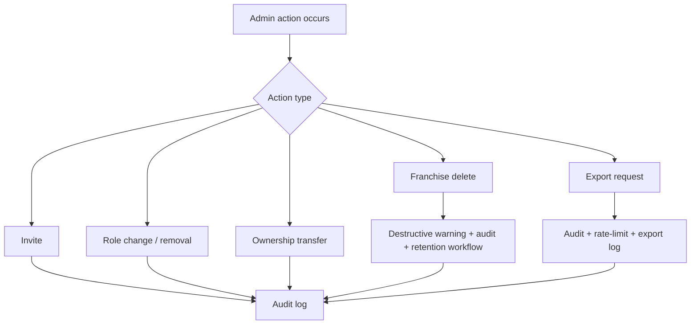
```mermaid
flowchart TD
    A[Admin action occurs] --> B{Action type}
    B --> C[Invite]
    B --> D[Role change / removal]
    B --> E[Ownership transfer]
    B --> F[Franchise delete]
    B --> G[Export request]
    C --> H[Audit log]
    D --> H
    E --> H
    F --> I[Destructive warning + audit + retention workflow]
    G --> J[Audit + rate-limit + export log]
    I --> H
    J --> H
    class A admin;
    class B,C,D,E,F,G,H,I,J system;
```

**📋 Planned Tasks — Phase 8.5**
- Workspace audit log for team administration.
- Invite history with timestamps and actor identity.
- Export log with filters, requester, and file lifecycle.
- Soft-delete / access revocation policy documented.
- Franchise deletion policy documented clearly.
- Ownership transfer safeguards documented.
- Last-owner protection documented.
- Destructive confirmation standards documented.
- Retention rules for invites, exports, and audit logs documented.
- Compliance wording for admin-visible history documented.

### Phase 8 Consolidated Delivery Checklist
- Workspace branding and organization settings.
- CAN-SPAM physical address setup.
- Domain verification and sender verification.
- Team Members management dashboard.
- Invitation system:
  send, resend, cancel, accept.
- Role-aware Owner, Admin, Creator, and Viewer permissions.
- Revoke access flow.
- Voluntary leave flow.
- Ownership transfer flow.
- Franchise Accounts system.
- Franchise invite, activation, suspension, deletion flows.
- Team user export:
  sync and async.
- Export history and secure download handling.
- Audit log and retention rules.
- Full documentation for UI, API, data, lifecycle, and governance behavior.

---

---

---

### 🔐 RBAC System
- Roles involved: Owner, Admin.
- What is enforced in backend: `require_permission("settings:manage")` and `"settings:view"`.
- What is enforced in frontend: Granular UI element toggling via `can()` utility.

---

### 🚀 Features (From Real System)
- **Franchise Governance Engine**
  - **What it does:** Enables parent workspaces to spawn, suspend, reactivate, and govern child workspaces while maintaining absolute data isolation.
  - **Where it exists:** `platform/api/routes/team.py` and `platform/client/src/app/settings/franchises/`
  - **Why it belongs here:** Ultimate enterprise team management.
  - **Classification:** Core Feature

- **Workspace Request Workflow**
  - **What it does:** Bi-directional approval system for Admins to request billing or franchise changes, requiring Owner approval.
  - **Where it exists:** `platform/client/src/app/settings/requests/page.tsx`
  - **Classification:** Core Feature

## Phase 9 — Security, Compliance & Deliverability Infrastructure
**WHY:** Ensures emails reach the inbox natively without landing in spam, maintaining strict data compliance and backup integrity.

### Phase 9 Architecture Flow

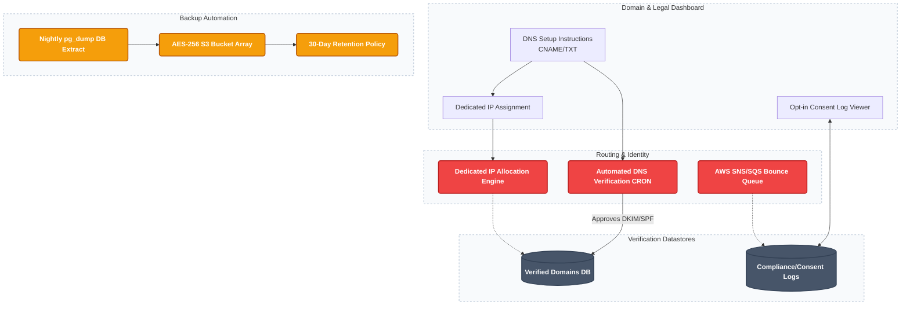
```mermaid
graph TD
    classDef infra fill:#ef4444,stroke:#b91c1c,stroke-width:2px,color:#fff,font-weight:bold,rx:5px,ry:5px;
    classDef pipeline fill:#2563eb,stroke:#1d4ed8,stroke-width:2px,color:#fff,font-weight:bold,rx:5px,ry:5px;
    classDef monitor fill:#f59e0b,stroke:#b45309,stroke-width:2px,color:#fff,font-weight:bold,rx:5px,ry:5px;
    classDef database fill:#475569,stroke:#334155,stroke-width:2px,color:#fff,font-weight:bold,rx:5px,ry:5px;

    subgraph ComplianceUI [Domain & Legal Dashboard]
        DNSView[DNS Setup Instructions <br> CNAME/TXT]
        IPView[Dedicated IP Assignment]
        ConsentView[Opt-in Consent Log Viewer]
        
        DNSView --> IPView
        class DNSView frontend;
        class IPView frontend;
        class ConsentView frontend;
    end

    subgraph InfrastructureLayer [Routing & Identity]
        DNSCRON[Automated DNS Verification CRON]
        IPRouter[Dedicated IP Allocation Engine]
        SNS[AWS SNS/SQS Bounce Queue]
        
        DNSView --> DNSCRON
        IPView --> IPRouter
        class DNSCRON infra;
        class IPRouter infra;
        class SNS infra;
    end

    subgraph DataProtection [Backup Automation]
        BackupCRON[Nightly pg_dump DB Extract]
        S3[AES-256 S3 Bucket Array]
        Lifecycle[30-Day Retention Policy]
        
        BackupCRON --> S3
        S3 --> Lifecycle
        class BackupCRON monitor;
        class S3 monitor;
        class Lifecycle monitor;
    end

    subgraph TrustData [Verification Datastores]
        Domains[(Verified Domains DB)]
        Consent[(Compliance/Consent Logs)]
        
        DNSCRON --> |"Approves DKIM/SPF"| Domains
        ConsentView <--> Consent
        IPRouter -.-> Domains
        SNS -.-> Consent
        class Domains database;
        class Consent database;
    end

    classDef dualBox fill:#f8fafc,stroke:#cbd5e1,stroke-width:2px,stroke-dasharray: 4 4;
    class ComplianceUI dualBox;
    class InfrastructureLayer dualBox;
    class DataProtection dualBox;
    class TrustData dualBox;
```

**[BACKEND]**
- Dedicated IP Allocation engine attaching isolated IPs per high-tier tenant.
- Automated DNS Verification CRON constantly scanning CNAME/TXT records for DMARC/SPF/DKIM validity.
- Bounce & Spam complaint SNS/SQS queue ingestion.
- Nightly `pg_dump` backups natively pushing AES-256 encrypted payloads to S3 with 30-day retention policies.

**[FRONTEND]**
- DNS Setup Instructions rendering exact copy-paste values for external providers natively.
- Dedicated IP health monitoring widget.
- GDPR Compliance / Opt-in consent log viewer.

**📋 Planned Tasks — Phase 9**
- Custom domain setup wizard (enter domain > get DNS records > verify)
- Dedicated IP Allocation engine per high-tier tenant
- Automated DNS Verification CRON (CNAME/TXT for DMARC/SPF/DKIM)
- Bounce & Spam complaint SNS/SQS queue ingestion
- Nightly pg_dump backups pushed AES-256 encrypted to S3 (30-day retention)
- DNS Setup Instructions rendering copy-paste values for external providers
- Dedicated IP health monitoring widget
- IP warmup status page (daily send limit and progression)
- [GAP 1 — System Email Migration] Register and verify `mail.shrflow.app` via AWS SES
- [GAP 1] Migrate all system emails (OTP, audit alerts, notifications) off Gmail MVP onto `mail.shrflow.app`
- [GAP 6 — Dedicated IP Warmup] Implement 30-day warmup automation CRON (`warmup_scheduler.py`)
- [GAP 6] Days 1–3: 50 emails/day cap
- [GAP 6] Days 4–7: 200 emails/day cap
- [GAP 6] Days 8–14: 500 emails/day cap
- [GAP 6] Days 15–21: 1,000 emails/day cap
- [GAP 6] Days 22–30: 5,000 emails/day cap
- [GAP 6] Day 31+: Full capacity granted conditionally (bounce < 2%, complaint < 0.1%)

---

---

## Phase 9.5 — Global Notification System
**WHY:** Keeps users engaged and informed of system-critical events in real-time.

**[BACKEND]**
- **Notification Engine**: Centralized service to dispatch alerts (In-App or Email).
- **WebSocket Gateway**: Real-time delivery of "Toasts" for active dashboard sessions.
- **Preference Service**: Allows users to choose which types of alerts they want to receive (In-App only, Email only, or both).

**[FRONTEND]**
- **Notification Center (Bell UI)**: A global header component with unread counts and a list of recent alerts.
- **Real-Time Toast Library**: Integration of `sonner` or `react-hot-toast` with the WebSocket gateway.

---

## Phase 10 — Advanced Campaigns & Knowledge RAG Bot
**WHY:** Deep automation workflows and intelligence mechanisms dramatically optimizing open rates naturally.

### Phase 10 & 10.5 Architecture Flow (Advanced Campaigns & Deep RAG)

```mermaid
graph TD
    classDef frontend fill:#2563eb,stroke:#1d4ed8,stroke-width:2px,color:#fff,font-weight:bold,rx:5px,ry:5px;
    classDef ai fill:#10b981,stroke:#047857,stroke-width:2px,color:#fff,font-weight:bold,rx:5px,ry:5px;
    classDef logic fill:#f59e0b,stroke:#b45309,stroke-width:2px,color:#fff,font-weight:bold,rx:5px,ry:5px;
    classDef database fill:#475569,stroke:#334155,stroke-width:2px,color:#fff,font-weight:bold,rx:5px,ry:5px;

    subgraph IntelligenceUI [Advanced Tenant Interfaces]
        ChatWidget[Floating AI Chat Assistant]
        DripCanvas[Visual Drip Workflow Builder]
        ABSplit[A/B Variant Creation Matrix]
        
        ChatWidget --> DripCanvas
        ABSplit --> DripCanvas
        class ChatWidget frontend;
        class DripCanvas frontend;
        class ABSplit frontend;
    end

    subgraph DripEngine [Advanced Logic Core]
        StateMachine[Chronological Drip State Machine]
        STOptimizer[Send-Time Optimization Logic]
        WinnerBot[A/B Autonomous Winner Selector]
        
        DripCanvas --> StateMachine
        ABSplit --> WinnerBot
        StateMachine --> STOptimizer
        class StateMachine logic;
        class STOptimizer logic;
        class WinnerBot logic;
    end

    subgraph RAGOrchestration [AI Inference Pipeline]
        Langchain[LangChain / LlamaIndex Orchestrator]
        Embeddings[Realtime Embedding Model]
        ContextBuilder[Cosine Similarity Context Ingestion]
        
        ChatWidget --> |"Natural Language Ask"| Langchain
        Langchain <--> ContextBuilder
        Embeddings --> ContextBuilder
        class Langchain ai;
        class Embeddings ai;
        class ContextBuilder ai;
    end

    subgraph KnowledgeData [Vector Datastore]
        TenantSets[(Tenant Campaign Datasets)]
        pgvector[(pgvector / Pinecone <br> High-Dimensional Array)]
        
        WinnerBot -.-> |"Ingests Winners"| TenantSets
        TenantSets --> Embeddings
        ContextBuilder <--> pgvector
        class TenantSets database;
        class pgvector database;
    end

    classDef dualBox fill:#f8fafc,stroke:#cbd5e1,stroke-width:2px,stroke-dasharray: 4 4;
    class IntelligenceUI dualBox;
    class DripEngine dualBox;
    class RAGOrchestration dualBox;
    class KnowledgeData dualBox;
```

**[BACKEND]**
- Audience A/B split logic partitioning recipients evenly and identifying open-rate winners autonomously.
- Drip campaign orchestration routing logic based on predefined chronological state machines.
- Send-time optimization evaluating historical recipient logs and distributing emails perfectly to the exact peak individual window.
- **Knowledge RAG Bot Service**: Advanced Vector-Database connection (Retrieval-Augmented Generation) continuously indexing the tenant's exact successful templates, tone definitions, and audience responses mathematically.

**[FRONTEND]**
- Multi-variant A/B creation UI integrating directly inside the campaign builder cleanly.
- Visual canvas implementing drag-and-drop conditions creating Drip automated sequence flows.
- **Strategy Chatbot RAG Widget**: Sliding sidebar chatbot specifically contextualized on the tenant's data enabling advanced interrogations ("Write me a follow-up heavily replicating the absolute best subject line we utilized in Q2").

**📋 Planned Tasks — Phase 10**
- A/B Testing: Two subject line variants sent to a split audience, winner auto-sent
- Audience A/B split logic partitioning recipients (open-rate winner auto-selected)
- Drip campaign orchestration via chronological state machines
- Predictive Send-Time Optimization (Machine Learning algorithm determining peak individual inbox-checking minute)
- Visual canvas drag-and-drop Drip sequence builder
- Multi-variant A/B creation UI inside the campaign builder
- Knowledge RAG Bot Service (Vector DB + LangChain orchestrator)
- Semantic Search API (natural language > cosine-similarity search)
- LLM Orchestration Layer (LangChain/LlamaIndex grounded responses)
- Global AI Assistant Widget (floating chat module with conversation history)
- Prompt Library UI (curated starter questions)
- Segment / Filter Generator (natural language input auto-configures filters)
- Deliverability Explainer Modal ("Explain this" button for SMTP bounce codes)
- pgvector / Pinecone high-dimensional embedding store setup
- Data Ingestion Pipeline (embed successful campaign HTML/subjects asynchronously)

---

## Phase 10.5 — AI & Deep RAG Integration
**WHY:** Transforms the platform from a manual sending tool into an intelligent marketing assistant leveraging the tenant's own historical data.

**[BACKEND]**
- **Vector Database Provisioning**: Setup pgvector (or Pinecone) to store high-dimensional embeddings.
- **Data Ingestion Pipeline**: Asynchronously chunk and embed successful campaign HTML, subject lines, and send-time metrics every time a campaign completes.
- **Semantic Search API**: Endpoint taking natural language queries, embedding them, and performing cosine-similarity searches against the tenant's vector namespace.
- **LLM Orchestration Layer**: LangChain/LlamaIndex implementation processing retrieved context and generating grounded responses without hallucinations.

**[FRONTEND]**
- **Global AI Assistant Widget**: Floating chat module available across all pages maintaining conversation history.
- **Prompt Library UI**: Curated list of starter questions ("Analyze my last 3 campaigns", "Generate a segment for unengaged users").
- **Segment / Filter Generator**: Natural language input box on the Contacts page that auto-configures complex dropdown filters based on AI interpretation.
- **Deliverability Explainer Modal**: "Explain this" button next to raw SMTP bounce codes that opens an AI-generated, plain-English summary of the exact fix needed.
- **Multi-Language "Smart Translation"**: Allow user to draft a template and instantly generate localized copies for international scaling.

---

## Phase 11 — API & Integrations
**WHY:** Creates extreme extensibility via headless consumption and outgoing system webhooks.

### Phase 11 Architecture Flow

```mermaid
graph TD
    classDef frontend fill:#2563eb,stroke:#1d4ed8,stroke-width:2px,color:#fff,font-weight:bold,rx:5px,ry:5px;
    classDef api fill:#10b981,stroke:#047857,stroke-width:2px,color:#fff,font-weight:bold,rx:5px,ry:5px;
    classDef external fill:#ef4444,stroke:#b91c1c,stroke-width:2px,color:#fff,font-weight:bold,rx:5px,ry:5px;
    classDef database fill:#475569,stroke:#334155,stroke-width:2px,color:#fff,font-weight:bold,rx:5px,ry:5px;

    subgraph PortalUI [External Integrator Facing]
        OpenAPI[Interactive Swagger OpenAPI Docs]
        WebhookUI[Event Subscription Manager]
        DevDash[API Consumption Dash]
        
        DevDash --> OpenAPI
        DevDash --> WebhookUI
        class OpenAPI frontend;
        class WebhookUI frontend;
        class DevDash frontend;
    end

    subgraph HeadlessAPI [Inbound Transactional API]
        RESTAPI[/v1/send Protected Endpoint/]
        PayloadValidation[JSON Schema Payload Validator]
        AuthCache[API Key Redis Validation]
        
        RESTAPI --> PayloadValidation
        RESTAPI --> AuthCache
        PayloadValidation --> |"Injects to RMQ"| DeliveryQueue
        class RESTAPI api;
        class PayloadValidation api;
        class AuthCache api;
    end

    subgraph WebhookDispatcher [Outbound Event Engine]
        EventTracker[Open / Bounce Listener]
        Retrier[Exponential Backoff Retrier]
        PayloadBuilder[System-to-Tenant Webhook Dispatcher]
        
        EventTracker --> PayloadBuilder
        PayloadBuilder -.-> |"Attempts Deliver"| Retrier
        class EventTracker api;
        class Retrier api;
        class PayloadBuilder api;
    end

    subgraph ExternalClients [Tenant Systems]
        CRM[External Hubspot / Salesforce]
        CustomApp[Tenant Custom Codebases]
        Endpoints[(Tenant Webhook Subscriptions)]
        
        HeadlessAPI <--> CustomApp
        PayloadBuilder --> |"HTTP POST"| CRM
        WebhookUI --> Endpoints
        class CRM external;
        class CustomApp external;
        class Endpoints database;
    end

    classDef dualBox fill:#f8fafc,stroke:#cbd5e1,stroke-width:2px,stroke-dasharray: 4 4;
    class PortalUI dualBox;
    class HeadlessAPI dualBox;
    class WebhookDispatcher dualBox;
    class ExternalClients dualBox;
```

**[BACKEND]**
- Dedicated `/v1/send` REST API architecturally prioritizing transactional payload executions reliably.
- Webhook notification engine repeatedly attempting (via exponential backoff) to alert external tenant interfaces upon open/click/bounce milestones.

**[FRONTEND]**
- Developer portal natively hosting interactive OpenAPI documentation components cleanly.
- Webhook management interface facilitating specific event subscriptions visually.

**📋 Planned Tasks — Phase 11**
- A public REST API (/v1/send) for transactional email sending
- /v1/send endpoint with JSON Schema payload validation
- API Key Redis validation (authentication for external callers)
- Webhook notification engine with exponential backoff retrier
- Event subscription system (open, click, bounce, unsubscribe events)
- Webhook Subscription Manager UI
- Interactive Swagger OpenAPI documentation portal
- API Consumption Dashboard (daily usage, rejection trends)
- HubSpot / Salesforce CRM outbound webhook delivery

---

## Phase 12 — Enterprise Domain Auto-Discovery (JIT Provisioning)
**WHY:** Reduces extreme onboarding friction for massive organizations via automatic corporate-domain correlation.

### Phase 12 Architecture Flow

```mermaid
graph TD
    classDef frontend fill:#2563eb,stroke:#1d4ed8,stroke-width:2px,color:#fff,font-weight:bold,rx:5px,ry:5px;
    classDef logic fill:#10b981,stroke:#047857,stroke-width:2px,color:#fff,font-weight:bold,rx:5px,ry:5px;
    classDef security fill:#f59e0b,stroke:#b45309,stroke-width:2px,color:#fff,font-weight:bold,rx:5px,ry:5px;
    classDef database fill:#475569,stroke:#334155,stroke-width:2px,color:#fff,font-weight:bold,rx:5px,ry:5px;

    subgraph EnterpriseUI [Corporate End-User Interfaces]
        Onboard[Signup Interceptor]
        WaitRoom[Employee Waiting Room UI]
        AdminGov[IT Governance Approval Portal]
        
        Onboard --> WaitRoom
        WaitRoom -.-> |"Awaits"| AdminGov
        class Onboard frontend;
        class WaitRoom frontend;
        class AdminGov frontend;
    end

    subgraph JITDiscovery [Just-In-Time Provisioning API]
        PDEP[Public Domain Exclusion <br> Gmail/Yahoo Drop]
        VBD[Verification-Before-Disclosure <br> OTP Recon Shield]
        Matcher[Corporate Domain Correlator]
        
        Onboard --> |"Enters @acme.com"| PDEP
        PDEP --> VBD
        VBD --> Matcher
        class PDEP logic;
        class VBD logic;
        class Matcher logic;
    end

    subgraph SSOIntegration [Active Directory Auth]
        SAML[SAML/LDAP Corporate Bridge]
        RBAC[Automatic Role Assigner]
        
        Matcher --> SAML
        SAML --> RBAC
        RBAC --> AdminGov
        class SAML security;
        class RBAC security;
    end

    subgraph IdentityStorage [Enterprise Boundary State]
        Tenants[(Workspace/Tenant Boundaries)]
        SSOMeta[(SAML Configurations)]
        
        Matcher <--> Tenants
        SAML <--> SSOMeta
        class Tenants database;
        class SSOMeta database;
    end

    classDef dualBox fill:#f8fafc,stroke:#cbd5e1,stroke-width:2px,stroke-dasharray: 4 4;
    class EnterpriseUI dualBox;
    class JITDiscovery dualBox;
    class SSOIntegration dualBox;
    class IdentityStorage dualBox;
```

**[BACKEND]**
- JIT provisioning processor intercepting recognized corporate domains reliably.
- PDEP Filter aggressively blocking free providers (Gmail, Yahoo) from discovery mechanisms.
- VBD (Verification-Before-Disclosure) forcing OTP entry identically before confirming domain existence preventing reconnaissance.
- Active Directory SSO integrations via secure SAML/LDAP bridges mapping user roles reliably.

**[FRONTEND]**
- Custom waiting room interfaces reassuring unapproved employees cleanly.
- Governance Portal rendering direct approval matrices prioritizing swift IT Administrator workflow ingestion natively.

**📋 Planned Tasks — Phase 12**
- Custom domain setup wizard (enter domain > get DNS records > verify)
- JIT provisioning processor — intercepts recognized corporate domains
- PDEP Filter — blocks free providers (Gmail, Yahoo) from discovery
- VBD (Verification-Before-Disclosure) — requires OTP before confirming domain existence
- Active Directory SSO integrations via SAML/LDAP bridges
- Custom waiting room UI reassuring unapproved employees
- IT Governance Portal with approval matrix for administrators
- Automatic Role Assigner via RBAC post SSO login
- SAML Configuration storage per enterprise tenant

---

## Phase 13 — Scale & Microservices
**WHY:** Separating bounded contexts logically when extreme transaction volumes demand independent scaling axes natively.

### Phase 13 Architecture Flow

```mermaid
graph TD
    classDef api fill:#10b981,stroke:#047857,stroke-width:2px,color:#fff,font-weight:bold,rx:5px,ry:5px;
    classDef worker fill:#8b5cf6,stroke:#6d28d9,stroke-width:2px,color:#fff,font-weight:bold,rx:5px,ry:5px;
    classDef external fill:#ef4444,stroke:#b91c1c,stroke-width:2px,color:#fff,font-weight:bold,rx:5px,ry:5px;
    classDef database fill:#475569,stroke:#334155,stroke-width:2px,color:#fff,font-weight:bold,rx:5px,ry:5px;

    subgraph APIGateway [Nginx/Kong Routing]
        Gateway[Central Reverse Proxy]
        Degraded[Conditional Degradation Rules]
        
        Gateway --> Degraded
        class Gateway external;
        class Degraded external;
    end

    subgraph MicroserviceCluster [Decoupled Domain APIs]
        AuthAPI[Authentication Container]
        ContactAPI[Contacts & Segments Container]
        RenderAPI[Template MJML Container]
        AnalyticsAPI[Click/Open Tracking Container]
        
        Gateway --> AuthAPI
        Gateway --> ContactAPI
        Gateway --> RenderAPI
        Gateway --> AnalyticsAPI
        class AuthAPI api;
        class ContactAPI api;
        class RenderAPI api;
        class AnalyticsAPI api;
    end

    subgraph AsynchronousBackplane [Redis/RabbitMQ Bus]
        Redis[Redis In-Memory Cache/Locks]
        RabbitMQ[Cross-Service Message Bus]
        
        ContactAPI <--> Redis
        AnalyticsAPI --> |"Publishes Event"| RabbitMQ
        class Redis worker;
        class RabbitMQ worker;
    end

    subgraph DatabasePartitioning [Scale-Out Storage]
        AuthDB[(Auth & Roles PostgreSQL)]
        Lake[(ClickHouse / TimescaleDB <br> Event Analytics)]
        
        AuthAPI --> AuthDB
        RabbitMQ --> |"Consumes to Lake"| Lake
        class AuthDB database;
        class Lake database;
    end

    classDef dualBox fill:#f8fafc,stroke:#cbd5e1,stroke-width:2px,stroke-dasharray: 4 4;
    class APIGateway dualBox;
    class MicroserviceCluster dualBox;
    class AsynchronousBackplane dualBox;
    class DatabasePartitioning dualBox;
```

**[BACKEND]**
- Complete decomposition partitioning Auth, Contacts, Delivery, Templates, and Analytics functionally across separated containers.
- Message bus replacements upgrading database-polling directly into Redis-backed asynchronous workers natively.
- Blacklist verification CRON continuously pinging MXToolbox API monitoring IP health perpetually.

**[FRONTEND]**
- Degraded-state conditional rendering preserving essential UI functionality even when sub-scale internal matrices disconnect slightly (e.g. allowing editing while analytics systems update).

**📋 Planned Tasks — Phase 13**
- Complete decomposition: Auth, Contacts, Delivery, Templates, Analytics into separate containers
- Message bus replacement (database-polling > Redis-backed async workers)
- Horizontal worker scaling (stateless workers, Docker Swarm / k8s replicas)
- Circuit breaker on SES SMTP (fail fast on consecutive failures, auto-reset)
- Blacklist verification CRON (MXToolbox API monitoring IP health)
- Nginx/Kong API Gateway with conditional degradation rules
- Platform health dashboard (Redis queue depth, worker status)
- **SMTP Classification Matrix**: Standardize SMTP responses into Invalid, Technical, Content, and Reputation categories.
- Cost monitoring dashboard (per-tenant SES cost vs plan revenue)
- **ClickHouse / TimescaleDB Migration**: Move historical event analytics to a columnar database for sub-second segmentation.
- **"Double-Writing" Pipeline**: Ingest data into both Postgres and ClickHouse during the migration phase.
- Degraded-state UI conditional rendering (allow editing while analytics updates)
- [GAP 4 — Event Archival Strategy] Migrate `email_events` > 90 days old from PostgreSQL to ClickHouse
- [GAP 4] Rewrite analytics frontend queries to route historical trends (> 90d) to ClickHouse
- [GAP 5 — Worker Decomposition Phase 2] Split Monolith into 5 dedicated micro-workers
- [GAP 5] `email_sender.py` (Scales horizontally, purely pulls from queue and sends to AWS SES)
- [GAP 5] `webhook_handler.py` (Ingests SNS bounce/complaint webhooks, scales horizontally)
- [GAP 5] `reputation_worker.py` (Single-instance, aggregates bounce events into tenant rolling scores)
- [GAP 5] `warmup_scheduler.py` (Single-instance CRON, advances daily IP limits)
- [GAP 5] `dispatch_logger.py` (Batches successful sends into `email_events` database inserts optimally)

---

## Notification Strategy

**In-App (Toast/Banner UI)**
- Campaign dispatched, Campaign paused, SMTP error warnings, Quota limit alerts, Daily list validations.

**System Emails (Sent via Centralized System Emailer)**
- Sender Identity OTPs, Campaign completion analytical summaries, Password resets, Payment failed alerts, Monthly usage recitals.

**System/Legal Emails (Appended internally to every dispatched campaign)**
- Clean un-subscription notifications natively respecting external click intercepts securely.
- Mandatory CAN-SPAM/GDPR entity address placements enforcing platform legality completely.

---

## Phase 14 — Platform Command Center (Master Admin)
**WHY:** A centralized "God Mode" for the Managing Team to monitor all tenants, subscriptions, and escalated issues.

**[ARCH] Workspace Switcher Logic**
- **Unified Login**: One `/login` for everyone (Tenants and Admins).
- **Header Toggle**: A visual dropdown in the top header (visible only to staff) to switch between the "Master Admin Dashboard" and the "Personal Marketing Workspace".
- **Security Check**: Backend middleware enforces `is_platform_admin` flag on all `/admin/*` routes.

**[BACKEND]**
- **Super-Admin API**: Protected routes for tenant management, billing overrides, and global stats.
- **Dynamic "SEQ" Reputation Scoring**: Real-time Engagement Quality score (0-100) based on rolling open vs. complaint ratios.
- **Bounce-Rate "Drift" Watchdog**: Anomaly detection that pauses campaigns if bounce rates spike above historical standard deviations.
- **"Kill-Switch" Worker Logic**: Workers check Redis `tenant:status` before every batch; instantly NACKing tasks if a tenant is suspended mid-send.
- **Privacy-Preserving Proxy**: Automatic PII masking (e.g., `rahul@gmail.com` -> `r***@g***.com`) when an Admin enters "Shadow Mode" to debug a tenant's account.
- **Tenant Performance Watchdog**: Real-time monitoring of all tenants for bounce-rate spikes or spam traps.

**[FRONTEND]**
- **Super Dashboard**: Visual map of platform-wide health, throughput, and revenue.
- **Tenant Directory**: Searchable list of all companies on the platform with drill-down views.
- **Shadow Mode Banner**: Persistent orange banner at the top of the screen ("Shadowing Tenant: [Name]") with an "Exit Shadow Mode" button.

---

## Phase 15 — Internal Team Management & Staff RBAC
**WHY:** Allows the Platform Owner (You) to build a professional managing team with restricted permissions.

**[BACKEND]**
- **Internal RBAC Matrix**:
    - `OWNER`: Full access (Billing, Deletion, Team Invites).
    - `SUPPORT_LEAD`: Can shadow tenants and manage tickets; no billing access.
    - `COMPLIANCE`: Can suspend tenants for spam; no template editing access.
    - `VIEWER`: Read-only access to global analytics.
- **Staff Invitation System**: Secure invitation flow to onboard employees into the Master Admin context.
- **Admin Audit Log**: Immutable history tracking every action taken by an internal team member.

**[FRONTEND]**
- **Master Team Settings**: Management UI for the Owner to add/remove employees and edit roles.
- **Role-Aware UI**: Automatically hides/disables sensitive financial and deletion buttons based on the employee's role.

---

## Phase 16 — Unified Profile & Account Settings
**WHY:** Centralized management for user identity, security, and workspace defaults.

**📋 Planned Tasks — Phase 16**
- User Profile Page (Avatar, Name, Password reset)
- Multi-Factor Authentication (MFA) setup for both Tenants and Admins
- Workspace Branding (Upload Logo, define Brand Colors for default template styles)
- Workspace Member Management (Invite co-workers to a specific tenant workspace)

---

## Phase 17 — Advanced Intelligence & AI
**WHY:** Differentiates the platform by automating optimization and list health.

**📋 Planned Tasks — Phase 17**
- **Bayesian A/B/n Testing Engine**: Update winner probabilities in real-time using Multi-Armed Bandit algorithms.
- **Machine Learning STO (Send-Time Optimization)**: Predict the optimal send-hour for every individual subscriber based on historical engagement.
- **Automatic "Zombie" Removal**: Background worker identifies inactive subscribers (90+ days) and applies a "Sunset Policy" to protect reputation.
- **Smart Subject Suggestion**: AI-driven subject line generator based on previous high-performing campaigns.

---

## Database Index Strategy (Critical for Scale)
- `contacts(tenant_id, email)` — Fast deduplication.
- `email_tasks(status, scheduled_at)` — Ultra-fast worker polling.
- `campaigns(tenant_id, status)` — Fast dashboard loading.
- `audit_logs(tenant_id, timestamp)` — Fast compliance fetching.
- `email_events(campaign_id, contact_id)` — Fast analytical aggregations.
- `sender_identities(verification_token)` — Secure fast-lookups during identity validation.

## 🔐 Global RBAC Audit Report

1. **Roles defined in system:**
   - `owner`, `admin`, `creator`, `viewer`.

2. **Where roles are enforced:**
   - **Backend:** `utils/permissions.py` provides `require_permission()` dependency, which decodes the JWT and validates against a hardcoded RBAC dictionary mapping roles to actions (e.g., `campaign:send`).
   - **Frontend:** `AuthContext.tsx` maintains session state. The `can(user, action)` utility function is used globally to conditionally render UI components.
   - **Middleware:** `utils/jwt_middleware.py` provides base authentication (`require_authenticated_user`) and legacy strict checks (`require_admin_or_owner`).

3. **Critical gaps:**
   - The backend enforcement is surprisingly thorough. Most core entities (`campaigns`, `contacts`, `templates`, `settings`, `domains`, `team`) use `require_permission` consistently.
   - **Risk:** Some older helper routes or webhooks might bypass RBAC, but they are protected by signature verification (e.g., SNS webhooks).

4. **Recommendations:**
   - Consolidate legacy `require_admin_or_owner` into the `require_permission` dictionary system for uniformity.

---

## 🧱 Architecture Evolution Summary

- **Major shifts detected:**
  - **Database Access:** Shifted from purely using Supabase PostgREST (via `supabase-py`) to integrating `asyncpg` for direct, high-performance Postgres connection pooling. This was required for setting transaction-level RLS context (`SET LOCAL app.current_tenant_id`) during background worker execution.
  - **Messaging:** Heavy reliance on RabbitMQ (`aio-pika`) for all heavy lifting (CSV processing, Email dispatch).
  - **Caching/State:** Redis is critical infrastructure, handling rate-limiting (`slowapi`), distributed locking for idempotency, and WebSockets Pub/Sub for real-time import progress.

- **Current architecture (real):**
  - FastAPI (Gateway) -> Supabase (Auth/DB) -> RabbitMQ (Message Broker) -> Standalone Python Workers -> AWS SES / Gmail.

- **Risk areas:**
  - The embedded scheduler in `platform/api/main.py` will cause double-dispatch if multiple API replicas are deployed. It must be disabled in production in favor of the standalone worker with Redis locks.

- **Scalability readiness:**
  - High. The streaming chunk parser and worker queues mean the API node memory footprint remains small regardless of tenant data size.

---

## 🎨 UI System Audit

- **Design system vs actual usage:**
  - The `shadcn/ui` system is implemented successfully. Complex components like DataTables and Modals adhere strictly to the design system.
- **UX inconsistencies:**
  - Minor. The onboarding flow was recently refactored to resolve a "ghost workspace" trap, improving multi-tenant navigation significantly.
- **Missing critical states:**
  - Overall excellent coverage of empty states (`EmptyState` component) and loading spinners across primary entities.

---
