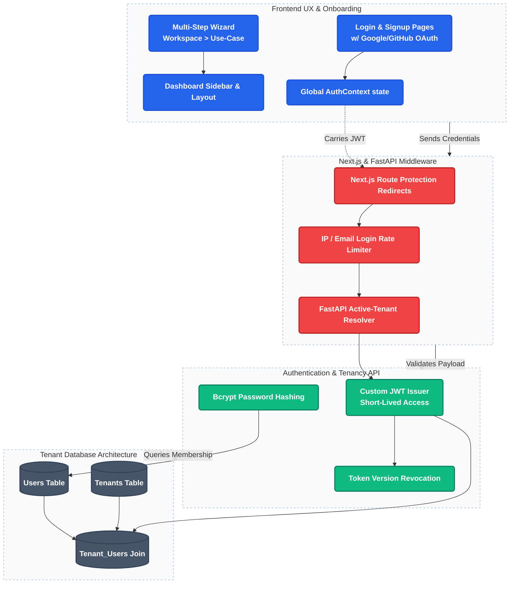

# 1. Multi-Tenant SaaS Core & Workspace Orchestration Hub

This project establishes the foundation of the platform's multi-tenant capabilities, ensuring absolute security, data isolation, and user onboarding flows.

---

### Architecture Flow



---

### Technical Highlights

1. **Database-Level Row-Level Security (RLS):**
   Unlike basic SaaS designs that rely solely on `WHERE tenant_id = ...` application filters, we enforce isolation at the database layer. Even if an application route has a bug, PostgreSQL blocks unauthorized cross-tenant data requests.
2. **Transaction-Scoped Tenant Injection:**
   Since HTTP clients like Supabase PostgREST bypass RLS variables easily, the backend switches to an `asyncpg` TCP connection pool. Every query transaction executes:
   ```sql
   SET LOCAL app.current_tenant_id = '{tenant_id}';
   ```
   Postgres automatically enforces the security policies for all subsequent statements in the scope of the transaction.
3. **Workspace Switching UI:**
   A Next.js layout context reads active workspaces and dynamically issues active JWT payloads mapping correct `tenant_id` claims, enabling seamless account switching.

---

### Core Code File Paths

Inspect the actual source files in the repository:

*   **Database RLS Policies:**
    [`migrations/035_rls_tenant_isolation.sql`](https://github.com/Rahul-pamula/ShrFlow-V1/blob/main/migrations/035_rls_tenant_isolation.sql) — Configures `ALTER TABLE ... ENABLE ROW LEVEL SECURITY` and isolation policies across core tables.
*   **Connection Pool & Context Manager:**
    [`platform/api/utils/db_engine.py`](https://github.com/Rahul-pamula/ShrFlow-V1/blob/main/platform/api/utils/db_engine.py) — Binds connection acquisitions to the RLS session state setup using the `get_conn(tenant_id)` context helper.
*   **JWT & Authentication Middleware:**
    [`platform/api/utils/jwt_middleware.py`](https://github.com/Rahul-pamula/ShrFlow-V1/blob/main/platform/api/utils/jwt_middleware.py) — Resolves, decodes, and validates tenant identity claims.
*   **Active-Tenant Resolution Router:**
    [`platform/api/routes/auth.py`](https://github.com/Rahul-pamula/ShrFlow-V1/blob/main/platform/api/routes/auth.py) — Handles login, signup, and token refreshes.
*   **Onboarding & Workspace Client Logic:**
    [`platform/client/src/context/AuthContext.tsx`](https://github.com/Rahul-pamula/ShrFlow-V1/blob/main/platform/client/src/context/AuthContext.tsx) — Orchestrates frontend session distribution and tenant validation guards.
