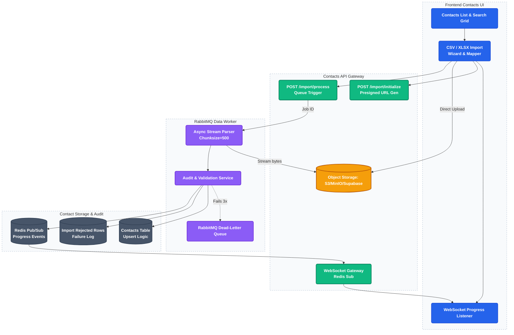

# 2. High-Volume CSV Ingestion Pipeline & Contacts Engine

This project implements a storage-first, async chunked ingestion pipeline capable of parsing gigabyte-scale contact databases without memory exhaustion or API timeouts.

---

### Architecture Flow

---

### Technical Highlights

1. **Storage-First Presigned Ingestion:**
   Rather than uploading files directly to FastAPI and risking gateway timeouts (e.g., Nginx body limits), the client requests a presigned URL (`POST /import/initialize`) and uploads raw CSVs directly to AWS S3/Object Storage.
2. **Chunked Streaming & O(1) Memory Space:**
   When enqueued via RabbitMQ, the Python worker opens a stream to the S3 object and parses the file in **batches of 500 rows** using a streaming parser. This guarantees that memory utilization stays constant (O(1)) regardless of file size (e.g. 10MB vs 2GB).
3. **Real-time Live Progress Hooks:**
   As the worker finishes each chunk, it updates job statistics and triggers a message via **Redis Pub/Sub**. The API's WebSocket connection captures these events and feeds real-time progress bars to the user interface.
4. **Deduplication and Validation:**
   Applies deduplication at database insertion boundaries using Postgres upserts on combinations of `(tenant_id, email)` while logging invalid email syntaxes to a secondary `import_rejected_rows` audit log.

---

### Core Code File Paths

*   **Ingestion Endpoint APIs:**
    [`platform/api/routes/contacts.py`](https://github.com/Rahul-pamula/ShrFlow-V1/blob/main/platform/api/routes/contacts.py) — Houses initialization and processing triggers.
*   **Import Process Orchestrator:**
    [`platform/api/services/import_service.py`](https://github.com/Rahul-pamula/ShrFlow-V1/blob/main/platform/api/services/import_service.py) — Orchestrates files, templates, and batch creations.
*   **Distributed RabbitMQ Worker:**
    [`platform/worker/import_worker.py`](https://github.com/Rahul-pamula/ShrFlow-V1/blob/main/platform/worker/import_worker.py) — Listens on RabbitMQ channels and consumes ingestion tasks.
*   **Chunked Stream Handler:**
    [`platform/worker/handlers/import_handler.py`](https://github.com/Rahul-pamula/ShrFlow-V1/blob/main/platform/worker/handlers/import_handler.py) — Streams the S3 resource, performs data conversions, runs email validations, and performs batch database insertion.
*   **CSV File Parser Utility:**
    [`platform/api/utils/file_parser.py`](https://github.com/Rahul-pamula/ShrFlow-V1/blob/main/platform/api/utils/file_parser.py) — Handles low-level column mapping and delimiter identification.
