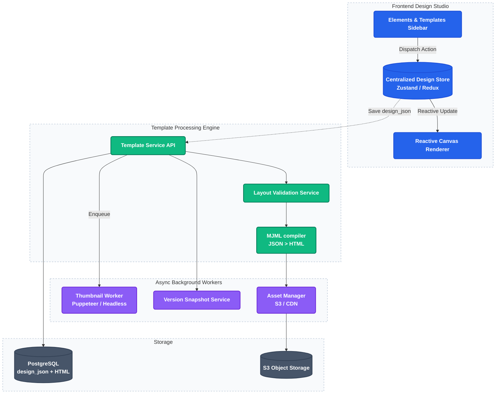

# 3. No-Code Email Builder & MJML Compilation Microservice

This project implements a state-driven layout engine, providing a responsive visual design editor for creating email layouts and compiling them server-side into stable, multi-client responsive HTML payloads via MJML.

---

### Architecture Flow

---

### Technical Highlights

1. **DesignJSON as Single Source of Truth:**
   The builder stores structure as a tree containing `Rows -> Columns -> Blocks`. Absolute canvas-style positioning is forbidden. This flow-based layout design ensures 100% rendering stability across historically problematic email clients (like Microsoft Outlook).
2. **State-Driven Zustand Client Store:**
   Uses a centralized Zustand store on the client, turning every drag-and-drop or property edit into an immutable JSON tree mutation, entirely eliminating typical DOM-syncing bugs.
3. **Stateless MJML Compilation Microservice:**
   Translates custom blocks (e.g., text, images, buttons, spacer grids) into MJML XML schemas, which are then compiled server-side to generate minified, CSS-inlined, and client-compatible HTML.
4. **Pre-Send HTML Constraints checks:**
   Performs pre-validation audits, checking if the final HTML file exceeds the strict Gmail 102KB clipping threshold and verifying that merge tags (personalization tokens) have fallback defaults.

---

### Core Code File Paths

*   **MJML Compilation & Rendering Service:**
    [`platform/api/services/compile_service.py`](https://github.com/Rahul-pamula/ShrFlow-V1/blob/main/platform/api/services/compile_service.py) — Contains JSON-to-MJML translator structures and calls the MJML compilation binaries.
*   **Template Core Operations Service:**
    [`platform/api/services/template_service.py`](https://github.com/Rahul-pamula/ShrFlow-V1/blob/main/platform/api/services/template_service.py) — Handles database storage of layout configurations.
*   **Template Deconstruction & Decoupled Work:**
    [`platform/services/template_service/`](https://github.com/Rahul-pamula/ShrFlow-V1/tree/main/platform/services/template_service) — Contains microservice decomposition utilities for template isolated operations.
*   **MJML Parser Unit Tests:**
    [`platform/api/test_mjml.py`](https://github.com/Rahul-pamula/ShrFlow-V1/blob/main/platform/api/test_mjml.py) — Validates syntax outputs and compilation guarantees.
*   **Frontend Design Studio Shell:**
    [`platform/client/src/app/templates/[id]/block/ProjectsDashboard.tsx`](https://github.com/Rahul-pamula/ShrFlow-V1/blob/main/platform/client/src/app/templates/[id]/block/ProjectsDashboard.tsx) — Implements visual layout grids and blocks list.
