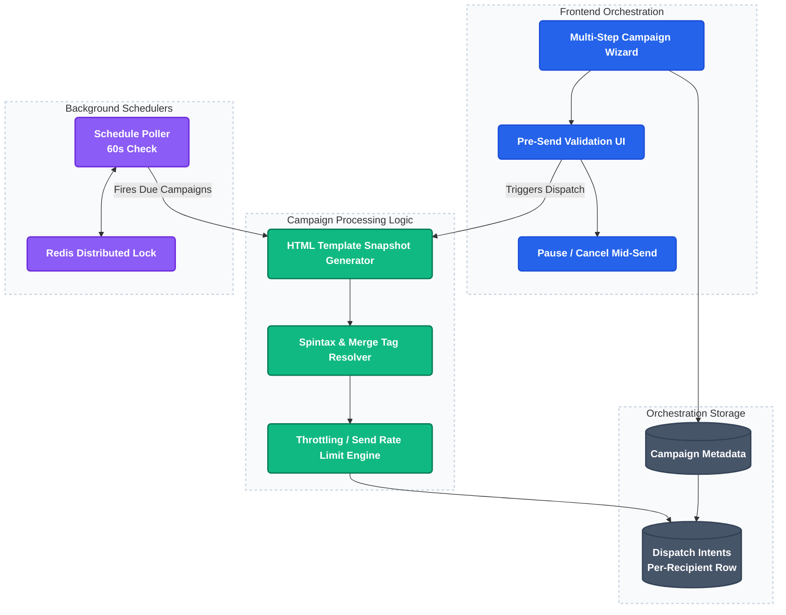

# 4. Asynchronous Campaign Dispatcher & Distributed Worker Cluster

This project implements a concurrent campaign dispatcher using a RabbitMQ/Celery backend worker pool. It guarantees safe bulk deliveries, locks task execution concurrency, and uses stream-based cursor fetching to keep database memory light.

---

### Architecture Flow

---

### Technical Highlights

1. **Pre-Send HTML Snapshotting:**
   Immediately freeze the template state (creating an immutable HTML payload snapshot) when a campaign is queued. This guarantees that edits made to a template after dispatching do not corrupt currently executing runs.
2. **Redis Distributed Concurrency Locks:**
   Since scheduler cron triggers fire parallel threads every minute, double-send bugs can occur if multiple engines process the same campaign. We acquire a key-locked resource (`lock:campaign:{id}`) inside Redis before executing, ensuring exactly one worker ever handles a campaign dispatch at a time.
3. **Cursor-Based DB Loading:**
   Instead of pulling all target contacts into memory (which crashes the API on 100k+ campaigns), we stream records in chunks via PostgreSQL cursor connections.
4. **Pause, Resume, and Throttling controls:**
   Stores campaign stats in Redis to allow dynamic pause/cancel operations mid-send and throttles connection requests to respect SMTP provider limits.

---

### Core Code File Paths

*   **Campaign Dispatch Service:**
    [`platform/api/services/campaign_dispatch_service.py`](https://github.com/Rahul-pamula/ShrFlow-V1/blob/main/platform/api/services/campaign_dispatch_service.py) — Handles the queuing logic, snapshot creation, and database schema mappings.
*   **Background Cron Scheduler:**
    [`platform/worker/scheduler.py`](https://github.com/Rahul-pamula/ShrFlow-V1/blob/main/platform/worker/scheduler.py) — Handles Redis distributed locks, queries pending schedules, and initiates dispatcher triggers.
*   **Celery Worker Lifecycle Handler:**
    [`platform/worker/background_worker.py`](https://github.com/Rahul-pamula/ShrFlow-V1/blob/main/platform/worker/background_worker.py) — Manages Celery applications, broker endpoints, and tasks hooks.
*   **Mail Transfer Worker:**
    [`platform/worker/centralized_email_worker.py`](https://github.com/Rahul-pamula/ShrFlow-V1/blob/main/platform/worker/centralized_email_worker.py) — Consumes queues, handles SMTP configurations, and validates CAN-SPAM footers.
