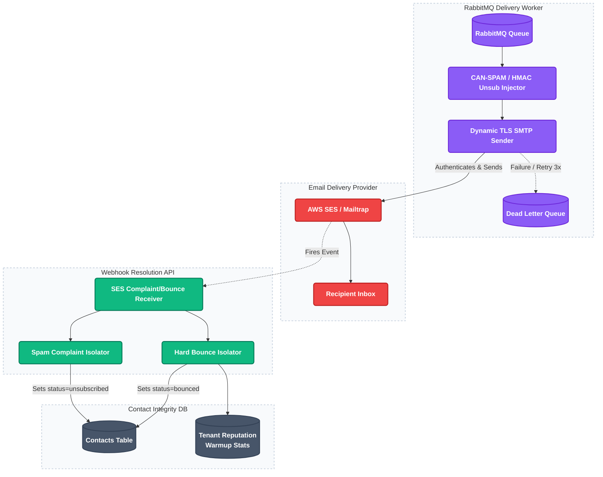

# 5. DKIM/SPF Domain Provisioning & SES Mail Infrastructure

This project automates the registration, configuration, and verification of sender domains. It uses AWS Boto3 to request verification tokens, exposes DNS setups for users, and integrates bounce/complaint feedback loops via AWS SNS webhooks.

---

### Architecture Flow

---

### Technical Highlights

1. **Programmatic SES Identity Verification:**
   When a user adds a domain, the API calls AWS SES (`verify_domain_dkim`) via the Boto3 SDK, retrieving 3 generated DKIM tokens. The platform translates these into DNS CNAME records and renders them in the UI for the user to publish.
2. **DNS Verification Checks:**
   Exposes checking endpoints (`POST /domains/{id}/verify`) to query current DNS registration entries (using boto3 `get_identity_dkim_attributes` and `get_identity_verification_attributes`) and dynamically updates domain verification states to "Verified".
3. **AWS SNS Webhook Verification Loop:**
   Ingests feedback events (Hard Bounces, Spam Complaints) sent by AWS SNS. To prevent fake events from unsubscribing contacts, the webhook parses certificates and verifies the RSA signature of the SNS message before processing.
4. **Reputation Protection & Hard Suppression:**
   Hard bounces and spam complaints are instantly moved to a permanent suppression list, preventing further dispatches to keep the domain reputation high.

---

### Core Code File Paths

*   **Domain Provisioning Router:**
    [`platform/api/routes/domains.py`](https://github.com/Rahul-pamula/ShrFlow-V1/blob/main/platform/api/routes/domains.py) — Enqueues domains in AWS SES, queries verification values, and lists active DNS tokens.
*   **Sender Identities Router:**
    [`platform/api/routes/senders.py`](https://github.com/Rahul-pamula/ShrFlow-V1/blob/main/platform/api/routes/senders.py) — Handles sender email addresses validation.
*   **SNS Webhook & Signature Validation:**
    [`platform/api/routes/webhooks.py`](https://github.com/Rahul-pamula/ShrFlow-V1/blob/main/platform/api/routes/webhooks.py) — Ingests feedback loops from SES/SNS and processes bounce/complaint events.
*   **Deliverability Repositories:**
    [`platform/api/services/reputation_engine.py`](https://github.com/Rahul-pamula/ShrFlow-V1/blob/main/platform/api/services/reputation_engine.py) — Standardizes bounce rate monitoring.
