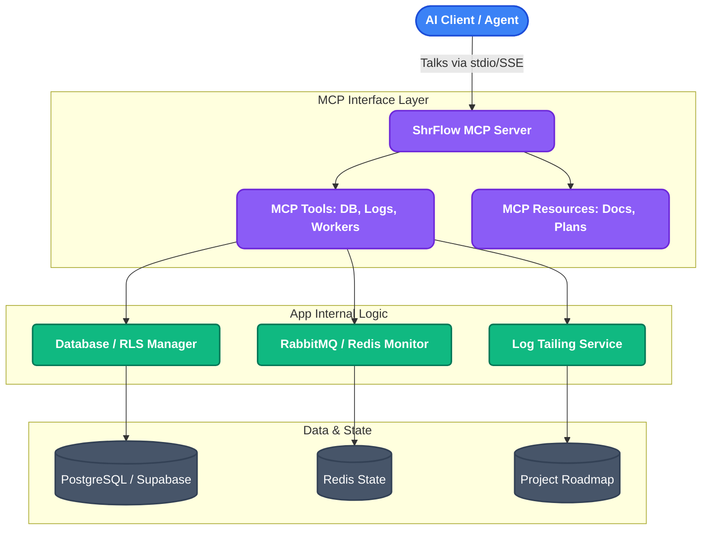

# 6. AI Developer Intelligence Server & Context-Aware RAG Engine

This project maps the strategic design and architectural blueprint for integrating a Model Context Protocol (MCP) server and RAG engine directly into the platform core to automate developer auditing, testing, and debugging.

---

### Architecture Flow

---

### Technical Highlights

1. **Standardized Model Context Protocol (MCP) Bridge:**
   Exposes internal app boundaries (database connections, Celery statuses, and log files) over a standard stdio/SSE bridge. This permits AI clients (like Claude Desktop or autonomous agents) to safely read and debug live infrastructure.
2. **Context-Aware RAG Engine:**
   Implements resource loaders exposing project plans (`phase_wise_plan.md`) and database schemas as live vector-search indices, helping the AI understand design constraints when suggesting edits.
3. **Infrastructure Telemetry Tools:**
   Exposes diagnostic tools:
   *   `db_inspector`: List tables, details columns, and validates PostgreSQL RLS security properties.
   *   `worker_monitor`: Queries RabbitMQ queue depths and lists active Redis distributed campaign locks.
   *   `audit_viewer`: Queries immutable `audit_logs` entries to track operational faults chronologically.

---

### Core Code File Paths

*   **Phase 1.9 MCP Strategic Specification:**
    [`docs/plan/phase_wise_plan.md`](https://github.com/Rahul-pamula/ShrFlow-V1/blob/main/docs/plan/phase_wise_plan.md#L628-L705) — Outlines the architecture plan, tool listings, and validation routines.
*   **System Developer Intelligence Overview:**
    [`docs/plan/overview.md`](https://github.com/Rahul-pamula/ShrFlow-V1/blob/main/docs/plan/overview.md#L393-L436) — Breaks down Phase 1.9's integration architecture flow and gaps.
